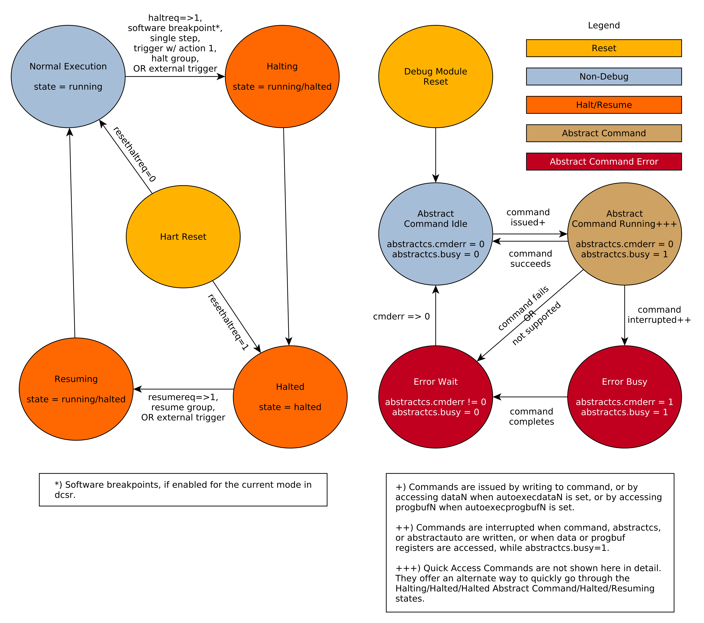

# 3.1. Debug Module (DM) (non-ISA extension)

## 3.1\. Debug Module (DM) (non-ISA extension)

The Debug Module implements a translation interface between abstract debug operations and their specific implementation. It might support the following operations:

1. Give the debugger necessary information about the implementation. (Required)
2. Allow any individual hart to be halted and resumed. (Required)
3. Provide status on which harts are halted. (Required)
4. Provide abstract read and write access to a halted hart’s GPRs. (Required)
5. Provide access to a reset signal that allows debugging from the very first instruction after reset. (Required)
6. Provide a mechanism to allow debugging harts immediately out of reset (regardless of the reset cause). (Optional)
7. Provide abstract access to non-GPR hart registers. (Optional)
8. Provide a Program Buffer to force the hart to execute arbitrary instructions. (Optional)
9. Allow multiple harts to be halted, resumed, and/or reset at the same time. (Optional)
10. Allow memory access from a hart’s point of view. (Optional)
11. Allow direct System Bus Access. (Optional)
12. Group harts. When any hart in the group halts, they all halt. (Optional)
13. Respond to external triggers by halting each hart in a configured group. (Optional)
14. Signal an external trigger when a hart in a group halts. (Optional)

In order to be compatible with this specification an implementation must:

1. Implement all the required features listed above.
2. Implement at least one of Program Buffer, System Bus Access, or Abstract Access Memory command mechanisms.
3. Do at least one of:  
   1. Implement the Program Buffer.  
   2. Implement abstract access to all registers that are visible to software running on the hart including all the registers that are present on the hart and listed in [Table 3](#tab:regno).  
   3. Implement abstract access to at least all GPRs, [dcsr](Sdext.html#csr-dcsr), and [dpc](Sdext.html#csr-dpc), and advertise the implementation as conforming to the "Minimal RISC-V Debug Specification", instead of the "RISC-V Debug Specification".

A single DM can debug up to  harts.

### 3.1.1\. Debug Module Interface (DMI)

Debug Modules are subordinates on a bus called the Debug Module Interface (DMI). The bus manager is the Debug Transport Module(s). The Debug Module Interface can be a trivial bus with one manager and one subordinate (see [implementations.adoc#tab:dmi\_signals](implementations.html#tab:dmi%5Fsignals)), or use a more full-featured bus like TileLink or the AMBA Advanced Peripheral Bus. The details are left to the system designer.

The DMI uses between 7 and 32 address bits. Each address points at a single 32-bit register that can be read or written. The bottom of the address space is used for the first (and usually only) DM. Extra space can be used for custom debug devices, other cores, additional DMs, etc. If there are additional DMs on this DMI, the base address of the next DM in the DMI address space is given in [nextdm](#dm-nextdm).

The Debug Module is controlled via register accesses to its DMI address space.

### 3.1.2\. Reset Control

There are two methods that allow a debugger to reset harts. [ndmreset](#dmcontrol-ndmreset) resets all the harts in the hardware platform, as well as all other parts of the hardware platform except for the Debug Modules, Debug Transport Modules, and Debug Module Interface. Exactly what is affected by this reset is implementation dependent, but it must be possible to debug programs from the first instruction executed. [hartreset](#dmcontrol-hartreset) resets all the currently selected harts. In this case an implementation may reset more harts than just the ones that are selected. The debugger can discover which other harts are reset (if any) by selecting them and checking [anyhavereset](#dmstatus-anyhavereset) and [allhavereset](#dmstatus-allhavereset).

To perform either of these resets, the debugger first asserts the bit, and then clears it. The actual reset may start as soon as the bit is asserted, but may start an arbitrarily long time after the bit is deasserted. The reset itself may also take an arbitrarily long time. While the reset is on-going, harts are either in the running state, indicating it’s possible to perform some abstract commands during this time, or in the unavailable state, indicating it’s not possible to perform any abstract commands during this time. Once a hart’s reset is complete, `havereset` becomes set. When a hart comes out of reset and [haltreq](#dmcontrol-haltreq) or `resethaltreq`are set, the hart will immediately enter Debug Mode (halted state). Otherwise, if the hart was initially running it will execute normally (running state) and if the hart was initially halted it should now be running but may be halted.

| |  There is no general, reliable way for the debugger to know when reset has actually begun. |
| -------------------------------------------------------------------------------------------- |

The Debug Module’s own state and registers should only be reset at power-up and while [dmactive](#dmcontrol-dmactive) in [dmcontrol](#dm-dmcontrol) is 0\. If there is another mechanism to reset the DM, this mechanism must also reset all the harts accessible to the DM.

Due to clock and power domain crossing issues, it might not be possible to perform arbitrary DMI accesses across hardware platform reset. While[ndmreset](#dmcontrol-ndmreset) or any external reset is asserted, the only supported DM operations are reading/writing [dmcontrol](#dm-dmcontrol) and reading[ndmresetpending](#dmstatus-ndmresetpending). The behavior of other accesses is undefined.

When harts have been reset, they must set a sticky `havereset` state bit. The conceptual `havereset` state bits can be read for selected harts in [anyhavereset](#dmstatus-anyhavereset) and [allhavereset](#dmstatus-allhavereset) in [dmstatus](#dm-dmstatus). These bits must be set regardless of the cause of the reset. The `havereset` bits for the selected harts can be cleared by writing 1 to [ackhavereset](#dmcontrol-ackhavereset) in [dmcontrol](#dm-dmcontrol). The `havereset` bits might or might not be cleared when [dmactive](#dmcontrol-dmactive) is low.

### 3.1.3\. Selecting Harts

Up to  harts can be connected to a single DM. Commands issued to the DM only apply to the currently selected harts.

To enumerate all the harts, a debugger must first determine `HARTSELLEN`by writing all ones to \`hartsel\` (assuming the maximum size) and reading back the value to see which bits were actually set. Then it selects each hart starting from 0 until either [anynonexistent](#dmstatus-anynonexistent) in [dmstatus](#dm-dmstatus) is 1, or the highest index (depending on `HARTSELLEN`) is reached.

The debugger can discover the mapping between hart indices and `mhartid` by using the interface to read `mhartid`, or by reading the hardware platform’s configuration structure.

#### 3.1.3.1\. Selecting a Single Hart

All debug modules must support selecting a single hart. The debugger can select a hart by writing its index to \`hartsel\`. Hart indexes start at 0 and are contiguous until the final index.

#### 3.1.3.2\. Selecting Multiple Harts

Debug Modules may implement a Hart Array Mask register to allow selecting multiple harts at once. The th bit in the Hart Array Mask register applies to the hart with index . If the bit is 1 then the hart is selected. Usually a DM will have a Hart Array Mask register exactly wide enough to select all the harts it supports, but it’s allowed to tie any of these bits to 0.

The debugger can set bits in the hart array mask register using [hawindowsel](#dm-hawindowsel) and [hawindow](#dm-hawindow), then apply actions to all selected harts by setting [hasel](#dmcontrol-hasel). If this feature is supported, multiple harts can be halted, resumed, and reset simultaneously. The state of the hart array mask register is not affected by setting or clearing [hasel](#dmcontrol-hasel).

Execution of Abstract Commands ignores this mechanism and only applies to the hart selected by \`hartsel\`.

### 3.1.4\. Hart DM States

Every hart that can be selected is in exactly one of the following four DM states: non-existent, unavailable, running, or halted. Which state the selected harts are in is reflected by [allnonexistent](#dmstatus-allnonexistent), [anynonexistent](#dmstatus-anynonexistent), [allunavail](#dmstatus-allunavail), [anyunavail](#dmstatus-anyunavail), [allrunning](#dmstatus-allrunning), [anyrunning](#dmstatus-anyrunning), [allhalted](#dmstatus-allhalted), and [anyhalted](#dmstatus-anyhalted).

Harts are nonexistent if they will never be part of this hardware platform, no matter how long a user waits. E.g. in a simple single-hart hardware platform only one hart exists, and all others are nonexistent. Debuggers may assume that a hardware platform has no harts with indexes higher than the first nonexistent one.

Harts are unavailable if they might exist/become available at a later time, or if there are other harts with higher indexes than this one. Harts may be unavailable for a variety of reasons including being reset, temporarily powered down, and not being plugged into the hardware platform. That means harts might become available or unavailable at any time, although these events should be rare in hardware platforms built to be easily debugged. There are no guarantees about the state of the hart when it becomes available.

Hardware platforms with very large number of harts may permanently disable some during manufacturing, leaving holes in the otherwise continuous hart index space. In order to let the debugger discover all harts, they must show up as unavailable even if there is no chance of them ever becoming available.

Harts are running when they are executing normally, as if no debugger was attached. This includes being in a low power mode or waiting for an interrupt, as long as a halt request will result in the hart being halted.

Harts are halted when they are in Debug Mode, only performing tasks on behalf of the debugger.

Which states a hart that is reset goes through is implementation dependent. Harts may be unavailable while reset is asserted, and some time after reset is deasserted. They might transition to running for some time after reset is deasserted. Finally they end up either running or halted, depending on [haltreq](#dmcontrol-haltreq) and `resethaltreq`.

### 3.1.5\. Run Control

For every hart, the Debug Module tracks 4 conceptual bits of state: halt request, resume ack, halt-on-reset request, and hart reset. (The hart reset and halt-on-reset request bits are optional.) These 4 bits reset to 0, except for resume ack, which may reset to either 0 or 1\. The DM receives halted, running, and havereset signals from each hart. The debugger can observe the state of resume ack in [allresumeack](#dmstatus-allresumeack) and [anyresumeack](#dmstatus-anyresumeack), and the state of halted, running, and havereset signals in [allhalted](#dmstatus-allhalted), [anyhalted](#dmstatus-anyhalted), [allrunning](#dmstatus-allrunning), [anyrunning](#dmstatus-anyrunning), [allhavereset](#dmstatus-allhavereset), and [anyhavereset](#dmstatus-anyhavereset). The state of the other bits cannot be observed directly.

When a debugger writes 1 to [haltreq](#dmcontrol-haltreq), each selected hart’s halt request bit is set. When a running hart, or a hart just coming out of reset, sees its halt request bit high, it responds by halting, deasserting its running signal, and asserting its halted signal. Halted harts ignore their halt request bit.

When a debugger writes 1 to [resumereq](#dmcontrol-resumereq), each selected hart’s resume ack bit is cleared and each selected, halted hart is sent a resume request. Harts respond by resuming, clearing their halted signal, and asserting their running signal. At the end of this process the resume ack bit is set. These status signals of all selected harts are reflected in [allresumeack](#dmstatus-allresumeack), [anyresumeack](#dmstatus-anyresumeack), [allrunning](#dmstatus-allrunning), and [anyrunning](#dmstatus-anyrunning). Resume requests are ignored by running harts.

When halt or resume is requested, a hart must respond in less than one second, unless it is unavailable. (How this is implemented is not further specified. A few clock cycles will be a more typical latency).

The DM can implement optional halt-on-reset bits for each hart, which it indicates by setting [hasresethaltreq](#dmstatus-hasresethaltreq) to 1\. This means the DM implements the [setresethaltreq](#dmcontrol-setresethaltreq) and [clrresethaltreq](#dmcontrol-clrresethaltreq) bits. Writing 1 to [setresethaltreq](#dmcontrol-setresethaltreq) sets the halt-on-reset request bit for each selected hart. When a hart’s halt-on-reset request bit is set, the hart will immediately enter debug mode on the next deassertion of its reset. This is true regardless of the reset’s cause. The hart’s halt-on-reset request bit remains set until cleared by the debugger writing 1 to [clrresethaltreq](#dmcontrol-clrresethaltreq) while the hart is selected, or by DM reset.

If the DM is reset while a hart is halted, it is UNSPECIFIED whether that hart resumes. Debuggers should use [resumereq](#dmcontrol-resumereq) to explicitly resume harts before clearing [dmactive](#dmcontrol-dmactive) and disconnecting.

### 3.1.6\. Halt Groups, Resume Groups, and External Triggers

An optional feature allows a debugger to place harts into two kinds of groups: halt groups and resume groups. It is also possible to add external triggers to a halt and resume groups. At any given time, each hart and each trigger is a member of exactly one halt group and exactly one resume group.

In both halt and resume groups, group 0 is special. Harts in group 0 halt/resume as if groups aren’t implemented at all.

When any hart in a halt group halts:

1. That hart halts normally, with [cause](Sdext.html#dcsr-cause) reflecting the original cause of the halt.
2. All the other harts in the halt group that are running will quickly halt. [cause](Sdext.html#dcsr-cause) for those harts should be set to 6, but may be set to 3\. Other harts in the halt group that are halted but have started the process of resuming must also quickly become halted, even if they do resume briefly.
3. Any external triggers in that group are notified.

Adding a hart to a halt group does not automatically halt that hart, even if other harts in the group are already halted.

When an external trigger that’s a member of the halt group fires:

1. All the harts in the halt group that are running will quickly halt. [cause](Sdext.html#dcsr-cause) for those harts should be set to 6, but may be set to 3\. Other harts in the halt group that are halted but have started the process of resuming must also quickly become halted, even if they do resume briefly.

When any hart in a resume group resumes:

1. All the other harts in that group that are halted will quickly resume as soon as any currently executing abstract commands have completed. Each hart in the group sets its resume ack bit as soon as it has resumed. Harts that are in the process of halting should complete that process and stay halted.
2. Any external triggers in that group are notified.

Adding a hart to a resume group does not automatically resume that hart, even if other harts in the group are currently running.

When an external trigger that’s a member of the resume group fires:

1. All the harts in that group that are halted will quickly resume as soon as any currently executing abstract commands have completed. Each hart in the group sets its resume ack bit as soon as it has resumed. Harts that are in the process of halting should complete that process and stay halted.

External triggers are abstract concepts that can signal the DM and/or receive signals from the DM. This configuration is done through [dmcs2](#dm-dmcs2), where external triggers are referred to by a number. Commonly, external triggers are capable of sending a signal from the hardware platform into the DM, as well as receiving a signal from the DM to take their own action on. It is also allowable for an external trigger to be input-only or output-only. By convention external triggers 0-7 are bidirectional, triggers 8-11 are input-only, and triggers 12-15 are output-only but this is not required.

| |  External triggers could be used to implement near simultaneous halting/resuming of all cores in a hardware platform, when not all cores are RISC-V cores. |
| ------------------------------------------------------------------------------------------------------------------------------------------------------------ |

When the DM is reset, all harts must be placed in the lowest-numbered halt and resume groups that they can be in. (This will usually be group 0.)

Some designs may choose to hardcode hart groups to a group other than group 0, meaning it is never possible to halt or resume just a single hart. This is explicitly allowed. In that case it must be possible to discover the groups by using [dmcs2](#dm-dmcs2) even if it’s not possible to change the configuration.

### 3.1.7\. Abstract Commands

The DM supports a set of abstract commands, most of which are optional. Depending on the implementation, the debugger may be able to perform some abstract commands even when the selected hart is not halted. Debuggers can only determine which abstract commands are supported by a given hart in a given state (running, halted, or held in reset) by attempting them and then looking at [cmderr](#abstractcs-cmderr) in [abstractcs](#dm-abstractcs) to see if they were successful. Commands may be supported with some options set, but not with other options set. If a command has unsupported options set or if bits that are defined as 0 aren’t 0, then the DM must set [cmderr](#abstractcs-cmderr) to 2 (not supported).

| |  Example: Every DM must support the Access Register command, but might not support accessing CSRs. If the debugger requests to read a CSR in that case, the command will return "not supported". |
| -------------------------------------------------------------------------------------------------------------------------------------------------------------------------------------------------- |

Debuggers execute abstract commands by writing them to [command](#dm-command). They can determine whether an abstract command is complete by reading [busy](#abstractcs-busy) in [abstractcs](#dm-abstractcs). If the debugger starts a new command while [busy](#abstractcs-busy) is set, [cmderr](#abstractcs-cmderr) becomes 1 (busy), the currently executing command still gets to run to completion, but any error generated by the currently executing command is lost. After completion, [cmderr](#abstractcs-cmderr) indicates whether the command was successful or not. Commands may fail because a hart is not halted, not running, unavailable, or because they encounter an error during execution.

If the command takes arguments, the debugger must write them to the`data` registers before writing to [command](#dm-command). If a command returns results, the Debug Module must ensure they are placed in the `data` registers before [busy](#abstractcs-busy)is cleared. Which `data` registers are used for the arguments is described in [Table 1](#tab:datareg). In all cases the least-significant word is placed in the lowest-numbered `data` register. The argument width depends on the command being executed, and is DXLEN where not explicitly specified.

__Table 1\. Use of Data Registers__
| Argument Width | arg0/return value         | arg1         | arg2          |
| -------------- | ------------------------- | ------------ | ------------- |
| 32             | [data0](#dm-data0)        | data1        | data2         |
| 64             | [data0](#dm-data0), data1 | data2, data3 | data4, data5  |
| 128            | [data0](#dm-data0)\-data3 | data4\-data7 | data8\-data11 |

| |  The Abstract Command interface is designed to allow a debugger to write commands as fast as possible, and then later check whether they completed without error. In the common case the debugger will be much slower than the target and commands succeed, which allows for maximum throughput. If there is a failure, the interface ensures that no commands execute after the failing one. To discover which command failed, the debugger has to look at the state of the DM (e.g. contents of [data0](#dm-data0)) or hart (e.g. contents of a register modified by a Program Buffer program) to determine which one failed. |
| --------------------------------------------------------------------------------------------------------------------------------------------------------------------------------------------------------------------------------------------------------------------------------------------------------------------------------------------------------------------------------------------------------------------------------------------------------------------------------------------------------------------------------------------------------------------------------------------------------------------------------- |

While an abstract command is executing ([busy](#abstractcs-busy) in [abstractcs](#dm-abstractcs) is high), a debugger must not change \`hartsel\`, and must not write 1 to [haltreq](#dmcontrol-haltreq), [resumereq](#dmcontrol-resumereq), [ackhavereset](#dmcontrol-ackhavereset), [setresethaltreq](#dmcontrol-setresethaltreq), or [clrresethaltreq](#dmcontrol-clrresethaltreq). The hardware should not rely on this debugger behavior, but should enforce it by ignoring writes to these bits while [busy](#abstractcs-busy) is high.

If an abstract command does not complete in the expected time and appears to be hung, the debugger can try to reset the hart (using [hartreset](#dmcontrol-hartreset) or [ndmreset](#dmcontrol-ndmreset)). If that doesn’t clear [busy](#abstractcs-busy), then it can try resetting the Debug Module (using [dmactive](#dmcontrol-dmactive)).

If an abstract command is started while the selected hart is unavailable or if a hart becomes unavailable while executing an abstract command, then the Debug Module may terminate the abstract command, setting [busy](#abstractcs-busy) low, and [cmderr](#abstractcs-cmderr) to 4 (halt/resume). Alternatively, the command could just appear to be hung ([busy](#abstractcs-busy) never goes low).

#### 3.1.7.1\. Abstract Command Listing

This section describes each of the different abstract commands and how their fields should be interpreted when they are written to [command](#dm-command).

Each abstract command is a 32-bit value. The top 8 bits contain [cmdtype](#command-cmdtype) which determines the kind of command. [Table 2](#tab:cmdtype) lists all commands.

__Table 2\. Meaning of [cmdtype](#command-cmdtype)__
| [cmdtype](#command-cmdtype) | Command                                       |
| --------------------------- | --------------------------------------------- |
| 0                           | [Access Register Command](#ac-accessregister) |
| 1                           | [Quick Access](#ac-quickaccess)               |
| 2                           | [Access Memory Command](#ac-accessmemory)     |

##### `Access Register`

This command gives the debugger access to CPU registers and allows it to execute the Program Buffer. It performs the following sequence of operations:

1. If [write](#accessregister-write) is clear and [transfer](#accessregister-transfer) is set, then copy data from the register specified by [regno](#accessregister-regno) into the `arg0` region of`data`, and perform any side effects that occur when this register is read from M-mode.
2. If [write](#accessregister-write) is set and [transfer](#accessregister-transfer) is set, then copy data from the`arg0` region of `data` into the register specified by[regno](#accessregister-regno), and perform any side effects that occur when this register is written from M-mode.
3. If [aarpostincrement](#accessregister-aarpostincrement) and[transfer](#accessregister-transfer) are set, increment[regno](#accessregister-regno). [regno](#accessregister-regno) may also be incremented if [aarpostincrement](#accessregister-aarpostincrement) is set and[transfer](#accessregister-transfer) is clear.
4. Execute the Program Buffer, if [postexec](#accessregister-postexec) is set.

If any of these operations fail, [cmderr](#abstractcs-cmderr) is set and none of the remaining steps are executed. An implementation may detect an upcoming failure early, and fail the overall command before it reaches the step that would cause failure. If the failure is that the requested register does not exist in the hart, [cmderr](#abstractcs-cmderr) must be set to 3 (exception).

Debug Modules must implement this command and must support read and write access to all GPRs when the selected hart is halted. Debug Modules may optionally support accessing other registers, or accessing registers when the hart is running. It is recommended that if one register in a group is accessible, then all registers in that group are accessible, but each individual register (aside from GPRs) may be supported differently across read, write, and halt status.

Registers might not be accessible if they wouldn’t be accessible by M mode code currently running. (E.g. `fflags` might not be accessible when `mstatus.FS` is 0.) If this is the case, the debugger is responsible for changing state to make the registers accessible. The Core Debug Registers ([\[debreg\]](#debreg)) should be accessible if abstract CSR access is implemented.

__Table 3\. Abstract Register Numbers__
| Numbers         | Group Description                                                          |
| --------------- | -------------------------------------------------------------------------- |
| 0x0000 — 0x0fff | CSRs. The \`\`PC'' can be accessed here through [dpc](Sdext.html#csr-dpc). |
| 0x1000 — 0x101f | GPRs                                                                       |
| 0x1020 — 0x103f | Floating point registers                                                   |
| 0xc000 — 0xffff | Reserved for non-standard extensions and internal use.                     |

| |  The encoding of [aarsize](#accessregister-aarsize) was chosen to match [sbaccess](#sbcs-sbaccess) in [sbcs](#dm-sbcs). |
| ------------------------------------------------------------------------------------------------------------------------- |

This command modifies `arg0` only when a register is read. The other `data` registers are not changed.

 

| Field            | Description                                                                                                                                                                                                                                                                                                                                                                                                                                                                                                                                                                                                                                         |
| ---------------- | --------------------------------------------------------------------------------------------------------------------------------------------------------------------------------------------------------------------------------------------------------------------------------------------------------------------------------------------------------------------------------------------------------------------------------------------------------------------------------------------------------------------------------------------------------------------------------------------------------------------------------------------------- |
| cmdtype          | This is 0 to indicate Access Register Command.                                                                                                                                                                                                                                                                                                                                                                                                                                                                                                                                                                                                      |
| aarsize          | 2 (32bit): Access the lowest 32 bits of the register. 3 (64bit): Access the lowest 64 bits of the register. 4 (128bit): Access the lowest 128 bits of the register. If [aarsize](#accessregister-aarsize) specifies a size larger than the register’s actual size, then the access must fail. If a register is accessible, then reads of [aarsize](#accessregister-aarsize)less than or equal to the register’s actual size must be supported. Writing less than the full register may be supported, but what happens to the high bits in that case is UNSPECIFIED. This field controls the Argument Width as referenced in[Table 1](#tab:datareg). |
| aarpostincrement | 0 (disabled): No effect. This variant must be supported. 1 (enabled): After a successful register access, [regno](#accessregister-regno) is incremented. Incrementing past the highest supported value causes [regno](#accessregister-regno) to become UNSPECIFIED. Supporting this variant is optional. It is undefined whether the increment happens when [transfer](#accessregister-transfer) is 0.                                                                                                                                                                                                                                              |
| postexec         | 0 (disabled): No effect. This variant must be supported, and is the only supported one if [progbufsize](#abstractcs-progbufsize) is 0. 1 (enabled): Execute the program in the Program Buffer exactly once after performing the transfer, if any. Supporting this variant is optional.                                                                                                                                                                                                                                                                                                                                                              |
| transfer         | 0 (disabled): Don’t do the operation specified by [write](#accessregister-write). 1 (enabled): Do the operation specified by [write](#accessregister-write). This bit can be used to just execute the Program Buffer without having to worry about placing valid values into [aarsize](#accessregister-aarsize) or [regno](#accessregister-regno).                                                                                                                                                                                                                                                                                                  |
| write            | When [transfer](#accessregister-transfer) is set: 0 (arg0): Copy data from the specified register into arg0 portion of data. 1 (register): Copy data from arg0 portion of data into the specified register.                                                                                                                                                                                                                                                                                                                                                                                                                                         |
| regno            | Number of the register to access, as described in[Table 3](#tab:regno).[dpc](Sdext.html#csr-dpc) may be used as an alias for PC if this command is supported on a non-halted hart.                                                                                                                                                                                                                                                                                                                                                                                                                                                                  |

##### `Quick Access`

Perform the following sequence of operations:

1. If the hart is halted, the command sets [cmderr](#abstractcs-cmderr) to \`\`halt/resume'' and does not continue.
2. Halt the hart. If the hart halts for some other reason (e.g. breakpoint), the command sets [cmderr](#abstractcs-cmderr) to \`\`halt/resume'' and does not continue.
3. Execute the Program Buffer. If an exception occurs, [cmderr](#abstractcs-cmderr) is set to \`\`exception,'' the Program Buffer execution ends, and the hart is halted with [cause](Sdext.html#dcsr-cause) set to 3.
4. If the Program Buffer executed without an exception, then resume the hart.

Implementing this command is optional.

This command does not touch the `data` registers.

 

| Field   | Description                                 |
| ------- | ------------------------------------------- |
| cmdtype | This is 1 to indicate Quick Access command. |

##### `Access Memory`

This command lets the debugger perform memory accesses, with the exact same memory view and permissions as performing loads/stores on the selected hart. This includes access to hart-local memory-mapped registers, etc. The command performs the following sequence of operations:

1. Copy data from the memory location specified in `arg1` into the`arg0` portion of `data`, if [write](#accessregister-write) is clear.
2. Copy data from the `arg0` portion of `data` into the memory location specified in `arg1`, if [write](#accessregister-write) is set.
3. If [aampostincrement](#accessmemory-aampostincrement) is set, increment `arg1`.

If any of these operations fail, [cmderr](#abstractcs-cmderr) is set and none of the remaining steps are executed. An access may only fail if the hart, running M-mode code, might encounter that same failure when it attempts the same access. An implementation may detect an upcoming failure early, and fail the overall command before it reaches the step that would cause failure.

Debug Modules may optionally implement this command and may support read and write access to memory locations when the selected hart is running or halted. If this command supports memory accesses while the hart is running, it must also support memory accesses while the hart is halted.

| |  The encoding of [aamsize](#accessmemory-aamsize) was chosen to match [sbaccess](#sbcs-sbaccess) in [sbcs](#dm-sbcs). |
| ----------------------------------------------------------------------------------------------------------------------- |

This command modifies `arg0` only when memory is read. It modifies`arg1` only if [aampostincrement](#accessmemory-aampostincrement) is set. The other `data`registers are not changed.

 

| Field            | Description                                                                                                                                                                                                                                                                                                                                                                                                                                                                                                                                                                                                  |
| ---------------- | ------------------------------------------------------------------------------------------------------------------------------------------------------------------------------------------------------------------------------------------------------------------------------------------------------------------------------------------------------------------------------------------------------------------------------------------------------------------------------------------------------------------------------------------------------------------------------------------------------------ |
| cmdtype          | This is 2 to indicate Access Memory Command.                                                                                                                                                                                                                                                                                                                                                                                                                                                                                                                                                                 |
| aamvirtual       | An implementation does not have to implement both virtual and physical accesses, but it must fail accesses that it doesn’t support. 0 (physical): Addresses are physical (to the hart they are performed on). 1 (virtual): Addresses are virtual, and translated the way they would be from M-mode, with MPRV set. Debug Modules on systems without address translation (i.e. virtual addresses equal physical) may optionally allow [aamvirtual](#accessmemory-aamvirtual) set to 1, which would produce the same result as that same abstract command with [aamvirtual](#accessmemory-aamvirtual) cleared. |
| aamsize          | 0 (8bit): Access the lowest 8 bits of the memory location. 1 (16bit): Access the lowest 16 bits of the memory location. 2 (32bit): Access the lowest 32 bits of the memory location. 3 (64bit): Access the lowest 64 bits of the memory location. 4 (128bit): Access the lowest 128 bits of the memory location.                                                                                                                                                                                                                                                                                             |
| aampostincrement | After a memory access has completed, if this bit is 1, incrementarg1 (which contains the address used) by the number of bytes encoded in [aamsize](#accessmemory-aamsize). Supporting this variant is optional, but highly recommended for performance reasons.                                                                                                                                                                                                                                                                                                                                              |
| write            | 0 (arg0): Copy data from the memory location specified in arg1 into the low bits of arg0. The value of the remaining bits ofarg0 are UNSPECIFIED. 1 (memory): Copy data from the low bits of arg0 into the memory location specified in arg1.                                                                                                                                                                                                                                                                                                                                                                |
| target-specific  | These bits are reserved for target-specific uses.                                                                                                                                                                                                                                                                                                                                                                                                                                                                                                                                                            |

### 3.1.8\. Program Buffer

To support executing arbitrary instructions on a halted hart, a Debug Module can include a Program Buffer that a debugger can write small programs to. DMs that support all necessary functionality using abstract commands only may choose to omit the Program Buffer.

A debugger can write a small program to the Program Buffer, and then execute it exactly once with the Access Register Abstract Command, setting the [postexec](#accessregister-postexec) bit in [command](#dm-command). The debugger can write whatever program it likes (including jumps out of the Program Buffer), but the program must end with `ebreak` or `c.ebreak`. An implementation may support an implicit`ebreak` that is executed when a hart runs off the end of the Program Buffer. This is indicated by [impebreak](#dmstatus-impebreak). With this feature, a Program Buffer of just 2 32-bit words can offer efficient debugging.

While these programs are executed, the hart does not leave Debug Mode (see [Sdext.adoc#debugmode](Sdext.html#debugmode)). If an exception is encountered during execution of the Program Buffer, no more instructions are executed, the hart remains in Debug Mode, and [cmderr](#abstractcs-cmderr) is set to 3 (`exception error`). If the debugger executes a program that doesn’t terminate with an `ebreak` instruction, the hart will remain in Debug Mode and the debugger will lose control of the hart.

If [progbufsize](#abstractcs-progbufsize) is 1 then the following apply:

1. [impebreak](#dmstatus-impebreak) must be 1.
2. If the debugger writes a compressed instruction into the Program Buffer, it must be placed into the lower 16 bits and accompanied by a compressed`nop` in the upper 16 bits.

| |  This requirement on the debugger for the case of [progbufsize](#abstractcs-progbufsize) equal to 1 is to accommodate hardware designs that prefer to stuff instructions directly into the pipeline when halted, instead of having the Program Buffer exist in the address space somewhere. |
| --------------------------------------------------------------------------------------------------------------------------------------------------------------------------------------------------------------------------------------------------------------------------------------------- |

The Program Buffer may be implemented as RAM which is accessible to the hart. A debugger can determine if this is the case by executing small programs that attempt to write and read back relative to `pc` while executing from the Program Buffer. If so, the debugger has more flexibility in what it can do with the program buffer.

### 3.1.9\. Overview of Hart Debug States

[Figure 1](#abstract%5Fsm) shows a conceptual view of the states passed through by a hart during run/halt debugging as influenced by the different fields of [dmcontrol](#dm-dmcontrol), [abstractcs](#dm-abstractcs), [abstractauto](#dm-abstractauto), and [command](#dm-command).

 

Figure 1\. Run/Halt Debug State Machine for single-hart hardware platforms. As only a small amount of state is visible to the debugger, the states and transitions are conceptual.

### 3.1.10\. System Bus Access

A debugger can access memory from a hart’s point of view using a Program Buffer or the Abstract Access Memory command. (Both these features are optional.) A Debug Module may also include a System Bus Access block to provide memory access without involving a hart, regardless of whether Program Buffer is implemented. The System Bus Access block uses physical addresses.

The System Bus Access block may support 8-, 16-, 32-, 64-, and 128-bit accesses. [Table 4](#sbdatabits) shows which bits in `sbdata` are used for each access size.

__Table 4\. System Bus Data Bits__
| Access Size | Data Bits                                                                                      |
| ----------- | ---------------------------------------------------------------------------------------------- |
| 8           | [sbdata0](#dm-sbdata0) bits 7:0                                                                |
| 16          | [sbdata0](#dm-sbdata0) bits 15:0                                                               |
| 32          | [sbdata0](#dm-sbdata0)                                                                         |
| 64          | [sbdata1](#dm-sbdata1), [sbdata0](#dm-sbdata0)                                                 |
| 128         | [sbdata3](#dm-sbdata3), [sbdata2](#dm-sbdata2), [sbdata1](#dm-sbdata1), [sbdata0](#dm-sbdata0) |

Depending on the microarchitecture, data accessed through System Bus Access might not always be coherent with that observed by each hart. It is up to the debugger to enforce coherency if the implementation does not. This specification does not define a standard way to do this. Possibilities may include writing to special memory-mapped locations, or executing special instructions via the Program Buffer.

| |  Implementing a System Bus Access block has several benefits even when a Debug Module also implements a Program Buffer. First, it is possible to access memory in a running system with minimal impact. Second, it may improve performance when accessing memory. Third, it may provide access to devices that a hart does not have access to. |
| ------------------------------------------------------------------------------------------------------------------------------------------------------------------------------------------------------------------------------------------------------------------------------------------------------------------------------------------------ |

### 3.1.11\. Minimally Intrusive Debugging

Depending on the task it is performing, some harts can only be halted very briefly. There are several mechanisms that allow accessing resources in such a running system with a minimal impact on the running hart.

First, an implementation may allow some abstract commands to execute without halting the hart.

Second, the Quick Access abstract command can be used to halt a hart, quickly execute the contents of the Program Buffer, and let the hart run again. Combined with instructions that allow Program Buffer code to access the `data` registers, as described in [hartinfo](#dm-hartinfo), this can be used to quickly perform a memory or register access. For some hardware platforms this will be too intrusive, but many hardware platforms that can’t be halted can bear an occasional hiccup of a hundred or less cycles.

Third, if the System Bus Access block is implemented, it can be used while a hart is running to access system memory.

### 3.1.12\. Security

To protect intellectual property it may be desirable to lock access to the Debug Module. To allow access during a manufacturing process and not afterwards, a reasonable solution could be to add a fuse bit to the Debug Module that can be used to permanently disable it. Since this is technology specific, it is not further addressed in this spec.

Another option is to allow the DM to be unlocked only by users who have an access key. Between [authenticated](#dmstatus-authenticated), [authbusy](#dmstatus-authbusy), and [authdata](#dm-authdata) arbitrarily complex authentication mechanism can be supported. When [authenticated](#dmstatus-authenticated) is clear, the DM must not interact with the rest of the hardware platform, nor expose details about the harts connected to the DM. All DM registers should read 0, while writes should be ignored, with the following mandatory exceptions:

1. [authenticated](#dmstatus-authenticated) in [dmstatus](#dm-dmstatus) is readable.
2. [authbusy](#dmstatus-authbusy) in [dmstatus](#dm-dmstatus) is readable.
3. [version](Sdtrig.html#tinfo-version) in [dmstatus](#dm-dmstatus) is readable.
4. [dmactive](#dmcontrol-dmactive) in [dmcontrol](#dm-dmcontrol) is readable and writable.
5. [authdata](#dm-authdata) is readable and writable.

Implementations where it’s not possible to unlock the DM by using [authdata](#dm-authdata) should not implement that register.

### 3.1.13\. Version Detection

To detect the version of the Debug Module with a minimum of side effects, use the following procedure:

1. Read [dmcontrol](#dm-dmcontrol).
2. If [dmactive](#dmcontrol-dmactive) is 0 or [ndmreset](#dmcontrol-ndmreset) is 1:  
   1. Write [dmcontrol](#dm-dmcontrol), preserving [hartreset](#dmcontrol-hartreset), [hasel](#dmcontrol-hasel), [hartsello](#dmcontrol-hartsello), and [hartselhi](#dmcontrol-hartselhi) from the value that was read, setting [dmactive](#dmcontrol-dmactive), and clearing all the other bits.  
   2. Read [dmcontrol](#dm-dmcontrol) until [dmactive](#dmcontrol-dmactive) is high.
3. Read [dmstatus](#dm-dmstatus), which contains [version](#dmstatus-version).

If it was necessary to clear [ndmreset](#dmcontrol-ndmreset), this might have the following side effects:

1. [haltreq](#dmcontrol-haltreq) is cleared, potentially preventing a halt request made by a previous debugger from taking effect.
2. [resumereq](#dmcontrol-resumereq) is cleared, potentially preventing a resume request made by a previous debugger from taking effect.
3. [ndmreset](#dmcontrol-ndmreset) is deasserted, releasing the hardware platform from reset if a previous debugger had set it.
4. [dmactive](#dmcontrol-dmactive) is asserted, releasing the DM from reset. This in itself is not observable by any harts.

This procedure is guaranteed to work in future versions of this spec. The meaning of the [dmcontrol](#dm-dmcontrol) bits where [hartreset](#dmcontrol-hartreset), [hasel](#dmcontrol-hasel), [hartsello](#dmcontrol-hartsello), and [hartselhi](#dmcontrol-hartselhi) currently reside might change, but preserving them will have no side effects. Clearing the bits of [dmcontrol](#dm-dmcontrol) not explicitly mentioned here will have no side effects beyond the ones mentioned above.

### 3.1.14\. Debug Module Registers

The registers described in this section are accessed over the DMI bus. Each DM has a base address (which is 0 for the first DM). The register addresses below are offsets from this base address.

Debug Module DMI Registers that are unimplemented or not mentioned in the table below return 0 when read. Writing them has no effect.

__Table 5\. Debug Module Debug Bus Registers__
| Address | Name                                                               | Section                                                                     |
| ------- | ------------------------------------------------------------------ | --------------------------------------------------------------------------- |
| 0x04    | Abstract Data 0 ([data0](#dm-data0))                               | [Abstract Data 0 (data0, at 0x04)](#dm-data0)                               |
| 0x05    | Abstract Data 1 (data1)                                            |                                                                             |
| 0x06    | Abstract Data 2 (data2)                                            |                                                                             |
| 0x07    | Abstract Data 3 (data3)                                            |                                                                             |
| 0x08    | Abstract Data 4 (data4)                                            |                                                                             |
| 0x09    | Abstract Data 5 (data5)                                            |                                                                             |
| 0x0a    | Abstract Data 6 (data6)                                            |                                                                             |
| 0x0b    | Abstract Data 7 (data7)                                            |                                                                             |
| 0x0c    | Abstract Data 8 (data8)                                            |                                                                             |
| 0x0d    | Abstract Data 9 (data9)                                            |                                                                             |
| 0x0e    | Abstract Data 10 (data10)                                          |                                                                             |
| 0x0f    | Abstract Data 11 (data11)                                          |                                                                             |
| 0x10    | Debug Module Control ([dmcontrol](#dm-dmcontrol))                  | [Debug Module Control (dmcontrol, at 0x10)](#dm-dmcontrol)                  |
| 0x11    | Debug Module Status ([dmstatus](#dm-dmstatus))                     | [Debug Module Status (dmstatus, at 0x11)](#dm-dmstatus)                     |
| 0x12    | Hart Info ([hartinfo](#dm-hartinfo))                               | [Hart Info (hartinfo, at 0x12)](#dm-hartinfo)                               |
| 0x13    | Halt Summary 1 ([haltsum1](#dm-haltsum1))                          | [Halt Summary 1 (haltsum1, at 0x13)](#dm-haltsum1)                          |
| 0x14    | Hart Array Window Select ([hawindowsel](#dm-hawindowsel))          | [Hart Array Window Select (hawindowsel, at 0x14)](#dm-hawindowsel)          |
| 0x15    | Hart Array Window ([hawindow](#dm-hawindow))                       | [Hart Array Window (hawindow, at 0x15)](#dm-hawindow)                       |
| 0x16    | Abstract Control and Status ([abstractcs](#dm-abstractcs))         | [Abstract Control and Status (abstractcs, at 0x16)](#dm-abstractcs)         |
| 0x17    | Abstract Command ([command](#dm-command))                          | [Abstract Command (command, at 0x17)](#dm-command)                          |
| 0x18    | Abstract Command Autoexec ([abstractauto](#dm-abstractauto))       | [Abstract Command Autoexec (abstractauto, at 0x18)](#dm-abstractauto)       |
| 0x19    | Configuration Structure Pointer 0 ([confstrptr0](#dm-confstrptr0)) | [Configuration Structure Pointer 0 (confstrptr0, at 0x19)](#dm-confstrptr0) |
| 0x1a    | Configuration Structure Pointer 1 ([confstrptr1](#dm-confstrptr1)) | [Configuration Structure Pointer 1 (confstrptr1, at 0x1a)](#dm-confstrptr1) |
| 0x1b    | Configuration Structure Pointer 2 ([confstrptr2](#dm-confstrptr2)) | [Configuration Structure Pointer 2 (confstrptr2, at 0x1b)](#dm-confstrptr2) |
| 0x1c    | Configuration Structure Pointer 3 ([confstrptr3](#dm-confstrptr3)) | [Configuration Structure Pointer 3 (confstrptr3, at 0x1c)](#dm-confstrptr3) |
| 0x1d    | Next Debug Module ([nextdm](#dm-nextdm))                           | [Next Debug Module (nextdm, at 0x1d)](#dm-nextdm)                           |
| 0x1f    | Custom Features ([custom](#dm-custom))                             | [Custom Features (custom, at 0x1f)](#dm-custom)                             |
| 0x20    | Program Buffer 0 ([progbuf0](#dm-progbuf0))                        | [Program Buffer 0 (progbuf0, at 0x20)](#dm-progbuf0)                        |
| 0x21    | Program Buffer 1 (progbuf1)                                        |                                                                             |
| 0x22    | Program Buffer 2 (progbuf2)                                        |                                                                             |
| 0x23    | Program Buffer 3 (progbuf3)                                        |                                                                             |
| 0x24    | Program Buffer 4 (progbuf4)                                        |                                                                             |
| 0x25    | Program Buffer 5 (progbuf5)                                        |                                                                             |
| 0x26    | Program Buffer 6 (progbuf6)                                        |                                                                             |
| 0x27    | Program Buffer 7 (progbuf7)                                        |                                                                             |
| 0x28    | Program Buffer 8 (progbuf8)                                        |                                                                             |
| 0x29    | Program Buffer 9 (progbuf9)                                        |                                                                             |
| 0x2a    | Program Buffer 10 (progbuf10)                                      |                                                                             |
| 0x2b    | Program Buffer 11 (progbuf11)                                      |                                                                             |
| 0x2c    | Program Buffer 12 (progbuf12)                                      |                                                                             |
| 0x2d    | Program Buffer 13 (progbuf13)                                      |                                                                             |
| 0x2e    | Program Buffer 14 (progbuf14)                                      |                                                                             |
| 0x2f    | Program Buffer 15 (progbuf15)                                      |                                                                             |
| 0x30    | Authentication Data ([authdata](#dm-authdata))                     | [Authentication Data (authdata, at 0x30)](#dm-authdata)                     |
| 0x32    | Debug Module Control and Status 2 ([dmcs2](#dm-dmcs2))             | [Debug Module Control and Status 2 (dmcs2, at 0x32)](#dm-dmcs2)             |
| 0x34    | Halt Summary 2 ([haltsum2](#dm-haltsum2))                          | [Halt Summary 2 (haltsum2, at 0x34)](#dm-haltsum2)                          |
| 0x35    | Halt Summary 3 ([haltsum3](#dm-haltsum3))                          | [Halt Summary 3 (haltsum3, at 0x35)](#dm-haltsum3)                          |
| 0x37    | System Bus Address 127:96 ([sbaddress3](#dm-sbaddress3))           | [System Bus Address 127:96 (sbaddress3, at 0x37)](#dm-sbaddress3)           |
| 0x38    | System Bus Access Control and Status ([sbcs](#dm-sbcs))            | [System Bus Access Control and Status (sbcs, at 0x38)](#dm-sbcs)            |
| 0x39    | System Bus Address 31:0 ([sbaddress0](#dm-sbaddress0))             | [System Bus Address 31:0 (sbaddress0, at 0x39)](#dm-sbaddress0)             |
| 0x3a    | System Bus Address 63:32 ([sbaddress1](#dm-sbaddress1))            | [System Bus Address 63:32 (sbaddress1, at 0x3a)](#dm-sbaddress1)            |
| 0x3b    | System Bus Address 95:64 ([sbaddress2](#dm-sbaddress2))            | [System Bus Address 95:64 (sbaddress2, at 0x3b)](#dm-sbaddress2)            |
| 0x3c    | System Bus Data 31:0 ([sbdata0](#dm-sbdata0))                      | [System Bus Data 31:0 (sbdata0, at 0x3c)](#dm-sbdata0)                      |
| 0x3d    | System Bus Data 63:32 ([sbdata1](#dm-sbdata1))                     | [System Bus Data 63:32 (sbdata1, at 0x3d)](#dm-sbdata1)                     |
| 0x3e    | System Bus Data 95:64 ([sbdata2](#dm-sbdata2))                     | [System Bus Data 95:64 (sbdata2, at 0x3e)](#dm-sbdata2)                     |
| 0x3f    | System Bus Data 127:96 ([sbdata3](#dm-sbdata3))                    | [System Bus Data 127:96 (sbdata3, at 0x3f)](#dm-sbdata3)                    |
| 0x40    | Halt Summary 0 ([haltsum0](#dm-haltsum0))                          | [Halt Summary 0 (haltsum0, at 0x40)](#dm-haltsum0)                          |
| 0x70    | Custom Features 0 ([custom0](#dm-custom0))                         | [Custom Features 0 (custom0, at 0x70)](#dm-custom0)                         |
| 0x71    | Custom Features 1 (custom1)                                        |                                                                             |
| 0x72    | Custom Features 2 (custom2)                                        |                                                                             |
| 0x73    | Custom Features 3 (custom3)                                        |                                                                             |
| 0x74    | Custom Features 4 (custom4)                                        |                                                                             |
| 0x75    | Custom Features 5 (custom5)                                        |                                                                             |
| 0x76    | Custom Features 6 (custom6)                                        |                                                                             |
| 0x77    | Custom Features 7 (custom7)                                        |                                                                             |
| 0x78    | Custom Features 8 (custom8)                                        |                                                                             |
| 0x79    | Custom Features 9 (custom9)                                        |                                                                             |
| 0x7a    | Custom Features 10 (custom10)                                      |                                                                             |
| 0x7b    | Custom Features 11 (custom11)                                      |                                                                             |
| 0x7c    | Custom Features 12 (custom12)                                      |                                                                             |
| 0x7d    | Custom Features 13 (custom13)                                      |                                                                             |
| 0x7e    | Custom Features 14 (custom14)                                      |                                                                             |
| 0x7f    | Custom Features 15 (custom15)                                      |                                                                             |

#### Debug Module Status (dmstatus, at 0x11)

This register reports status for the overall Debug Module as well as the currently selected harts, as defined in [hasel](#dmcontrol-hasel). Its address will not change in the future, because it contains [version](#dmstatus-version).

This entire register is read-only.

 

 

 

| Field           | Description                                                                                                                                                                                                                                                                                                                                                                                                              | Access | Reset  |
| --------------- | ------------------------------------------------------------------------------------------------------------------------------------------------------------------------------------------------------------------------------------------------------------------------------------------------------------------------------------------------------------------------------------------------------------------------ | ------ | ------ |
| ndmresetpending | 0 (false): Unimplemented, or [ndmreset](#dmcontrol-ndmreset) is zero and no ndmreset is currently in progress. 1 (true): [ndmreset](#dmcontrol-ndmreset) is currently nonzero, or there is an ndmreset in progress.                                                                                                                                                                                                      | **R**  | \-     |
| stickyunavail   | 0 (current): The per-hart unavail bits reflect the current state of the hart. 1 (sticky): The per-hart unavail bits are sticky. Once they are set, they will not clear until the debugger acknowledges them using [ackunavail](#dmcontrol-ackunavail).                                                                                                                                                                   | **R**  | Preset |
| impebreak       | If 1, then there is an implicit ebreak instruction at the non-existent word immediately after the Program Buffer. This saves the debugger from having to write the ebreak itself, and allows the Program Buffer to be one word smaller. This must be 1 when [progbufsize](#abstractcs-progbufsize) is 1.                                                                                                                 | **R**  | Preset |
| allhavereset    | This field is 1 when all currently selected harts have been reset and reset has not been acknowledged for any of them.                                                                                                                                                                                                                                                                                                   | **R**  | \-     |
| anyhavereset    | This field is 1 when at least one currently selected hart has been reset and reset has not been acknowledged for that hart.                                                                                                                                                                                                                                                                                              | **R**  | \-     |
| allresumeack    | This field is 1 when all currently selected harts have their resume ack bit set.                                                                                                                                                                                                                                                                                                                                         | **R**  | \-     |
| anyresumeack    | This field is 1 when any currently selected hart has its resume ack bit set.                                                                                                                                                                                                                                                                                                                                             | **R**  | \-     |
| allnonexistent  | This field is 1 when all currently selected harts do not exist in this hardware platform.                                                                                                                                                                                                                                                                                                                                | **R**  | \-     |
| anynonexistent  | This field is 1 when any currently selected hart does not exist in this hardware platform.                                                                                                                                                                                                                                                                                                                               | **R**  | \-     |
| allunavail      | This field is 1 when all currently selected harts are unavailable, or (if [stickyunavail](#dmstatus-stickyunavail) is 1) were unavailable without that being acknowledged.                                                                                                                                                                                                                                               | **R**  | \-     |
| anyunavail      | This field is 1 when any currently selected hart is unavailable, or (if [stickyunavail](#dmstatus-stickyunavail) is 1) was unavailable without that being acknowledged.                                                                                                                                                                                                                                                  | **R**  | \-     |
| allrunning      | This field is 1 when all currently selected harts are running.                                                                                                                                                                                                                                                                                                                                                           | **R**  | \-     |
| anyrunning      | This field is 1 when any currently selected hart is running.                                                                                                                                                                                                                                                                                                                                                             | **R**  | \-     |
| allhalted       | This field is 1 when all currently selected harts are halted.                                                                                                                                                                                                                                                                                                                                                            | **R**  | \-     |
| anyhalted       | This field is 1 when any currently selected hart is halted.                                                                                                                                                                                                                                                                                                                                                              | **R**  | \-     |
| authenticated   | 0 (false): Authentication is required before using the DM. 1 (true): The authentication check has passed. On components that don’t implement authentication, this bit must be preset as 1.                                                                                                                                                                                                                               | **R**  | Preset |
| authbusy        | 0 (ready): The authentication module is ready to process the next read/write to [authdata](#dm-authdata). 1 (busy): The authentication module is busy. Accessing [authdata](#dm-authdata) results in unspecified behavior. [authbusy](#dmstatus-authbusy) only becomes set in immediate response to an access to[authdata](#dm-authdata).                                                                                | **R**  | 0      |
| hasresethaltreq | 1 if this Debug Module supports halt-on-reset functionality controllable by the [setresethaltreq](#dmcontrol-setresethaltreq) and [clrresethaltreq](#dmcontrol-clrresethaltreq) bits. 0 otherwise.                                                                                                                                                                                                                       | **R**  | Preset |
| confstrptrvalid | 0 (invalid): [confstrptr0](#dm-confstrptr0)\--[confstrptr3](#dm-confstrptr3) hold information which is not relevant to the configuration structure. 1 (valid): [confstrptr0](#dm-confstrptr0)\--[confstrptr3](#dm-confstrptr3) hold the address of the configuration structure.                                                                                                                                          | **R**  | Preset |
| version         | 0 (none): There is no Debug Module present. 1 (0.11): There is a Debug Module and it conforms to version 0.11 of this specification. 2 (0.13): There is a Debug Module and it conforms to version 0.13 of this specification. 3 (1.0): There is a Debug Module and it conforms to version 1.0 of this specification. 15 (custom): There is a Debug Module but it does not conform to any available version of this spec. | **R**  | 3      |

#### Debug Module Control (dmcontrol, at 0x10)

This register controls the overall Debug Module as well as the currently selected harts, as defined in [hasel](#dmcontrol-hasel).

Throughout this document we refer to \`hartsel\`, which is [hartselhi](#dmcontrol-hartselhi)combined with [hartsello](#dmcontrol-hartsello). While the spec allows for 20 \`hartsel\` bits, an implementation may choose to implement fewer than that. The actual width of \`hartsel\` is called `HARTSELLEN`. It must be at least 0 and at most 20\. A debugger should discover `HARTSELLEN` by writing all ones to \`hartsel\` (assuming the maximum size) and reading back the value to see which bits were actually set. Debuggers must not change \`hartsel\` while an abstract command is executing. Hardware should enforce this by ignoring changes to \`hartsel\` while [busy](#abstractcs-busy) is set.

| |  There are separate [setresethaltreq](#dmcontrol-setresethaltreq) and [clrresethaltreq](#dmcontrol-clrresethaltreq) bits so that it is possible to write [dmcontrol](#dm-dmcontrol) without changing the halt-on-reset request bit for each selected hart, when not all selected harts have the same configuration. |
| --------------------------------------------------------------------------------------------------------------------------------------------------------------------------------------------------------------------------------------------------------------------------------------------------------------------- |

On any given write, a debugger may only write 1 to at most one of the following bits: [resumereq](#dmcontrol-resumereq), [hartreset](#dmcontrol-hartreset), [ackhavereset](#dmcontrol-ackhavereset),[setresethaltreq](#dmcontrol-setresethaltreq), and [clrresethaltreq](#dmcontrol-clrresethaltreq). The others must be written 0.

\`resethaltreq\` is an optional internal bit of per-hart state that cannot be read, but can be written with [setresethaltreq](#dmcontrol-setresethaltreq) and [clrresethaltreq](#dmcontrol-clrresethaltreq).

\`keepalive\` is an optional internal bit of per-hart state. When it is set, it suggests that the hardware should attempt to keep the hart available for the debugger, e.g. by keeping it from entering a low-power state once powered on. Even if the bit is implemented, hardware might not be able to keep a hart available. The bit is written through [setkeepalive](#dmcontrol-setkeepalive) and[clrkeepalive](#dmcontrol-clrkeepalive).

For forward compatibility, [version](#dmstatus-version) will always be readable when bit 1 ([ndmreset](#dmcontrol-ndmreset)) is 0 and bit 0 ([dmactive](#dmcontrol-dmactive)) is 1.

 

 

| Field           | Description                                                                                                                                                                                                                                                                                                                                                                                                                                                                                                                                                                                                                                                                                                                                                                                                                                                                                                                                                                                                                                                                                                                                                                                                                                                                                                                                                                                                                                                                                                                                                                                                                        | Access   | Reset |
| --------------- | ---------------------------------------------------------------------------------------------------------------------------------------------------------------------------------------------------------------------------------------------------------------------------------------------------------------------------------------------------------------------------------------------------------------------------------------------------------------------------------------------------------------------------------------------------------------------------------------------------------------------------------------------------------------------------------------------------------------------------------------------------------------------------------------------------------------------------------------------------------------------------------------------------------------------------------------------------------------------------------------------------------------------------------------------------------------------------------------------------------------------------------------------------------------------------------------------------------------------------------------------------------------------------------------------------------------------------------------------------------------------------------------------------------------------------------------------------------------------------------------------------------------------------------------------------------------------------------------------------------------------------------- | -------- | ----- |
| haltreq         | Writing 0 clears the halt request bit for all currently selected harts. This may cancel outstanding halt requests for those harts. Writing 1 sets the halt request bit for all currently selected harts. Running harts will halt whenever their halt request bit is set. Writes apply to the new value of \`hartsel\` and [hasel](#dmcontrol-hasel). Writes to this bit should be ignored while an abstract command is executing.                                                                                                                                                                                                                                                                                                                                                                                                                                                                                                                                                                                                                                                                                                                                                                                                                                                                                                                                                                                                                                                                                                                                                                                                  | **WARZ** | \-    |
| resumereq       | Writing 1 causes the currently selected harts to resume once, if they are halted when the write occurs. It also clears the resume ack bit for those harts. [resumereq](#dmcontrol-resumereq) is ignored if [haltreq](#dmcontrol-haltreq) is set. Writes apply to the new value of \`hartsel\` and [hasel](#dmcontrol-hasel). Writes to this bit should be ignored while an abstract command is executing.                                                                                                                                                                                                                                                                                                                                                                                                                                                                                                                                                                                                                                                                                                                                                                                                                                                                                                                                                                                                                                                                                                                                                                                                                          | **W1**   | \-    |
| hartreset       | This optional field writes the reset bit for all the currently selected harts. To perform a reset the debugger writes 1, and then writes 0 to deassert the reset signal. While this bit is 1, the debugger must not change which harts are selected. If this feature is not implemented, the bit always stays 0, so after writing 1 the debugger can read the register back to see if the feature is supported. Writes apply to the new value of \`hartsel\` and [hasel](#dmcontrol-hasel).                                                                                                                                                                                                                                                                                                                                                                                                                                                                                                                                                                                                                                                                                                                                                                                                                                                                                                                                                                                                                                                                                                                                        | **WARL** | 0     |
| ackhavereset    | 0 (nop): No effect. 1 (ack): Clears havereset for any selected harts. Writes apply to the new value of \`hartsel\` and [hasel](#dmcontrol-hasel). Writes to this bit should be ignored while an abstract command is executing.                                                                                                                                                                                                                                                                                                                                                                                                                                                                                                                                                                                                                                                                                                                                                                                                                                                                                                                                                                                                                                                                                                                                                                                                                                                                                                                                                                                                     | **W1**   | \-    |
| ackunavail      | 0 (nop): No effect. 1 (ack): Clears unavail for any selected harts that are currently available. Writes apply to the new value of \`hartsel\` and [hasel](#dmcontrol-hasel).                                                                                                                                                                                                                                                                                                                                                                                                                                                                                                                                                                                                                                                                                                                                                                                                                                                                                                                                                                                                                                                                                                                                                                                                                                                                                                                                                                                                                                                       | **W1**   | \-    |
| hasel           | Selects the definition of currently selected harts. 0 (single): There is a single currently selected hart, that is selected by \`hartsel\`. 1 (multiple): There may be multiple currently selected harts — the hart selected by \`hartsel\`, plus those selected by the hart array mask register. An implementation which does not implement the hart array mask register must tie this field to 0\. A debugger which wishes to use the hart array mask register feature should set this bit and read back to see if the functionality is supported.                                                                                                                                                                                                                                                                                                                                                                                                                                                                                                                                                                                                                                                                                                                                                                                                                                                                                                                                                                                                                                                                               | **WARL** | 0     |
| hartsello       | The low 10 bits of \`hartsel\`: the DM-specific index of the hart to select. This hart is always part of the currently selected harts.                                                                                                                                                                                                                                                                                                                                                                                                                                                                                                                                                                                                                                                                                                                                                                                                                                                                                                                                                                                                                                                                                                                                                                                                                                                                                                                                                                                                                                                                                             | **WARL** | 0     |
| hartselhi       | The high 10 bits of \`hartsel\`: the DM-specific index of the hart to select. This hart is always part of the currently selected harts.                                                                                                                                                                                                                                                                                                                                                                                                                                                                                                                                                                                                                                                                                                                                                                                                                                                                                                                                                                                                                                                                                                                                                                                                                                                                                                                                                                                                                                                                                            | **WARL** | 0     |
| setkeepalive    | This optional field sets \`keepalive\` for all currently selected harts, unless [clrkeepalive](#dmcontrol-clrkeepalive) is simultaneously set to 1. Writes apply to the new value of \`hartsel\` and [hasel](#dmcontrol-hasel).                                                                                                                                                                                                                                                                                                                                                                                                                                                                                                                                                                                                                                                                                                                                                                                                                                                                                                                                                                                                                                                                                                                                                                                                                                                                                                                                                                                                    | **W1**   | \-    |
| clrkeepalive    | This optional field clears \`keepalive\` for all currently selected harts. Writes apply to the new value of \`hartsel\` and [hasel](#dmcontrol-hasel).                                                                                                                                                                                                                                                                                                                                                                                                                                                                                                                                                                                                                                                                                                                                                                                                                                                                                                                                                                                                                                                                                                                                                                                                                                                                                                                                                                                                                                                                             | **W1**   | \-    |
| setresethaltreq | This optional field writes the halt-on-reset request bit for all currently selected harts, unless [clrresethaltreq](#dmcontrol-clrresethaltreq) is simultaneously set to 1\. When set to 1, each selected hart will halt upon the next deassertion of its reset. The halt-on-reset request bit is not automatically cleared. The debugger must write to [clrresethaltreq](#dmcontrol-clrresethaltreq) to clear it. Writes apply to the new value of \`hartsel\` and [hasel](#dmcontrol-hasel). If [hasresethaltreq](#dmstatus-hasresethaltreq) is 0, this field is not implemented. Writes to this bit should be ignored while an abstract command is executing.                                                                                                                                                                                                                                                                                                                                                                                                                                                                                                                                                                                                                                                                                                                                                                                                                                                                                                                                                                   | **W1**   | \-    |
| clrresethaltreq | This optional field clears the halt-on-reset request bit for all currently selected harts. Writes apply to the new value of \`hartsel\` and [hasel](#dmcontrol-hasel). Writes to this bit should be ignored while an abstract command is executing.                                                                                                                                                                                                                                                                                                                                                                                                                                                                                                                                                                                                                                                                                                                                                                                                                                                                                                                                                                                                                                                                                                                                                                                                                                                                                                                                                                                | **W1**   | \-    |
| ndmreset        | This bit controls the reset signal from the DM to the rest of the hardware platform. The signal should reset every part of the hardware platform, including every hart, except for the DM and any logic required to access the DM. To perform a hardware platform reset the debugger writes 1, and then writes 0 to deassert the reset.                                                                                                                                                                                                                                                                                                                                                                                                                                                                                                                                                                                                                                                                                                                                                                                                                                                                                                                                                                                                                                                                                                                                                                                                                                                                                            | **R/W**  | 0     |
| dmactive        | This bit serves as a reset signal for the Debug Module itself. After changing the value of this bit, the debugger must poll[dmcontrol](#dm-dmcontrol) until [dmactive](#dmcontrol-dmactive) has taken the requested value before performing any action that assumes the requested [dmactive](#dmcontrol-dmactive)state change has completed. Hardware may take an arbitrarily long time to complete activation or deactivation and will indicate completion by setting [dmactive](#dmcontrol-dmactive) to the requested value. During this time, the DM may ignore any register writes. 0 (inactive): The module’s state, including authentication mechanism, takes its reset values (the [dmactive](#dmcontrol-dmactive) bit is the only bit which can be written to something other than its reset value). Any accesses to the module may fail. Specifically, [version](#dmstatus-version) might not return correct data. When this value is written, the DM may ignore any other bits written to \`dmcontrol\` in the same write. 1 (active): The module functions normally. No other mechanism should exist that may result in resetting the Debug Module after power up. To place the Debug Module into a known state, a debugger should write 0 to [dmactive](#dmcontrol-dmactive), poll until [dmactive](#dmcontrol-dmactive) is observed 0, write 1 to [dmactive](#dmcontrol-dmactive), and poll until [dmactive](#dmcontrol-dmactive) is observed 1. Implementations may pay attention to this bit to further aid debugging, for example by preventing the Debug Module from being power gated while debugging is active. | **R/W**  | 0     |

#### Hart Info (hartinfo, at 0x12)

This register gives information about the hart currently selected by \`hartsel\`.

This register is optional. If it is not present it should read all-zero.

If this register is included, the debugger can do more with the Program Buffer by writing programs which explicitly access the `data` and/or `dscratch`registers.

This entire register is read-only.

 

| Field      | Description                                                                                                                                                                                                                                                                                                                                                | Access | Reset  |
| ---------- | ---------------------------------------------------------------------------------------------------------------------------------------------------------------------------------------------------------------------------------------------------------------------------------------------------------------------------------------------------------- | ------ | ------ |
| nscratch   | Number of dscratch registers available for the debugger to use during program buffer execution, starting from [dscratch0](Sdext.html#csr-dscratch0). The debugger can make no assumptions about the contents of these registers between commands.                                                                                                          | **R**  | Preset |
| dataaccess | 0 (csr): The data registers are shadowed in the hart by CSRs. Each CSR is DXLEN bits in size, and corresponds to a single argument, per [Table 1](#tab:datareg). 1 (memory): The data registers are shadowed in the hart’s memory map. Each register takes up 4 bytes in the memory map.                                                                   | **R**  | Preset |
| datasize   | If [dataaccess](#hartinfo-dataaccess) is 0: Number of CSRs dedicated to shadowing the data registers. If [dataaccess](#hartinfo-dataaccess) is 1: Number of 32-bit words in the memory map dedicated to shadowing the data registers. Since there are at most 12 data registers, the value in this register must be 12 or smaller.                         | **R**  | Preset |
| dataaddr   | If [dataaccess](#hartinfo-dataaccess) is 0: The number of the first CSR dedicated to shadowing the data registers. If [dataaccess](#hartinfo-dataaccess) is 1: Address of RAM where the data registers are shadowed. This address is sign extended giving a range of -2048 to 2047, easily addressed with a load or store usingx0 as the address register. | **R**  | Preset |

#### Hart Array Window Select (hawindowsel, at 0x14)

This register selects which of the 32-bit portion of the hart array mask register (see [3.1.3.2\. Selecting Multiple Harts](#hartarraymask)) is accessible in [hawindow](#dm-hawindow).

 

| Field       | Description                                                                                                                                                                                   | Access   | Reset |
| ----------- | --------------------------------------------------------------------------------------------------------------------------------------------------------------------------------------------- | -------- | ----- |
| hawindowsel | The high bits of this field may be tied to 0, depending on how large the array mask register is. E.g. on a hardware platform with 48 harts only bit 0 of this field may actually be writable. | **WARL** | 0     |

#### Hart Array Window (hawindow, at 0x15)

This register provides R/W access to a 32-bit portion of the hart array mask register (see [3.1.3.2\. Selecting Multiple Harts](#hartarraymask)). The position of the window is determined by [hawindowsel](#dm-hawindowsel). I.e. bit 0 refers to hart [hawindowsel](#dm-hawindowsel) , while bit 31 refers to hart[hawindowsel](#dm-hawindowsel) .

Since some bits in the hart array mask register may be constant 0, some bits in this register may be constant 0, depending on the current value of [hawindowsel](#dm-hawindowsel).

 

#### Abstract Control and Status (abstractcs, at 0x16)

Writing this register while an abstract command is executing causes[cmderr](#abstractcs-cmderr) to become 1 (busy) once the command completes ([busy](#abstractcs-busy) becomes 0).

| |  [datacount](#abstractcs-datacount) must be at least 1 to support RV32 harts, 2 to support RV64 harts, or 4 to support RV128 harts. |
| ------------------------------------------------------------------------------------------------------------------------------------- |

 

| Field       | Description                                                                                                                                                                                                                                                                                                                                                                                                                                                                                                                                                                                                                                                                                                                                                                                                                                                                                                                                                                                                                                                                                                                                                                                                                                            | Access    | Reset  |
| ----------- | ------------------------------------------------------------------------------------------------------------------------------------------------------------------------------------------------------------------------------------------------------------------------------------------------------------------------------------------------------------------------------------------------------------------------------------------------------------------------------------------------------------------------------------------------------------------------------------------------------------------------------------------------------------------------------------------------------------------------------------------------------------------------------------------------------------------------------------------------------------------------------------------------------------------------------------------------------------------------------------------------------------------------------------------------------------------------------------------------------------------------------------------------------------------------------------------------------------------------------------------------------ | --------- | ------ |
| progbufsize | Size of the Program Buffer, in 32-bit words. Valid sizes are 0 - 16.                                                                                                                                                                                                                                                                                                                                                                                                                                                                                                                                                                                                                                                                                                                                                                                                                                                                                                                                                                                                                                                                                                                                                                                   | **R**     | Preset |
| busy        | 0 (ready): There is no abstract command currently being executed. 1 (busy): An abstract command is currently being executed. This bit is set as soon as [command](#dm-command) is written, and is not cleared until that command has completed.                                                                                                                                                                                                                                                                                                                                                                                                                                                                                                                                                                                                                                                                                                                                                                                                                                                                                                                                                                                                        | **R**     | 0      |
| relaxedpriv | This optional bit controls whether program buffer and abstract memory accesses are performed with the exact and full set of permission checks that apply based on the current architectural state of the hart performing the access, or with a relaxed set of permission checks (e.g. PMP restrictions are ignored). The details of the latter are implementation-specific. 0 (full checks): Full permission checks apply. 1 (relaxed checks): Relaxed permission checks apply.                                                                                                                                                                                                                                                                                                                                                                                                                                                                                                                                                                                                                                                                                                                                                                        | **WARL**  | Preset |
| cmderr      | Gets set if an abstract command fails. The bits in this field remain set until they are cleared by writing 1 to them. No abstract command is started until the value is reset to 0. This field only contains a valid value if [busy](#abstractcs-busy) is 0. 0 (none): No error. 1 (busy): An abstract command was executing while [command](#dm-command),[abstractcs](#dm-abstractcs), or [abstractauto](#dm-abstractauto) was written, or when one of the data or progbuf registers was read or written. This status is only written if [cmderr](#abstractcs-cmderr) contains 0. 2 (not supported): The command in [command](#dm-command) is not supported. It may be supported with different options set, but it will not be supported at a later time when the hart or system state are different. 3 (exception): An exception occurred while executing the command (e.g. while executing the Program Buffer). 4 (halt/resume): The abstract command couldn’t execute because the hart wasn’t in the required state (running/halted), or unavailable. 5 (bus): The abstract command failed due to a bus error (e.g. alignment, access size, or timeout). 6 (reserved): Reserved for future use. 7 (other): The command failed for another reason. | **R/W1C** | 0      |
| datacount   | Number of data registers that are implemented as part of the abstract command interface. Valid sizes are 1 — 12.                                                                                                                                                                                                                                                                                                                                                                                                                                                                                                                                                                                                                                                                                                                                                                                                                                                                                                                                                                                                                                                                                                                                       | **R**     | Preset |

#### Abstract Command (command, at 0x17)

Writes to this register cause the corresponding abstract command to be executed.

Writing this register while an abstract command is executing causes[cmderr](#abstractcs-cmderr) to become 1 (busy) once the command completes (busy becomes 0).

If [cmderr](#abstractcs-cmderr) is non-zero, writes to this register are ignored.

| |  [cmderr](#abstractcs-cmderr) inhibits starting a new command to accommodate debuggers that, for performance reasons, send several commands to be executed in a row without checking [cmderr](#abstractcs-cmderr) in between. They can safely do so and check [cmderr](#abstractcs-cmderr) at the end without worrying that one command failed but then a later command (which might have depended on the previous one succeeding) passed. |
| -------------------------------------------------------------------------------------------------------------------------------------------------------------------------------------------------------------------------------------------------------------------------------------------------------------------------------------------------------------------------------------------------------------------------------------------- |

 

| Field   | Description                                                                                  | Access   | Reset |
| ------- | -------------------------------------------------------------------------------------------- | -------- | ----- |
| cmdtype | The type determines the overall functionality of this abstract command.                      | **WARZ** | 0     |
| control | This field is interpreted in a command-specific manner, described for each abstract command. | **WARZ** | 0     |

#### Abstract Command Autoexec (abstractauto, at 0x18)

This register is optional. Including it allows more efficient burst accesses. A debugger can detect whether it is supported by setting bits and reading them back.

If this register is implemented then bits corresponding to implemented progbuf and data registers must be writable. Other bits must be hard-wired to 0.

If this register is written while an abstract command is executing then the write is ignored and[cmderr](#abstractcs-cmderr) becomes 1 (busy) once the command completes (busy becomes 0).

 

| Field           | Description                                                                                                                                                                                                                  | Access   | Reset |
| --------------- | ---------------------------------------------------------------------------------------------------------------------------------------------------------------------------------------------------------------------------- | -------- | ----- |
| autoexecprogbuf | When a bit in this field is 1, read or write accesses to the corresponding progbuf word cause the DM to act as if the current value in [command](#dm-command) was written there again after the access to progbuf completes. | **WARL** | 0     |
| autoexecdata    | When a bit in this field is 1, read or write accesses to the corresponding data word cause the DM to act as if the current value in [command](#dm-command) was written there again after the access to data completes.       | **WARL** | 0     |

#### Configuration Structure Pointer 0 (confstrptr0, at 0x19)

When [confstrptrvalid](#dmstatus-confstrptrvalid) is set, reading this register returns bits 31:0 of the configuration structure pointer. Reading the other `confstrptr`registers returns the upper bits of the address.

When system bus access is implemented, this must be an address that can be used with the System Bus Access module. Otherwise, this must be an address that can be used to access the configuration structure from the hart with ID 0.

If [confstrptrvalid](#dmstatus-confstrptrvalid) is 0, then the `confstrptr` registers hold identifier information which is not further specified in this document.

The configuration structure itself is a data structure of the same format as the data structure pointed to by `mconfigptr` as described in the Privileged Spec.

This entire register is read-only.

 

#### Configuration Structure Pointer 1 (confstrptr1, at 0x1a)

When [confstrptrvalid](#dmstatus-confstrptrvalid) is set, reading this register returns bits 63:32 of the configuration structure pointer. See [confstrptr0](#dm-confstrptr0) for more details.

This entire register is read-only.

 

#### Configuration Structure Pointer 2 (confstrptr2, at 0x1b)

When [confstrptrvalid](#dmstatus-confstrptrvalid) is set, reading this register returns bits 95:64 of the configuration structure pointer. See [confstrptr0](#dm-confstrptr0) for more details.

This entire register is read-only.

 

#### Configuration Structure Pointer 3 (confstrptr3, at 0x1c)

When [confstrptrvalid](#dmstatus-confstrptrvalid) is set, reading this register returns bits 127:96 of the configuration structure pointer. See [confstrptr0](#dm-confstrptr0) for more details.

This entire register is read-only.

 

#### Next Debug Module (nextdm, at 0x1d)

If there is more than one DM accessible on this DMI, this register contains the base address of the next one in the chain, or 0 if this is the last one in the chain.

This entire register is read-only.

 

#### Abstract Data 0 (data0, at 0x04)

[data0](#dm-data0) through data11 are registers that may be read or changed by abstract commands. [datacount](#abstractcs-datacount) indicates how many of them are implemented, starting at [data0](#dm-data0), counting up.[Table 1](#tab:datareg) shows how abstract commands use these registers.

Accessing these registers while an abstract command is executing causes[cmderr](#abstractcs-cmderr) to be set to 1 (busy) if it is 0.

Attempts to write them while [busy](#abstractcs-busy) is set does not change their value.

The values in these registers might not be preserved after an abstract command is executed. The only guarantees on their contents are the ones offered by the command in question. If the command fails, no assumptions can be made about the contents of these registers.

 

#### Program Buffer 0 (progbuf0, at 0x20)

[progbuf0](#dm-progbuf0) through progbuf15 must provide write access to the optional program buffer. It may also be possible for the debugger to read from the program buffer through these registers. If reading is not supported, then all reads return 0.

[progbufsize](#abstractcs-progbufsize) indicates how many `progbuf` registers are implemented starting at [progbuf0](#dm-progbuf0), counting up.

Accessing these registers while an abstract command is executing causes[cmderr](#abstractcs-cmderr) to be set to 1 (busy) if it is 0.

Attempts to write them while [busy](#abstractcs-busy) is set does not change their value.

 

#### Authentication Data (authdata, at 0x30)

This register serves as a 32-bit serial port to/from the authentication module.

When [authbusy](#dmstatus-authbusy) is clear, the debugger can communicate with the authentication module by reading or writing this register. There is no separate mechanism to signal overflow/underflow.

 

#### Debug Module Control and Status 2 (dmcs2, at 0x32)

This register contains DM control and status bits that didn’t easily fit in [dmcontrol](#dm-dmcontrol) and [dmstatus](#dm-dmstatus). All are optional.

If halt groups are not implemented, then [group](#dmcs2-group) will always be 0 when [grouptype](#dmcs2-grouptype) is 0.

If resume groups are not implemented, then [grouptype](#dmcs2-grouptype) will remain 0 even after 1 is written there.

The DM external triggers available to add to halt groups may be the same as or distinct from the DM external triggers available to add to resume groups.

 

| Field        | Description                                                                                                                                                                                                                                                                                                                                                                                                                                                                                                                                                                                                                                                            | Access   | Reset  |
| ------------ | ---------------------------------------------------------------------------------------------------------------------------------------------------------------------------------------------------------------------------------------------------------------------------------------------------------------------------------------------------------------------------------------------------------------------------------------------------------------------------------------------------------------------------------------------------------------------------------------------------------------------------------------------------------------------- | -------- | ------ |
| grouptype    | 0 (halt): The remaining fields in this register configure halt groups. 1 (resume): The remaining fields in this register configure resume groups.                                                                                                                                                                                                                                                                                                                                                                                                                                                                                                                      | **WARL** | 0      |
| dmexttrigger | This field contains the currently selected DM external trigger. If a non-existent trigger value is written here, the hardware will change it to a valid one or 0 if no DM external triggers exist.                                                                                                                                                                                                                                                                                                                                                                                                                                                                     | **WARL** | 0      |
| group        | When [hgselect](#dmcs2-hgselect) is 0, contains the group of the hart specified by \`hartsel\`. When [hgselect](#dmcs2-hgselect) is 1, contains the group of the DM external trigger selected by [dmexttrigger](#dmcs2-dmexttrigger). The value written to this field is ignored unless [hgwrite](#dmcs2-hgwrite)is also written 1. Group numbers are contiguous starting at 0, with the highest number being implementation-dependent, and possibly different between different group types. Debuggers should read back this field after writing to confirm they are using a hart group that is supported. If groups aren’t implemented, then this entire field is 0. | **WARL** | preset |
| hgwrite      | When 1 is written and [hgselect](#dmcs2-hgselect) is 0, for every selected hart the DM will change its group to the value written to [group](#dmcs2-group), if the hardware supports that group for that hart. Implementations may also change the group of a minimal set of unselected harts in the same way, if that is necessary due to a hardware limitation. When 1 is written and [hgselect](#dmcs2-hgselect) is 1, the DM will change the group of the DM external trigger selected by [dmexttrigger](#dmcs2-dmexttrigger)to the value written to [group](#dmcs2-group), if the hardware supports that group for that trigger. Writing 0 has no effect.         | **W1**   | \-     |
| hgselect     | 0 (harts): Operate on harts. 1 (triggers): Operate on DM external triggers. If there are no DM external triggers, this field must be tied to 0.                                                                                                                                                                                                                                                                                                                                                                                                                                                                                                                        | **WARL** | 0      |

#### Halt Summary 0 (haltsum0, at 0x40)

Each bit in this read-only register indicates whether one specific hart is halted or not. Unavailable/nonexistent harts are not considered to be halted.

This register might not be present if fewer than 2 harts are connected to this DM.

The LSB reflects the halt status of hart {hartsel\[19:5\],5’h0}, and the MSB reflects halt status of hart {hartsel\[19:5\],5’h1f}.

This entire register is read-only.

 

#### Halt Summary 1 (haltsum1, at 0x13)

Each bit in this read-only register indicates whether any of a group of harts is halted or not. Unavailable/nonexistent harts are not considered to be halted.

This register might not be present if fewer than 33 harts are connected to this DM.

The LSB reflects the halt status of harts {hartsel\[19:10\],10’h0} through {hartsel\[19:10\],10’h1f}. The MSB reflects the halt status of harts {hartsel\[19:10\],10’h3e0} through {hartsel\[19:10\],10’h3ff}.

This entire register is read-only.

 

#### Halt Summary 2 (haltsum2, at 0x34)

Each bit in this read-only register indicates whether any of a group of harts is halted or not. Unavailable/nonexistent harts are not considered to be halted.

This register might not be present if fewer than 1025 harts are connected to this DM.

The LSB reflects the halt status of harts {hartsel\[19:15\],15’h0} through {hartsel\[19:15\],15’h3ff}. The MSB reflects the halt status of harts {hartsel\[19:15\],15’h7c00} through {hartsel\[19:15\],15’h7fff}.

This entire register is read-only.

 

#### Halt Summary 3 (haltsum3, at 0x35)

Each bit in this read-only register indicates whether any of a group of harts is halted or not. Unavailable/nonexistent harts are not considered to be halted.

This register might not be present if fewer than 32769 harts are connected to this DM.

The LSB reflects the halt status of harts 20’h0 through 20’h7fff. The MSB reflects the halt status of harts 20’hf8000 through 20’hfffff.

This entire register is read-only.

 

#### System Bus Access Control and Status (sbcs, at 0x38)

 

 

| Field           | Description                                                                                                                                                                                                                                                                                                                                                                                                                                                                                                                                                                  | Access    | Reset  |
| --------------- | ---------------------------------------------------------------------------------------------------------------------------------------------------------------------------------------------------------------------------------------------------------------------------------------------------------------------------------------------------------------------------------------------------------------------------------------------------------------------------------------------------------------------------------------------------------------------------- | --------- | ------ |
| sbversion       | 0 (legacy): The System Bus interface conforms to mainline drafts of this spec older than 1 January, 2018. 1 (1.0): The System Bus interface conforms to this version of the spec. Other values are reserved for future versions.                                                                                                                                                                                                                                                                                                                                             | **R**     | 1      |
| sbbusyerror     | Set when the debugger attempts to read data while a read is in progress, or when the debugger initiates a new access while one is already in progress (while [sbbusy](#sbcs-sbbusy) is set). It remains set until it’s explicitly cleared by the debugger. While this field is set, no more system bus accesses can be initiated by the Debug Module.                                                                                                                                                                                                                        | **R/W1C** | 0      |
| sbbusy          | When 1, indicates the system bus manager is busy. (Whether the system bus itself is busy is related, but not the same thing.) This bit goes high immediately when a read or write is requested for any reason, and does not go low until the access is fully completed. Writes to [sbcs](#dm-sbcs) while [sbbusy](#sbcs-sbbusy) is high result in undefined behavior. A debugger must not write to [sbcs](#dm-sbcs) until it reads[sbbusy](#sbcs-sbbusy) as 0.                                                                                                               | **R**     | 0      |
| sbreadonaddr    | When 1, every write to [sbaddress0](#dm-sbaddress0) automatically triggers a system bus read at the new address.                                                                                                                                                                                                                                                                                                                                                                                                                                                             | **R/W**   | 0      |
| sbaccess        | Select the access size to use for system bus accesses. 0 (8bit): 8-bit 1 (16bit): 16-bit 2 (32bit): 32-bit 3 (64bit): 64-bit 4 (128bit): 128-bit If [sbaccess](#sbcs-sbaccess) has an unsupported value when the DM starts a bus access, the access is not performed and [sberror](#sbcs-sberror) is set to 4.                                                                                                                                                                                                                                                               | **R/W**   | 2      |
| sbautoincrement | When 1, sbaddress is incremented by the access size (in bytes) selected in [sbaccess](#sbcs-sbaccess) after every system bus access.                                                                                                                                                                                                                                                                                                                                                                                                                                         | **R/W**   | 0      |
| sbreadondata    | When 1, every read from [sbdata0](#dm-sbdata0) automatically triggers a system bus read at the (possibly auto-incremented) address.                                                                                                                                                                                                                                                                                                                                                                                                                                          | **R/W**   | 0      |
| sberror         | When the Debug Module’s system bus manager encounters an error, this field gets set. The bits in this field remain set until they are cleared by writing 1 to them. While this field is non-zero, no more system bus accesses can be initiated by the Debug Module. An implementation may report \`\`Other'' (7) for any error condition. 0 (none): There was no bus error. 1 (timeout): There was a timeout. 2 (address): A bad address was accessed. 3 (alignment): There was an alignment error. 4 (size): An access of unsupported size was requested. 7 (other): Other. | **R/W1C** | 0      |
| sbasize         | Width of system bus addresses in bits. (0 indicates there is no bus access support.)                                                                                                                                                                                                                                                                                                                                                                                                                                                                                         | **R**     | Preset |
| sbaccess128     | 1 when 128-bit system bus accesses are supported.                                                                                                                                                                                                                                                                                                                                                                                                                                                                                                                            | **R**     | Preset |
| sbaccess64      | 1 when 64-bit system bus accesses are supported.                                                                                                                                                                                                                                                                                                                                                                                                                                                                                                                             | **R**     | Preset |
| sbaccess32      | 1 when 32-bit system bus accesses are supported.                                                                                                                                                                                                                                                                                                                                                                                                                                                                                                                             | **R**     | Preset |
| sbaccess16      | 1 when 16-bit system bus accesses are supported.                                                                                                                                                                                                                                                                                                                                                                                                                                                                                                                             | **R**     | Preset |
| sbaccess8       | 1 when 8-bit system bus accesses are supported.                                                                                                                                                                                                                                                                                                                                                                                                                                                                                                                              | **R**     | Preset |

#### System Bus Address 31:0 (sbaddress0, at 0x39)

If [sbasize](#sbcs-sbasize) is 0, then this register is not present.

When the system bus manager is busy, writes to this register will set[sbbusyerror](#sbcs-sbbusyerror) and don’t do anything else.

If [sberror](#sbcs-sberror) is 0, [sbbusyerror](#sbcs-sbbusyerror) is 0, and [sbreadonaddr](#sbcs-sbreadonaddr) is set then writes to this register start the following:

1. Set [sbbusy](#sbcs-sbbusy).
2. Perform a bus read from the new value of `sbaddress`.
3. If the read succeeded and [sbautoincrement](#sbcs-sbautoincrement) is set, increment `sbaddress`.
4. Clear [sbbusy](#sbcs-sbbusy).

 

| Field   | Description                                              | Access  | Reset |
| ------- | -------------------------------------------------------- | ------- | ----- |
| address | Accesses bits 31:0 of the physical address in sbaddress. | **R/W** | 0     |

#### System Bus Address 63:32 (sbaddress1, at 0x3a)

If [sbasize](#sbcs-sbasize) is less than 33, then this register is not present.

When the system bus manager is busy, writes to this register will set[sbbusyerror](#sbcs-sbbusyerror) and don’t do anything else.

 

| Field   | Description                                                                                        | Access  | Reset |
| ------- | -------------------------------------------------------------------------------------------------- | ------- | ----- |
| address | Accesses bits 63:32 of the physical address in sbaddress (if the system address bus is that wide). | **R/W** | 0     |

#### System Bus Address 95:64 (sbaddress2, at 0x3b)

If [sbasize](#sbcs-sbasize) is less than 65, then this register is not present.

When the system bus manager is busy, writes to this register will set[sbbusyerror](#sbcs-sbbusyerror) and don’t do anything else.

 

| Field   | Description                                                                                        | Access  | Reset |
| ------- | -------------------------------------------------------------------------------------------------- | ------- | ----- |
| address | Accesses bits 95:64 of the physical address in sbaddress (if the system address bus is that wide). | **R/W** | 0     |

#### System Bus Address 127:96 (sbaddress3, at 0x37)

If [sbasize](#sbcs-sbasize) is less than 97, then this register is not present.

When the system bus manager is busy, writes to this register will set[sbbusyerror](#sbcs-sbbusyerror) and don’t do anything else.

 

| Field   | Description                                                                                         | Access  | Reset |
| ------- | --------------------------------------------------------------------------------------------------- | ------- | ----- |
| address | Accesses bits 127:96 of the physical address in sbaddress (if the system address bus is that wide). | **R/W** | 0     |

#### System Bus Data 31:0 (sbdata0, at 0x3c)

If all of the `sbaccess` bits in [sbcs](#dm-sbcs) are 0, then this register is not present.

Any successful system bus read updates `sbdata`. If the width of the read access is less than the width of `sbdata`, the contents of the remaining high bits may take on any value.

If either [sberror](#sbcs-sberror) or [sbbusyerror](#sbcs-sbbusyerror) isn’t 0 then accesses do nothing.

If the bus manager is busy then accesses set [sbbusyerror](#sbcs-sbbusyerror), and don’t do anything else.

Writes to this register start the following:

1. Set [sbbusy](#sbcs-sbbusy).
2. Perform a bus write of the new value of `sbdata` to `sbaddress`.
3. If the write succeeded and [sbautoincrement](#sbcs-sbautoincrement) is set, increment `sbaddress`.
4. Clear [sbbusy](#sbcs-sbbusy).

Reads from this register start the following:

1. "Return" the data.
2. Set [sbbusy](#sbcs-sbbusy).
3. If [sbreadondata](#sbcs-sbreadondata) is set:  
   1. Perform a system bus read from the address contained in`sbaddress`, placing the result in `sbdata`.  
   2. If [sbautoincrement](#sbcs-sbautoincrement) is set and the read was successful, increment `sbaddress`.
4. Clear [sbbusy](#sbcs-sbbusy).

Only [sbdata0](#dm-sbdata0) has this behavior. The other `sbdata` registers have no side effects. On systems that have buses wider than 32 bits, a debugger should access [sbdata0](#dm-sbdata0) after accessing the other `sbdata`registers.

 

| Field | Description                   | Access  | Reset |
| ----- | ----------------------------- | ------- | ----- |
| data  | Accesses bits 31:0 of sbdata. | **R/W** | 0     |

#### System Bus Data 63:32 (sbdata1, at 0x3d)

If [sbaccess64](#sbcs-sbaccess64) and [sbaccess128](#sbcs-sbaccess128) are 0, then this register is not present.

If the bus manager is busy then accesses set [sbbusyerror](#sbcs-sbbusyerror), and don’t do anything else.

 

| Field | Description                                                     | Access  | Reset |
| ----- | --------------------------------------------------------------- | ------- | ----- |
| data  | Accesses bits 63:32 of sbdata (if the system bus is that wide). | **R/W** | 0     |

#### System Bus Data 95:64 (sbdata2, at 0x3e)

This register only exists if [sbaccess128](#sbcs-sbaccess128) is 1.

If the bus manager is busy then accesses set [sbbusyerror](#sbcs-sbbusyerror), and don’t do anything else.

 

| Field | Description                                                     | Access  | Reset |
| ----- | --------------------------------------------------------------- | ------- | ----- |
| data  | Accesses bits 95:64 of sbdata (if the system bus is that wide). | **R/W** | 0     |

#### System Bus Data 127:96 (sbdata3, at 0x3f)

This register only exists if [sbaccess128](#sbcs-sbaccess128) is 1.

If the bus manager is busy then accesses set [sbbusyerror](#sbcs-sbbusyerror), and don’t do anything else.

 

| Field | Description                                                      | Access  | Reset |
| ----- | ---------------------------------------------------------------- | ------- | ----- |
| data  | Accesses bits 127:96 of sbdata (if the system bus is that wide). | **R/W** | 0     |

#### Custom Features (custom, at 0x1f)

This optional register may be used for non-standard features. Future version of the debug spec will not use this address.

#### Custom Features 0 (custom0, at 0x70)

The optional [custom0](#dm-custom0) through custom15 registers may be used for non-standard features. Future versions of the debug spec will not use these addresses.
