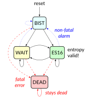
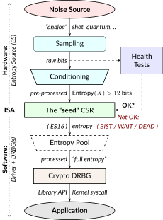
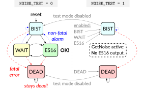

# 32.1. Cryptography Extensions: Scalar &amp; Entropy Source Instructions, Version 1.0.1

## [](#crypto%5Fscalar%5Finstructions)32.1\. Cryptography Extensions: Scalar & Entropy Source Instructions, Version 1.0.1

### [](#crypto%5Fscalar%5Fintroduction)32.1.1\. Introduction

This document describes the _scalar_ cryptography extension for RISC-V. All instructions described herein use the general-purpose `X`registers, and obey the 2-read-1-write register access constraint. These instructions are designed to be lightweight and suitable for `32` and `64` bit base architectures; from embedded IoT class cores to large, application class cores which do not implement a vector unit.

This document also describes the architectural interface to an Entropy Source, which can be used to generate cryptographic secrets. This is found in [32.1.4\. Entropy Source](#crypto%5Fscalar%5Fes).

It also contains a mechanism allowing core implementers to provide_"Constant Time Execution"_ guarantees in [32.1.5\. Data Independent Execution Latency Subset: Zkt](#crypto%5Fscalar%5Fzkt).

#### [](#crypto%5Fscalar%5Faudience)32.1.1.1\. Intended Audience

Cryptography is a specialised subject, requiring people with many different backgrounds to cooperate in its secure and efficient implementation. Where possible, we have written this specification to be understandable by all, though we recognise that the motivations and references to algorithms or other specifications and standards may be unfamiliar to those who are not domain experts.

This specification anticipates being read and acted on by various people with different backgrounds. We have tried to capture these backgrounds here, with a brief explanation of what we expect them to know, and how it relates to the specification. We hope this aids people’s understanding of which aspects of the specification are particularly relevant to them, and which they may (safely!) ignore or pass to a colleague.

Cryptographers and cryptographic software developers

These are the people we expect to write code using the instructions in this specification. They should understand fairly obviously the motivations for the instructions we include, and be familiar with most of the algorithms and outside standards to which we refer. We expect the sections on constant time execution ([32.1.5\. Data Independent Execution Latency Subset: Zkt](#crypto%5Fscalar%5Fzkt)) and the entropy source ([32.1.4\. Entropy Source](#crypto%5Fscalar%5Fes)) to be chiefly understood with their help.

Computer architects

We do not expect architects to have a cryptography background. We nonetheless expect architects to be able to examine our instructions for implementation issues, understand how the instructions will be used in context, and advise on how best to fit the functionality the cryptographers want to the ISA interface.

Digital design engineers & micro-architects

These are the people who will implement the specification inside a core. Again, no cryptography expertise is assumed, but we expect them to interpret the specification and anticipate any hardware implementation issues, e.g., where high-frequency design considerations apply, or where latency/area tradeoffs exist etc. In particular, they should be aware of the literature around efficiently implementing AES and SM4 SBoxes in hardware.

Verification engineers

Responsible for ensuring the correct implementation of the extension in hardware. No cryptography background is assumed. We expect them to identify interesting test cases from the specification. An understanding of their real-world usage will help with this. We do not expect verification engineers in this sense to be experts in entropy source design or certification, since this is a very specialised area. We do expect them however to identify all of the _architectural_test cases around the entropy source interface.

These are by no means the only people concerned with the specification, but they are the ones we considered most while writing it.

#### [](#crypto%5Fscalar%5Fsail%5Fspecifications)32.1.1.2\. Sail Specifications

RISC-V maintains a[formal model](https://github.com/riscv/sail-riscv)of the ISA specification, implemented in the Sail ISA specification language \[[27](../biblio/bibliography.html#bib-sail)\]. Note that _Sail_ refers to the specification language itself, and that there is a _model of RISC-V_, written using Sail. It is not correct to refer to "the Sail model". This is ambiguous, given there are many models of different ISAs implemented using Sail. We refer to the Sail implementation of RISC-V as "the RISC-V Sail model".

The Cryptography extension uses inline Sail code snippets from the actual model to give canonical descriptions of instruction functionality. Each instruction is accompanied by its expression in Sail, and includes calls to supporting functions which are too verbose to include directly in the specification. This supporting code is listed in[32.1.9\. Supporting Sail Code](#crypto%5Fscalar%5Fappx%5Fsail). The[Sail Manual](https://alasdair.github.io/manual.html)is recommended reading in order to best understand the code snippets.

Note that this document contains only a subset of the formal model: refer to the formal model GitHub[repository](https://github.com/riscv/sail-riscv)for the complete model.

#### [](#crypto%5Fscalar%5Fpolicies)32.1.1.3\. Policies

In creating this proposal, we tried to adhere to the following policies:

* Where there is a choice between:  
   1. supporting diverse implementation strategies for an algorithm or  
   2. supporting a single implementation style which is more performant / less expensive; the crypto extension will pick the more constrained but performant option. This fits a common pattern in other parts of the RISC-V specification, where recommended (but not required) instruction sequences for performing particular tasks are given as an example, such that both hardware and software implementers can optimise for only a single use-case.
* The extension will be designed to support _existing_ standardised cryptographic constructs well. It will not try to support proposed standards, or cryptographic constructs which exist only in academia. Cryptographic standards which are settled upon concurrently with or after the RISC-V cryptographic extension standardisation will be dealt with by future additions to, or versions of, the RISC-V cryptographic standard extension. It is anticipated that the NIST Lightweight Cryptography contest and the NIST Post-Quantum Cryptography contest may be dealt with this way, depending on timescales.
* Historically, there has been some discussion \[[28](../biblio/bibliography.html#bib-lsyrr:04)\] on how newly supported operations in general-purpose computing might enable new bases for cryptographic algorithms. The standard will not try to anticipate new useful low-level operations which _may_ be useful as building blocks for future cryptographic constructs.
* Regarding side-channel countermeasures: Where relevant, proposed instructions must aim to remove the possibility of any timing side-channels. For side-channels based on power or electro-magnetic (EM) measurements, the extension will not aim to support countermeasures which are implemented above the ISA abstraction layer. Recommendations will be given where relevant on how micro-architectures can implement instructions in a power/EM side-channel resistant way.

### [](#crypto%5Fscalar%5Fextensions)32.1.2\. Extensions Overview

The group of extensions introduced by the Scalar Cryptography Instruction Set Extension is listed here.

Detection of individual cryptography extensions uses the unified software-based RISC-V discovery method.

| |  At the time of writing, these discovery mechanisms are still a work in progress. |
| ----------------------------------------------------------------------------------- |

| |  A note on extension rationale Specialist encryption and decryption instructions are separated into different functional groups because some use cases (e.g., Galois/Counter Mode in TLS 1.3) do not require decryption functionality. The NIST and ShangMi algorithms suites are separated because their usefulness is heavily dependent on the countries a device is expected to operate in. NIST ciphers are a part of most standardised internet protocols, while ShangMi ciphers are required for use in China. |
| ---------------------------------------------------------------------------------------------------------------------------------------------------------------------------------------------------------------------------------------------------------------------------------------------------------------------------------------------------------------------------------------------------------------------------------------------------------------------------------------------------------------------- |

#### [](#zbkb-sc)32.1.2.1\. `Zbkb` \- Bitmanip instructions for Cryptography

This extension contains bit-manipulation instructions that are particularly useful for cryptography, most of which are also in the `Zbb` extension. Please refer to [Bit-manipulation for Cryptography](b-st-ext.html#zbkb) for more information.

#### [](#zbkc-sc)32.1.2.2\. `Zbkc` \- Carry-less multiply instructions

Constant time carry-less multiply for Galois/Counter Mode. These are separated from the [Bit-manipulation for Cryptography](b-st-ext.html#zbkb) because they have a considerable implementation overhead which cannot be amortised across other instructions.

Please refer to [Carry-less multiplication for Cryptography](b-st-ext.html#zbkc).

#### [](#zbkx-sc)32.1.2.3\. `Zbkx` \- Crossbar permutation instructions

These instructions are useful for implementing SBoxes in constant time, and potentially with DPA protections. These are separated from the [Bit-manipulation for Cryptography](b-st-ext.html#zbkb) because they have an implementation overhead which cannot be amortised across other instructions.

Please refer to [Crossbar permutation instructions](b-st-ext.html#zbkx).

#### [](#zknd)32.1.2.4\. `Zknd` \- NIST Suite: AES Decryption

Instructions for accelerating the decryption and key-schedule functions of the AES block cipher.

| RV32 | RV64      | Mnemonic                                                    | Instruction |
| ---- | --------- | ----------------------------------------------------------- | ----------- |
| ✓    | aes32dsi  | [AES final round decrypt (RV32)](#insns-aes32dsi)           |             |
| ✓    | aes32dsmi | [AES middle round decrypt (RV32)](#insns-aes32dsmi)         |             |
| ✓    | aes64ds   | [AES decrypt final round (RV64)](#insns-aes64ds)            |             |
| ✓    | aes64dsm  | [AES decrypt middle round (RV64)](#insns-aes64dsm)          |             |
| ✓    | aes64im   | [AES Decrypt KeySchedule MixColumns (RV64)](#insns-aes64im) |             |
| ✓    | aes64ks1i | [AES Key Schedule Instruction 1 (RV64)](#insns-aes64ks1i)   |             |
| ✓    | aes64ks2  | [AES Key Schedule Instruction 2 (RV64)](#insns-aes64ks2)    |             |

| |  The [AES Key Schedule Instruction 1 (RV64)](#insns-aes64ks1i) and [AES Key Schedule Instruction 2 (RV64)](#insns-aes64ks2) instructions are present in both the [Zknd](#zknd) and [Zkne](#zkne) extensions. |
| -------------------------------------------------------------------------------------------------------------------------------------------------------------------------------------------------------------- |

#### [](#zkne)32.1.2.5\. `Zkne` \- NIST Suite: AES Encryption

Instructions for accelerating the encryption and key-schedule functions of the AES block cipher.

| RV32 | RV64      | Mnemonic                                                       | Instruction |
| ---- | --------- | -------------------------------------------------------------- | ----------- |
| ✓    | aes32esi  | [AES final round encrypt (RV32)](#insns-aes32esi)              |             |
| ✓    | aes32esmi | [AES middle round encrypt (RV32)](#insns-aes32esmi)            |             |
| ✓    | aes64es   | [AES encrypt final round instruction (RV64)](#insns-aes64es)   |             |
| ✓    | aes64esm  | [AES encrypt middle round instruction (RV64)](#insns-aes64esm) |             |
| ✓    | aes64ks1i | [AES Key Schedule Instruction 1 (RV64)](#insns-aes64ks1i)      |             |
| ✓    | aes64ks2  | [AES Key Schedule Instruction 2 (RV64)](#insns-aes64ks2)       |             |

| |  The[aes64ks1i](#insns-aes64ks1i)and[aes64ks2](#insns-aes64ks2)instructions are present in both the [Zknd](#zknd) and [Zkne](#zkne) extensions. |
| ------------------------------------------------------------------------------------------------------------------------------------------------- |

#### [](#zknh)32.1.2.6\. `Zknh` \- NIST Suite: Hash Function Instructions

Instructions for accelerating the SHA2 family of cryptographic hash functions, as specified in \[[29](../biblio/bibliography.html#bib-nist:fips:180:4)\].

| RV32 | RV64        | Mnemonic                                                | Instruction                                      |
| ---- | ----------- | ------------------------------------------------------- | ------------------------------------------------ |
| ✓    | ✓           | sha256sig0                                              | [SHA2-256 Sigma0 instruction](#insns-sha256sig0) |
| ✓    | ✓           | sha256sig1                                              | [SHA2-256 Sigma1 instruction](#insns-sha256sig1) |
| ✓    | ✓           | sha256sum0                                              | [SHA2-256 Sum0 instruction](#insns-sha256sum0)   |
| ✓    | ✓           | sha256sum1                                              | [SHA2-256 Sum1 instruction](#insns-sha256sum1)   |
| ✓    | sha512sig0h | [SHA2-512 Sigma0 high (RV32)](#insns-sha512sig0h)       |                                                  |
| ✓    | sha512sig0l | [SHA2-512 Sigma0 low (RV32)](#insns-sha512sig0l)        |                                                  |
| ✓    | sha512sig1h | [SHA2-512 Sigma1 high (RV32)](#insns-sha512sig1h)       |                                                  |
| ✓    | sha512sig1l | [SHA2-512 Sigma1 low (RV32)](#insns-sha512sig1l)        |                                                  |
| ✓    | sha512sum0r | [SHA2-512 Sum0 (RV32)](#insns-sha512sum0r)              |                                                  |
| ✓    | sha512sum1r | [SHA2-512 Sum1 (RV32)](#insns-sha512sum1r)              |                                                  |
| ✓    | sha512sig0  | [SHA2-512 Sigma0 instruction (RV64)](#insns-sha512sig0) |                                                  |
| ✓    | sha512sig1  | [SHA2-512 Sigma1 instruction (RV64)](#insns-sha512sig1) |                                                  |
| ✓    | sha512sum0  | [SHA2-512 Sum0 instruction (RV64)](#insns-sha512sum0)   |                                                  |
| ✓    | sha512sum1  | [SHA2-512 Sum1 instruction (RV64)](#insns-sha512sum1)   |                                                  |

#### [](#zksed)32.1.2.7\. `Zksed` \- ShangMi Suite: SM4 Block Cipher Instructions

Instructions for accelerating the SM4 Block Cipher. Note that unlike AES, this cipher uses the same core operation for encryption and decryption, hence there is only one extension for it.

| RV32 | RV64 | Mnemonic | Instruction                                     |
| ---- | ---- | -------- | ----------------------------------------------- |
| ✓    | ✓    | sm4ed    | [SM4 Encrypt/Decrypt Instruction](#insns-sm4ed) |
| ✓    | ✓    | sm4ks    | [SM4 Key Schedule Instruction](#insns-sm4ks)    |

#### [](#zksh)32.1.2.8\. `Zksh` \- ShangMi Suite: SM3 Hash Function Instructions

Instructions for accelerating the SM3 hash function.

| RV32 | RV64 | Mnemonic | Instruction                      |
| ---- | ---- | -------- | -------------------------------- |
| ✓    | ✓    | sm3p0    | [SM3 P0 transform](#insns-sm3p0) |
| ✓    | ✓    | sm3p1    | [SM3 P1 transform](#insns-sm3p1) |

#### [](#zkr)32.1.2.9\. `Zkr` \- Entropy Source Extension

The entropy source extension defines the `seed` CSR at address `0x015`. This CSR provides up to 16 physical `entropy` bits that can be used to seed cryptographic random bit generators.

See [32.1.4\. Entropy Source](#crypto%5Fscalar%5Fes) for the normative specification and access control notes. [32.1.7\. Entropy Source Rationale and Recommendations](#crypto%5Fscalar%5Fappx%5Fes) contains design rationale and further recommendations to implementers.

#### [](#zkn)32.1.2.10\. `Zkn` \- NIST Algorithm Suite

This extension is shorthand for the following set of other extensions:

| Included Extension | Description                                    |
| ------------------ | ---------------------------------------------- |
| [Zbkb](#zbkb-sc)   | Bitmanipulation instructions for cryptography. |
| [Zbkc](#zbkc-sc)   | Carry-less multiply instructions.              |
| [Zbkx](#zbkx-sc)   | Cross-bar Permutation instructions.            |
| [Zkne](#zkne)      | AES encryption instructions.                   |
| [Zknd](#zknd)      | AES decryption instructions.                   |
| [Zknh](#zknh)      | SHA2 hash function instructions.               |

A core which implements `Zkn` must implement all of the above extensions.

#### [](#zks)32.1.2.11\. `Zks` \- ShangMi Algorithm Suite

This extension is shorthand for the following set of other extensions:

| Included Extension | Description                                    |
| ------------------ | ---------------------------------------------- |
| [Zbkb](#zbkb-sc)   | Bitmanipulation instructions for cryptography. |
| [Zbkc](#zbkc-sc)   | Carry-less multiply instructions.              |
| [Zbkx](#zbkx-sc)   | Cross-bar Permutation instructions.            |
| [Zksed](#zksed)    | SM4 block cipher instructions.                 |
| [Zksh](#zksh)      | SM3 hash function instructions.                |

A core which implements `Zks` must implement all of the above extensions.

#### [](#zk)32.1.2.12\. `Zk` \- Standard scalar cryptography extension

This extension is shorthand for the following set of other extensions:

| Included Extension            | Description                                   |
| ----------------------------- | --------------------------------------------- |
| [Zkn](#zkn)                   | NIST Algorithm suite extension.               |
| [Zkr](#zkr)                   | Entropy Source extension.                     |
| [Zkt](#crypto%5Fscalar%5Fzkt) | Data independent execution latency extension. |

A core which implements `Zk` must implement all of the above extensions.

#### [](#32-1-2-13-zkt-data-independent-execution-latency)32.1.2.13\. `Zkt` \- Data Independent Execution Latency

This extension allows CPU implementers to indicate to cryptographic software developers that a subset of RISC-V instructions are guaranteed to be implemented such that their execution latency is independent of the data values they operate on. A complete description of this extension is found in[32.1.5\. Data Independent Execution Latency Subset: Zkt](#crypto%5Fscalar%5Fzkt).

### [](#crypto%5Fscalar%5Finsns)32.1.3\. Instructions

#### [](#insns-aes32dsi)32.1.3.1\. aes32dsi

Synopsis

AES final round decryption instruction for RV32.

Mnemonic

aes32dsi rd, rs1, rs2, bs

Encoding

 

Description

This instruction sources a single byte from `rs2` according to `bs`. To this it applies the inverse AES SBox operation, and XOR’s the result with`rs1`. This instruction must _always_ be implemented such that its execution latency does not depend on the data being operated on.

Operation

```sail
function clause execute (AES32DSI (bs,rs2,rs1,rd)) = {
  let shamt   : bits( 5) = bs @ 0b000; /* shamt = bs*8 */
  let si      : bits( 8) = (X(rs2)[31..0] >> shamt)[7..0]; /* SBox Input */
  let so      : bits(32) = 0x000000 @ aes_sbox_inv(si);
  let result  : bits(32) = X(rs1)[31..0] ^ rol32(so, unsigned(shamt));
  X(rd) = EXTS(result); RETIRE_SUCCESS
}
```

Included in

| Extension            | Minimum version | Lifecycle state |
| -------------------- | --------------- | --------------- |
| [Zknd](#zknd) (RV32) | v1.0.0          | Ratified        |
| [Zkn](#zkn) (RV32)   | v1.0.0          | Ratified        |
| [Zk](#zk) (RV32)     | v1.0.0          | Ratified        |

#### [](#insns-aes32dsmi)32.1.3.2\. aes32dsmi

Synopsis

AES middle round decryption instruction for RV32.

Mnemonic

aes32dsmi rd, rs1, rs2, bs

Encoding

 

Description

This instruction sources a single byte from `rs2` according to `bs`. To this it applies the inverse AES SBox operation, and a partial inverse MixColumn, before XOR’ing the result with `rs1`. This instruction must _always_ be implemented such that its execution latency does not depend on the data being operated on.

Operation

```sail
function clause execute (AES32DSMI (bs,rs2,rs1,rd)) = {
  let shamt   : bits( 5) = bs @ 0b000; /* shamt = bs*8 */
  let si      : bits( 8) = (X(rs2)[31..0] >> shamt)[7..0]; /* SBox Input */
  let so      : bits( 8) = aes_sbox_inv(si);
  let mixed   : bits(32) = aes_mixcolumn_byte_inv(so);
  let result  : bits(32) = X(rs1)[31..0] ^ rol32(mixed, unsigned(shamt));
  X(rd) = EXTS(result); RETIRE_SUCCESS
}
```

Included in

| Extension            | Minimum version | Lifecycle state |
| -------------------- | --------------- | --------------- |
| [Zknd](#zknd) (RV32) | v1.0.0          | Ratified        |
| [Zkn](#zkn) (RV32)   | v1.0.0          | Ratified        |
| [Zk](#zk) (RV32)     | v1.0.0          | Ratified        |

#### [](#insns-aes32esi)32.1.3.3\. aes32esi

Synopsis

AES final round encryption instruction for RV32.

Mnemonic

aes32esi rd, rs1, rs2, bs

Encoding

 

Description

This instruction sources a single byte from `rs2` according to `bs`. To this it applies the forward AES SBox operation, before XOR’ing the result with `rs1`. This instruction must _always_ be implemented such that its execution latency does not depend on the data being operated on.

Operation

```sail
function clause execute (AES32ESI (bs,rs2,rs1,rd)) = {
  let shamt   : bits( 5) = bs @ 0b000; /* shamt = bs*8 */
  let si      : bits( 8) = (X(rs2)[31..0] >> shamt)[7..0]; /* SBox Input */
  let so      : bits(32) = 0x000000 @ aes_sbox_fwd(si);
  let result  : bits(32) = X(rs1)[31..0] ^ rol32(so, unsigned(shamt));
  X(rd) = EXTS(result); RETIRE_SUCCESS
}
```

Included in

| Extension            | Minimum version | Lifecycle state |
| -------------------- | --------------- | --------------- |
| [Zkne](#zkne) (RV32) | v1.0.0          | Ratified        |
| [Zkn](#zkn) (RV32)   | v1.0.0          | Ratified        |
| [Zk](#zk) (RV32)     | v1.0.0          | Ratified        |

#### [](#insns-aes32esmi)32.1.3.4\. aes32esmi

Synopsis

AES middle round encryption instruction for RV32.

Mnemonic

aes32esmi rd, rs1, rs2, bs

Encoding

 

Description

This instruction sources a single byte from `rs2` according to `bs`. To this it applies the forward AES SBox operation, and a partial forward MixColumn, before XOR’ing the result with `rs1`. This instruction must _always_ be implemented such that its execution latency does not depend on the data being operated on.

Operation

```sail
function clause execute (AES32ESMI (bs,rs2,rs1,rd)) = {
  let shamt   : bits( 5) = bs @ 0b000; /* shamt = bs*8 */
  let si      : bits( 8) = (X(rs2)[31..0] >> shamt)[7..0]; /* SBox Input */
  let so      : bits( 8) = aes_sbox_fwd(si);
  let mixed   : bits(32) = aes_mixcolumn_byte_fwd(so);
  let result  : bits(32) = X(rs1)[31..0] ^ rol32(mixed, unsigned(shamt));
  X(rd) = EXTS(result); RETIRE_SUCCESS
}
```

Included in

| Extension            | Minimum version | Lifecycle state |
| -------------------- | --------------- | --------------- |
| [Zkne](#zkne) (RV32) | v1.0.0          | Ratified        |
| [Zkn](#zkn) (RV32)   | v1.0.0          | Ratified        |
| [Zk](#zk) (RV32)     | v1.0.0          | Ratified        |

#### [](#insns-aes64ds)32.1.3.5\. aes64ds

Synopsis

AES final round decryption instruction for RV64.

Mnemonic

aes64ds rd, rs1, rs2

Encoding

 

Description

Uses the two 64-bit source registers to represent the entire AES state, and produces _half_ of the next round output, applying the Inverse ShiftRows and SubBytes steps. This instruction must _always_ be implemented such that its execution latency does not depend on the data being operated on.

| |  Note To Software Developers The following code snippet shows the final round of the AES block decryption.t0 and t1 hold the current round state.t2 and t3 hold the next round state. aes64ds t2, t0, t1 aes64ds t3, t1, t0 Note the reversed register order of the second instruction. |
| ----------------------------------------------------------------------------------------------------------------------------------------------------------------------------------------------------------------------------------------------------------------------------------------- |

Operation

```sail
function clause execute (AES64DS(rs2, rs1, rd)) = {
  let sr : bits(64) = aes_rv64_shiftrows_inv(X(rs2)[63..0], X(rs1)[63..0]);
  let wd : bits(64) = sr[63..0];
  X(rd) = aes_apply_inv_sbox_to_each_byte(wd);
  RETIRE_SUCCESS
}
```

Included in

| Extension            | Minimum version | Lifecycle state |
| -------------------- | --------------- | --------------- |
| [Zknd](#zknd) (RV64) | v1.0.0          | Ratified        |
| [Zkn](#zkn) (RV64)   | v1.0.0          | Ratified        |
| [Zk](#zk) (RV64)     | v1.0.0          | Ratified        |

#### [](#insns-aes64dsm)32.1.3.6\. aes64dsm

Synopsis

AES middle round decryption instruction for RV64.

Mnemonic

aes64dsm rd, rs1, rs2

Encoding

 

Description

Uses the two 64-bit source registers to represent the entire AES state, and produces _half_ of the next round output, applying the Inverse ShiftRows, SubBytes and MixColumns steps. This instruction must _always_ be implemented such that its execution latency does not depend on the data being operated on.

| |  Note To Software Developers The following code snippet shows one middle round of the AES block decryption.t0 and t1 hold the current round state.t2 and t3 hold the next round state. aes64dsm t2, t0, t1 aes64dsm t3, t1, t0 Note the reversed register order of the second instruction. |
| -------------------------------------------------------------------------------------------------------------------------------------------------------------------------------------------------------------------------------------------------------------------------------------------- |

Operation

```sail
function clause execute (AES64DSM(rs2, rs1, rd)) = {
  let sr : bits(64) = aes_rv64_shiftrows_inv(X(rs2)[63..0], X(rs1)[63..0]);
  let wd : bits(64) = sr[63..0];
  let sb : bits(64) = aes_apply_inv_sbox_to_each_byte(wd);
  X(rd)  = aes_mixcolumn_inv(sb[63..32]) @ aes_mixcolumn_inv(sb[31..0]);
  RETIRE_SUCCESS
}
```

Included in

| Extension            | Minimum version | Lifecycle state |
| -------------------- | --------------- | --------------- |
| [Zknd](#zknd) (RV64) | v1.0.0          | Ratified        |
| [Zkn](#zkn) (RV64)   | v1.0.0          | Ratified        |
| [Zk](#zk) (RV64)     | v1.0.0          | Ratified        |

#### [](#insns-aes64es)32.1.3.7\. aes64es

Synopsis

AES final round encryption instruction for RV64.

Mnemonic

aes64es rd, rs1, rs2

Encoding

 

Description

Uses the two 64-bit source registers to represent the entire AES state, and produces _half_ of the next round output, applying the ShiftRows and SubBytes steps. This instruction must _always_ be implemented such that its execution latency does not depend on the data being operated on.

| |  Note To Software Developers The following code snippet shows the final round of the AES block encryption.t0 and t1 hold the current round state.t2 and t3 hold the next round state. aes64es t2, t0, t1 aes64es t3, t1, t0 Note the reversed register order of the second instruction. |
| ----------------------------------------------------------------------------------------------------------------------------------------------------------------------------------------------------------------------------------------------------------------------------------------- |

Operation

```sail
function clause execute (AES64ES(rs2, rs1, rd)) = {
  let sr : bits(64) = aes_rv64_shiftrows_fwd(X(rs2)[63..0], X(rs1)[63..0]);
  let wd : bits(64) = sr[63..0];
  X(rd) = aes_apply_fwd_sbox_to_each_byte(wd);
  RETIRE_SUCCESS
}
```

Included in

| Extension            | Minimum version | Lifecycle state |
| -------------------- | --------------- | --------------- |
| [Zkne](#zkne) (RV64) | v1.0.0          | Ratified        |
| [Zkn](#zkn) (RV64)   | v1.0.0          | Ratified        |
| [Zk](#zk) (RV64)     | v1.0.0          | Ratified        |

#### [](#insns-aes64esm)32.1.3.8\. aes64esm

Synopsis

AES middle round encryption instruction for RV64.

Mnemonic

aes64esm rd, rs1, rs2

Encoding

 

Description

Uses the two 64-bit source registers to represent the entire AES state, and produces _half_ of the next round output, applying the ShiftRows, SubBytes and MixColumns steps. This instruction must _always_ be implemented such that its execution latency does not depend on the data being operated on.

| |  Note To Software Developers The following code snippet shows one middle round of the AES block encryption.t0 and t1 hold the current round state.t2 and t3 hold the next round state. aes64esm t2, t0, t1 aes64esm t3, t1, t0 Note the reversed register order of the second instruction. |
| -------------------------------------------------------------------------------------------------------------------------------------------------------------------------------------------------------------------------------------------------------------------------------------------- |

Operation

```sail
function clause execute (AES64ESM(rs2, rs1, rd)) = {
  let sr : bits(64) = aes_rv64_shiftrows_fwd(X(rs2)[63..0], X(rs1)[63..0]);
  let wd : bits(64) = sr[63..0];
  let sb : bits(64) = aes_apply_fwd_sbox_to_each_byte(wd);
  X(rd)  =  aes_mixcolumn_fwd(sb[63..32]) @ aes_mixcolumn_fwd(sb[31..0]);
  RETIRE_SUCCESS
}
```

Included in

| Extension            | Minimum version | Lifecycle state |
| -------------------- | --------------- | --------------- |
| [Zkne](#zkne) (RV64) | v1.0.0          | Ratified        |
| [Zkn](#zkn) (RV64)   | v1.0.0          | Ratified        |
| [Zk](#zk) (RV64)     | v1.0.0          | Ratified        |

#### [](#insns-aes64im)32.1.3.9\. aes64im

Synopsis

This instruction accelerates the inverse MixColumns step of the AES Block Cipher, and is used to aid creation of the decryption KeySchedule.

Mnemonic

aes64im rd, rs1

Encoding

 

Description

The instruction applies the inverse MixColumns transformation to two columns of the state array, packed into a single 64-bit register. It is used to create the inverse cipher KeySchedule, according to the equivalent inverse cipher construction in \[[30](../biblio/bibliography.html#bib-nist:fips:197)\] (Page 23, Section 5.3.5). This instruction must _always_ be implemented such that its execution latency does not depend on the data being operated on.

Operation

```sail
function clause execute (AES64IM(rs1, rd)) = {
  let w0 : bits(32) = aes_mixcolumn_inv(X(rs1)[31.. 0]);
  let w1 : bits(32) = aes_mixcolumn_inv(X(rs1)[63..32]);
  X(rd)  = w1 @ w0;
  RETIRE_SUCCESS
}
```

Included in

| Extension            | Minimum version | Lifecycle state |
| -------------------- | --------------- | --------------- |
| [Zknd](#zknd) (RV64) | v1.0.0          | Ratified        |
| [Zkn](#zkn) (RV64)   | v1.0.0          | Ratified        |
| [Zk](#zk) (RV64)     | v1.0.0          | Ratified        |

#### [](#insns-aes64ks1i)32.1.3.10\. aes64ks1i

Synopsis

This instruction implements part of the KeySchedule operation for the AES Block cipher involving the SBox operation.

Mnemonic

aes64ks1i rd, rs1, rnum

Encoding

 

Description

This instruction implements the rotation, SubBytes and Round Constant addition steps of the AES block cipher Key Schedule. This instruction must _always_ be implemented such that its execution latency does not depend on the data being operated on. Note that `rnum` must be in the range `0x0..0xA`. The values `0xB..0xF` are reserved.

Operation

```sail
function clause execute (AES64KS1I(rnum, rs1, rd)) = {
  if(unsigned(rnum) > 10) then {
    handle_illegal();  RETIRE_SUCCESS
  } else {
    let tmp1 : bits(32) = X(rs1)[63..32];
    let rc   : bits(32) = aes_decode_rcon(rnum); /* round number -> round constant */
    let tmp2 : bits(32) = if (rnum ==0xA) then tmp1 else ror32(tmp1, 8);
    let tmp3 : bits(32) = aes_subword_fwd(tmp2);
    let result : bits(64) = (tmp3 ^ rc) @ (tmp3 ^ rc);
    X(rd) = EXTZ(result);
    RETIRE_SUCCESS
  }
}
```

Included in

| Extension            | Minimum version | Lifecycle state |
| -------------------- | --------------- | --------------- |
| [Zkne](#zkne) (RV64) | v1.0.0          | Ratified        |
| [Zknd](#zknd) (RV64) | v1.0.0          | Ratified        |
| [Zkn](#zkn) (RV64)   | v1.0.0          | Ratified        |
| [Zk](#zk) (RV64)     | v1.0.0          | Ratified        |

#### [](#insns-aes64ks2)32.1.3.11\. aes64ks2

Synopsis

This instruction implements part of the KeySchedule operation for the AES Block cipher.

Mnemonic

aes64ks2 rd, rs1, rs2

Encoding

 

Description

This instruction implements the additional XOR’ing of key words as part of the AES block cipher Key Schedule. This instruction must _always_ be implemented such that its execution latency does not depend on the data being operated on.

Operation

```sail
function clause execute (AES64KS2(rs2, rs1, rd)) = {
  let w0 : bits(32) = X(rs1)[63..32] ^ X(rs2)[31..0];
  let w1 : bits(32) = X(rs1)[63..32] ^ X(rs2)[31..0] ^ X(rs2)[63..32];
  X(rd)  = w1 @ w0;
  RETIRE_SUCCESS
}
```

Included in

| Extension            | Minimum version | Lifecycle state |
| -------------------- | --------------- | --------------- |
| [Zkne](#zkne) (RV64) | v1.0.0          | Ratified        |
| [Zknd](#zknd) (RV64) | v1.0.0          | Ratified        |
| [Zkn](#zkn) (RV64)   | v1.0.0          | Ratified        |
| [Zk](#zk) (RV64)     | v1.0.0          | Ratified        |

#### [](#insns-andn-sc)32.1.3.12\. andn

Synopsis

AND with inverted operand

Mnemonic

andn _rd_, _rs1_, _rs2_

Encoding

 

Description

This instruction performs the bitwise logical AND operation between _rs1_ and the bitwise inversion of _rs2_.

Operation

```sail
X(rd) = X(rs1) & ~X(rs2);
```

Included in

| Extension                      | Minimum version | Lifecycle state |
| ------------------------------ | --------------- | --------------- |
| Zbb ([Zbb](b-st-ext.html#zbb)) | 1.0.0           | Ratified        |
| Zbkb ([Zbkb](#zbkb-sc))        | v1.0.0-rc4      | Ratified        |

#### [](#insns-brev8-sc)32.1.3.13\. brev8

Synopsis

Reverse the bits in each byte of a source register.

Mnemonic

brev8 _rd_, _rs_

Encoding

 

Description

This instruction reverses the order of the bits in every byte of a register.

Operation

```sail
result : xlenbits = EXTZ(0b0);
foreach (i from 0 to sizeof(xlen) by 8) {
    result[i+7..i] = reverse_bits_in_byte(X(rs1)[i+7..i]);
};
X(rd) = result;
```

Included in

| Extension               | Minimum version | Lifecycle state |
| ----------------------- | --------------- | --------------- |
| Zbkb ([Zbkb](#zbkb-sc)) | v1.0.0-rc4      | Ratified        |

#### [](#insns-clmul-sc)32.1.3.14\. clmul

Synopsis

Carry-less multiply (low-part)

Mnemonic

clmul _rd_, _rs1_, _rs2_

Encoding

 

Description

clmul produces the lower half of the 2·XLEN carry-less product.

Operation

```sail
let rs1_val = X(rs1);
let rs2_val = X(rs2);
let output : xlenbits = 0;

foreach (i from 0 to (xlen - 1) by 1) {
   output = if   ((rs2_val >> i) & 1)
            then output ^ (rs1_val << i);
            else output;
}

X[rd] = output
```

Included in

| Extension                      | Minimum version | Lifecycle state |
| ------------------------------ | --------------- | --------------- |
| Zbc ([Zbc](b-st-ext.html#zbc)) | 1.0.0           | Ratified        |
| Zbkc ([Zbkc](#zbkc-sc))        | v1.0.0-rc4      | Ratified        |

#### [](#insns-clmulh-sc)32.1.3.15\. clmulh

Synopsis

Carry-less multiply (high-part)

Mnemonic

clmulh _rd_, _rs1_, _rs2_

Encoding

 

Description

clmulh produces the upper half of the 2·XLEN carry-less product.

Operation

```sail
let rs1_val = X(rs1);
let rs2_val = X(rs2);
let output : xlenbits = 0;

foreach (i from 1 to xlen by 1) {
   output = if   ((rs2_val >> i) & 1)
            then output ^ (rs1_val >> (xlen - i));
            else output;
}

X[rd] = output
```

Included in

| Extension                      | Minimum version | Lifecycle state |
| ------------------------------ | --------------- | --------------- |
| Zbc ([Zbc](b-st-ext.html#zbc)) | 1.0.0           | Ratified        |
| Zbkc ([Zbkc](#zbkc-sc))        | v1.0.0-rc4      | Ratified        |

#### [](#insns-orn-sc)32.1.3.16\. orn

Synopsis

OR with inverted operand

Mnemonic

orn _rd_, _rs1_, _rs2_

Encoding

 

Description

This instruction performs the bitwise logical OR operation between _rs1_ and the bitwise inversion of _rs2_.

Operation

```sail
X(rd) = X(rs1) | ~X(rs2);
```

Included in

| Extension                      | Minimum version | Lifecycle state |
| ------------------------------ | --------------- | --------------- |
| Zbb ([Zbb](b-st-ext.html#zbb)) | v1.0.0          | Ratified        |
| Zbkb ([Zbkb](#zbkb-sc))        | v1.0.0-rc4      | Ratified        |

#### [](#insns-pack-sc)32.1.3.17\. pack

Synopsis

Pack the low halves of _rs1_ and _rs2_ into _rd_.

Mnemonic

pack _rd_, _rs1_, _rs2_

Encoding

 

Description

The pack instruction packs the XLEN/2-bit lower halves of _rs1_ and _rs2_ into_rd_, with _rs1_ in the lower half and _rs2_ in the upper half.

Operation

```sail
let lo_half : bits(xlen/2) = X(rs1)[xlen/2-1..0];
let hi_half : bits(xlen/2) = X(rs2)[xlen/2-1..0];
X(rd) = EXTZ(hi_half @ lo_half);
```

Included in

| Extension               | Minimum version | Lifecycle state |
| ----------------------- | --------------- | --------------- |
| Zbkb ([Zbkb](#zbkb-sc)) | v1.0.0-rc4      | Ratified        |

#### [](#insns-packh-sc)32.1.3.18\. packh

Synopsis

Pack the low bytes of _rs1_ and _rs2_ into _rd_.

Mnemonic

packh _rd_, _rs1_, _rs2_

Encoding

 

Description

And the packh instruction packs the least-significant bytes of_rs1_ and _rs2_ into the 16 least-significant bits of _rd_, zero extending the rest of _rd_.

Operation

```sail
let lo_half : bits(8) = X(rs1)[7..0];
let hi_half : bits(8) = X(rs2)[7..0];
X(rd) = EXTZ(hi_half @ lo_half);
```

Included in

| Extension               | Minimum version | Lifecycle state |
| ----------------------- | --------------- | --------------- |
| Zbkb ([Zbkb](#zbkb-sc)) | v1.0.0-rc4      | Ratified        |

#### [](#insns-packw-sc)32.1.3.19\. packw

Synopsis

Pack the low 16-bits of _rs1_ and _rs2_ into _rd_ on RV64.

Mnemonic

packw _rd_, _rs1_, _rs2_

Encoding

 

Description

This instruction packs the low 16 bits of_rs1_ and _rs2_ into the 32 least-significant bits of _rd_, sign extending the 32-bit result to the rest of _rd_. This instruction only exists on RV64 based systems.

Operation

```sail
let lo_half : bits(16) = X(rs1)[15..0];
let hi_half : bits(16) = X(rs2)[15..0];
X(rd) = EXTS(hi_half @ lo_half);
```

Included in

| Extension               | Minimum version | Lifecycle state |
| ----------------------- | --------------- | --------------- |
| Zbkb ([Zbkb](#zbkb-sc)) | v1.0.0-rc4      | Ratified        |

#### [](#insns-rev8-sc)32.1.3.20\. rev8

Synopsis

Byte-reverse register

Mnemonic

rev8 _rd_, _rs_

Encoding (RV32)

 

Encoding (RV64)

 

Description

This instruction reverses the order of the bytes in _rs_.

Operation

```sail
let input = X(rs);
let output : xlenbits = 0;
let j = xlen - 1;

foreach (i from 0 to (xlen - 8) by 8) {
   output[i..(i + 7)] = input[(j - 7)..j];
   j = j - 8;
}

X[rd] = output
```

| |  Note The **rev8** mnemonic corresponds to different instruction encodings in RV32 and RV64. |
| ---------------------------------------------------------------------------------------------- |

| |  Software Hint The byte-reverse operation is only available for the full register width. To emulate word-sized and halfword-sized byte-reversal, perform a rev8 rd,rs followed by a srai rd,rd,K, where K is XLEN-32 and XLEN-16, respectively. |
| ------------------------------------------------------------------------------------------------------------------------------------------------------------------------------------------------------------------------------------------------- |

Included in

| Extension                      | Minimum version | Lifecycle state |
| ------------------------------ | --------------- | --------------- |
| Zbb ([Zbb](b-st-ext.html#zbb)) | v1.0.0          | Ratified        |
| Zbkb ([Zbkb](#zbkb-sc))        | v1.0.0-rc4      | Ratified        |

#### [](#insns-rol-sc)32.1.3.21\. rol

Synopsis

Rotate Left (Register)

Mnemonic

rol _rd_, _rs1_, _rs2_

Encoding

 

Description

This instruction performs a rotate left of _rs1_ by the amount in least-significant log2(XLEN) bits of _rs2_.

Operation

```sail
let shamt = if   xlen == 32
            then X(rs2)[4..0]
            else X(rs2)[5..0];
let result = (X(rs1) << shamt) | (X(rs1) >> (xlen - shamt));

X(rd) = result;
```

Included in

| Extension                      | Minimum version | Lifecycle state |
| ------------------------------ | --------------- | --------------- |
| Zbb ([Zbb](b-st-ext.html#zbb)) | v1.0.0          | Ratified        |
| Zbkb ([Zbkb](#zbkb-sc))        | v1.0.0-rc4      | Ratified        |

#### [](#insns-rolw-sc)32.1.3.22\. rolw

Synopsis

Rotate Left Word (Register)

Mnemonic

rolw _rd_, _rs1_, _rs2_

Encoding

 

Description

This instruction performs a rotate left on the least-significant word of _rs1_ by the amount in least-significant 5 bits of _rs2_. The resulting word value is sign-extended by copying bit 31 to all of the more-significant bits.

Operation

```sail
let rs1 = EXTZ(X(rs1)[31..0])
let shamt = X(rs2)[4..0];
let result = (rs1 << shamt) | (rs1 >> (32 - shamt));
X(rd) = EXTS(result[31..0]);
```

Included in

| Extension                      | Minimum version | Lifecycle state |
| ------------------------------ | --------------- | --------------- |
| Zbb ([Zbb](b-st-ext.html#zbb)) | v1.0.0          | Ratified        |
| Zbkb ([Zbkb](#zbkb-sc))        | v1.0.0-rc4      | Ratified        |

#### [](#insns-ror-sc)32.1.3.23\. ror

Synopsis

Rotate Right

Mnemonic

ror _rd_, _rs1_, _rs2_

Encoding

 

Description

This instruction performs a rotate right of _rs1_ by the amount in least-significant log2(XLEN) bits of _rs2_.

Operation

```sail
let shamt = if   xlen == 32
            then X(rs2)[4..0]
            else X(rs2)[5..0];
let result = (X(rs1) >> shamt) | (X(rs1) << (xlen - shamt));

X(rd) = result;
```

Included in

| Extension                      | Minimum version | Lifecycle state |
| ------------------------------ | --------------- | --------------- |
| Zbb ([Zbb](b-st-ext.html#zbb)) | v1.0.0          | Ratified        |
| Zbkb ([Zbkb](#zbkb-sc))        | v1.0.0-rc4      | Ratified        |

#### [](#insns-rori-sc)32.1.3.24\. rori

Synopsis

Rotate Right (Immediate)

Mnemonic

rori _rd_, _rs1_, _shamt_

Encoding (RV32)

 

Encoding (RV64)

 

Description

This instruction performs a rotate right of _rs1_ by the amount in the least-significant log2(XLEN) bits of _shamt_. For RV32, the encodings corresponding to shamt\[5\]=1 are reserved.

Operation

```sail
let shamt = if   xlen == 32
            then shamt[4..0]
            else shamt[5..0];
let result = (X(rs1) >> shamt) | (X(rs1) << (xlen - shamt));

X(rd) = result;
```

Included in

| Extension                      | Minimum version | Lifecycle state |
| ------------------------------ | --------------- | --------------- |
| Zbb ([Zbb](b-st-ext.html#zbb)) | v1.0.0          | Ratified        |
| Zbkb ([Zbkb](#zbkb-sc))        | v1.0.0-rc4      | Ratified        |

#### [](#insns-roriw-sc)32.1.3.25\. roriw

Synopsis

Rotate Right Word by Immediate

Mnemonic

roriw _rd_, _rs1_, _shamt_

Encoding

 

Description

This instruction performs a rotate right on the least-significant word of _rs1_ by the amount in the least-significant log2(XLEN) bits of_shamt_. The resulting word value is sign-extended by copying bit 31 to all of the more-significant bits.

Operation

```sail
let rs1_data = EXTZ(X(rs1)[31..0];
let result = (rs1_data >> shamt) | (rs1_data << (32 - shamt));
X(rd) = EXTS(result[31..0]);
```

Included in

| Extension                      | Minimum version | Lifecycle state |
| ------------------------------ | --------------- | --------------- |
| Zbb ([Zbb](b-st-ext.html#zbb)) | v1.0.0          | Ratified        |
| Zbkb ([Zbkb](#zbkb-sc))        | v1.0.0-rc4      | Ratified        |

#### [](#insns-rorw-sc)32.1.3.26\. rorw

Synopsis

Rotate Right Word (Register)

Mnemonic

rorw _rd_, _rs1_, _rs2_

Encoding

 

Description

This instruction performs a rotate right on the least-significant word of _rs1_ by the amount in least-significant 5 bits of _rs2_. The resultant word is sign-extended by copying bit 31 to all of the more-significant bits.

Operation

```sail
let rs1 = EXTZ(X(rs1)[31..0])
let shamt = X(rs2)[4..0];
let result = (rs1 >> shamt) | (rs1 << (32 - shamt));
X(rd) = EXTS(result);
```

Included in

| Extension                      | Minimum version | Lifecycle state |
| ------------------------------ | --------------- | --------------- |
| Zbb ([Zbb](b-st-ext.html#zbb)) | v1.0.0          | Ratified        |
| Zbkb ([Zbkb](#zbkb-sc))        | v1.0.0-rc4      | Ratified        |

#### [](#insns-sha256sig0)32.1.3.27\. sha256sig0

Synopsis

Implements the Sigma0 transformation function as used in the SHA2-256 hash function \[[29](../biblio/bibliography.html#bib-nist:fips:180:4)\].

Mnemonic

sha256sig0 rd, rs1

Encoding

 

Description

This instruction is supported for both RV32 and RV64 base architectures. For RV32, the entire `XLEN` source register is operated on. For RV64, the low `32` bits of the source register are operated on, and the result sign extended to `XLEN` bits. Though named for SHA2-256, the instruction works for both the SHA2-224 and SHA2-256 parameterizations as described in \[[29](../biblio/bibliography.html#bib-nist:fips:180:4)\]. This instruction must _always_ be implemented such that its execution latency does not depend on the data being operated on.

Operation

```sail
function clause execute (SHA256SIG0(rs1,rd)) = {
  let inb    : bits(32) = X(rs1)[31..0];
  let result : bits(32) = ror32(inb,  7) ^ ror32(inb, 18) ^ (inb >>  3);
  X(rd)      = EXTS(result);
  RETIRE_SUCCESS
}
```

Included in

| Extension     | Minimum version | Lifecycle state |
| ------------- | --------------- | --------------- |
| [Zknh](#zknh) | v1.0.0          | Ratified        |
| [Zkn](#zkn)   | v1.0.0          | Ratified        |
| [Zk](#zk)     | v1.0.0          | Ratified        |

#### [](#insns-sha256sig1)32.1.3.28\. sha256sig1

Synopsis

Implements the Sigma1 transformation function as used in the SHA2-256 hash function \[[29](../biblio/bibliography.html#bib-nist:fips:180:4)\].

Mnemonic

sha256sig1 rd, rs1

Encoding

 

Description

This instruction is supported for both RV32 and RV64 base architectures. For RV32, the entire `XLEN` source register is operated on. For RV64, the low `32` bits of the source register are operated on, and the result sign extended to `XLEN` bits. Though named for SHA2-256, the instruction works for both the SHA2-224 and SHA2-256 parameterizations as described in \[[29](../biblio/bibliography.html#bib-nist:fips:180:4)\]. This instruction must _always_ be implemented such that its execution latency does not depend on the data being operated on.

Operation

```sail
function clause execute (SHA256SIG1(rs1,rd)) = {
  let inb    : bits(32) = X(rs1)[31..0];
  let result : bits(32) = ror32(inb, 17) ^ ror32(inb, 19) ^ (inb >> 10);
  X(rd)      = EXTS(result);
  RETIRE_SUCCESS
}
```

Included in

| Extension     | Minimum version | Lifecycle state |
| ------------- | --------------- | --------------- |
| [Zknh](#zknh) | v1.0.0          | Ratified        |
| [Zkn](#zkn)   | v1.0.0          | Ratified        |
| [Zk](#zk)     | v1.0.0          | Ratified        |

#### [](#insns-sha256sum0)32.1.3.29\. sha256sum0

Synopsis

Implements the Sum0 transformation function as used in the SHA2-256 hash function \[[29](../biblio/bibliography.html#bib-nist:fips:180:4)\].

Mnemonic

sha256sum0 rd, rs1

Encoding

 

Description

This instruction is supported for both RV32 and RV64 base architectures. For RV32, the entire `XLEN` source register is operated on. For RV64, the low `32` bits of the source register are operated on, and the result sign extended to `XLEN` bits. Though named for SHA2-256, the instruction works for both the SHA2-224 and SHA2-256 parameterizations as described in \[[29](../biblio/bibliography.html#bib-nist:fips:180:4)\]. This instruction must _always_ be implemented such that its execution latency does not depend on the data being operated on.

Operation

```sail
function clause execute (SHA256SUM0(rs1,rd)) = {
  let inb    : bits(32) = X(rs1)[31..0];
  let result : bits(32) = ror32(inb,  2) ^ ror32(inb, 13) ^ ror32(inb, 22);
  X(rd)      = EXTS(result);
  RETIRE_SUCCESS
}
```

Included in

| Extension     | Minimum version | Lifecycle state |
| ------------- | --------------- | --------------- |
| [Zknh](#zknh) | v1.0.0          | Ratified        |
| [Zkn](#zkn)   | v1.0.0          | Ratified        |
| [Zk](#zk)     | v1.0.0          | Ratified        |

#### [](#insns-sha256sum1)32.1.3.30\. sha256sum1

Synopsis

Implements the Sum1 transformation function as used in the SHA2-256 hash function \[[29](../biblio/bibliography.html#bib-nist:fips:180:4)\].

Mnemonic

sha256sum1 rd, rs1

Encoding

 

Description

This instruction is supported for both RV32 and RV64 base architectures. For RV32, the entire `XLEN` source register is operated on. For RV64, the low `32` bits of the source register are operated on, and the result sign extended to `XLEN` bits. Though named for SHA2-256, the instruction works for both the SHA2-224 and SHA2-256 parameterizations as described in \[[29](../biblio/bibliography.html#bib-nist:fips:180:4)\]. This instruction must _always_ be implemented such that its execution latency does not depend on the data being operated on.

Operation

```sail
function clause execute (SHA256SUM1(rs1,rd)) = {
  let inb    : bits(32) = X(rs1)[31..0];
  let result : bits(32) = ror32(inb,  6) ^ ror32(inb, 11) ^ ror32(inb, 25);
  X(rd)      = EXTS(result);
  RETIRE_SUCCESS
}
```

Included in

| Extension     | Minimum version | Lifecycle state |
| ------------- | --------------- | --------------- |
| [Zknh](#zknh) | v1.0.0          | Ratified        |
| [Zkn](#zkn)   | v1.0.0          | Ratified        |
| [Zk](#zk)     | v1.0.0          | Ratified        |

#### [](#insns-sha512sig0h)32.1.3.31\. sha512sig0h

Synopsis

Implements the _high half_ of the Sigma0 transformation, as used in the SHA2-512 hash function \[[29](../biblio/bibliography.html#bib-nist:fips:180:4)\].

Mnemonic

sha512sig0h rd, rs1, rs2

Encoding

 

Description

This instruction is implemented on RV32 only. Used to compute the Sigma0 transform of the SHA2-512 hash function in conjunction with the [sha512sig0l](#insns-sha512sig0l) instruction. The transform is a 64-bit to 64-bit function, so the input and output are each represented by two 32-bit registers. This instruction must _always_ be implemented such that its execution latency does not depend on the data being operated on.

| |  Note to software developers The entire Sigma0 transform for SHA2-512 may be computed on RV32 using the following instruction sequence: sha512sig0l    t0, a0, a1 sha512sig0h    t1, a1, a0 |
| --------------------------------------------------------------------------------------------------------------------------------------------------------------------------------------------- |

Operation

```sail
function clause execute (SHA512SIG0H(rs2, rs1, rd)) = {
  X(rd) = EXTS((X(rs1) >>  1) ^ (X(rs1) >>  7) ^ (X(rs1) >>  8) ^
               (X(rs2) << 31)                  ^ (X(rs2) << 24) );
  RETIRE_SUCCESS
}
```

Included in

| Extension            | Minimum version | Lifecycle state |
| -------------------- | --------------- | --------------- |
| [Zknh](#zknh) (RV32) | v1.0.0          | Ratified        |
| [Zkn](#zkn) (RV32)   | v1.0.0          | Ratified        |
| [Zk](#zk) (RV32)     | v1.0.0          | Ratified        |

#### [](#insns-sha512sig0l)32.1.3.32\. sha512sig0l

Synopsis

Implements the _low half_ of the Sigma0 transformation, as used in the SHA2-512 hash function \[[29](../biblio/bibliography.html#bib-nist:fips:180:4)\].

Mnemonic

sha512sig0l rd, rs1, rs2

Encoding

 

Description

This instruction is implemented on RV32 only. Used to compute the Sigma0 transform of the SHA2-512 hash function in conjunction with the [sha512sig0h](#insns-sha512sig0h) instruction. The transform is a 64-bit to 64-bit function, so the input and output are each represented by two 32-bit registers. This instruction must _always_ be implemented such that its execution latency does not depend on the data being operated on.

| |  Note to software developers The entire Sigma0 transform for SHA2-512 may be computed on RV32 using the following instruction sequence: sha512sig0l    t0, a0, a1 sha512sig0h    t1, a1, a0 |
| --------------------------------------------------------------------------------------------------------------------------------------------------------------------------------------------- |

Operation

```sail
function clause execute (SHA512SIG0L(rs2, rs1, rd)) = {
  X(rd) = EXTS((X(rs1) >>  1) ^ (X(rs1) >>  7) ^ (X(rs1) >>  8) ^
               (X(rs2) << 31) ^ (X(rs2) << 25) ^ (X(rs2) << 24) );
  RETIRE_SUCCESS
}
```

Included in

| Extension            | Minimum version | Lifecycle state |
| -------------------- | --------------- | --------------- |
| [Zknh](#zknh) (RV32) | v1.0.0          | Ratified        |
| [Zkn](#zkn) (RV32)   | v1.0.0          | Ratified        |
| [Zk](#zk) (RV32)     | v1.0.0          | Ratified        |

#### [](#insns-sha512sig1h)32.1.3.33\. sha512sig1h

Synopsis

Implements the _high half_ of the Sigma1 transformation, as used in the SHA2-512 hash function \[[29](../biblio/bibliography.html#bib-nist:fips:180:4)\].

Mnemonic

sha512sig1h rd, rs1, rs2

Encoding

 

Description

This instruction is implemented on RV32 only. Used to compute the Sigma1 transform of the SHA2-512 hash function in conjunction with the [sha512sig1l](#insns-sha512sig1l) instruction. The transform is a 64-bit to 64-bit function, so the input and output are each represented by two 32-bit registers. This instruction must _always_ be implemented such that its execution latency does not depend on the data being operated on.

| |  Note to software developers The entire Sigma1 transform for SHA2-512 may be computed on RV32 using the following instruction sequence: sha512sig1l    t0, a0, a1 sha512sig1h    t1, a1, a0 |
| --------------------------------------------------------------------------------------------------------------------------------------------------------------------------------------------- |

Operation

```sail
function clause execute (SHA512SIG1H(rs2, rs1, rd)) = {
  X(rd) = EXTS((X(rs1) <<  3) ^ (X(rs1) >>  6) ^ (X(rs1) >> 19) ^
               (X(rs2) >> 29)                  ^ (X(rs2) << 13) );
  RETIRE_SUCCESS
}
```

Included in

| Extension            | Minimum version | Lifecycle state |
| -------------------- | --------------- | --------------- |
| [Zknh](#zknh) (RV32) | v1.0.0          | Ratified        |
| [Zkn](#zkn) (RV32)   | v1.0.0          | Ratified        |
| [Zk](#zk) (RV32)     | v1.0.0          | Ratified        |

#### [](#insns-sha512sig1l)32.1.3.34\. sha512sig1l

Synopsis

Implements the _low half_ of the Sigma1 transformation, as used in the SHA2-512 hash function \[[29](../biblio/bibliography.html#bib-nist:fips:180:4)\].

Mnemonic

sha512sig1l rd, rs1, rs2

Encoding

 

Description

This instruction is implemented on RV32 only. Used to compute the Sigma1 transform of the SHA2-512 hash function in conjunction with the [sha512sig1h](#insns-sha512sig1h) instruction. The transform is a 64-bit to 64-bit function, so the input and output are each represented by two 32-bit registers. This instruction must _always_ be implemented such that its execution latency does not depend on the data being operated on.

| |  Note to software developers The entire Sigma1 transform for SHA2-512 may be computed on RV32 using the following instruction sequence: sha512sig1l    t0, a0, a1 sha512sig1h    t1, a1, a0 |
| --------------------------------------------------------------------------------------------------------------------------------------------------------------------------------------------- |

Operation

```sail
function clause execute (SHA512SIG1L(rs2, rs1, rd)) = {
  X(rd) = EXTS((X(rs1) <<  3) ^ (X(rs1) >>  6) ^ (X(rs1) >> 19) ^
               (X(rs2) >> 29) ^ (X(rs2) << 26) ^ (X(rs2) << 13) );
  RETIRE_SUCCESS
}
```

Included in

| Extension            | Minimum version | Lifecycle state |
| -------------------- | --------------- | --------------- |
| [Zknh](#zknh) (RV32) | v1.0.0          | Ratified        |
| [Zkn](#zkn) (RV32)   | v1.0.0          | Ratified        |
| [Zk](#zk) (RV32)     | v1.0.0          | Ratified        |

#### [](#insns-sha512sum0r)32.1.3.35\. sha512sum0r

Synopsis

Implements the Sum0 transformation, as used in the SHA2-512 hash function \[[29](../biblio/bibliography.html#bib-nist:fips:180:4)\].

Mnemonic

sha512sum0r rd, rs1, rs2

Encoding

 

Description

This instruction is implemented on RV32 only. Used to compute the Sum0 transform of the SHA2-512 hash function. The transform is a 64-bit to 64-bit function, so the input and output is represented by two 32-bit registers. This instruction must _always_ be implemented such that its execution latency does not depend on the data being operated on.

| |  Note to software developers The entire Sum0 transform for SHA2-512 may be computed on RV32 using the following instruction sequence: sha512sum0r    t0, a0, a1 sha512sum0r    t1, a1, a0 Note the reversed source register ordering. |
| --------------------------------------------------------------------------------------------------------------------------------------------------------------------------------------------------------------------------------------- |

Operation

```sail
function clause execute (SHA512SUM0R(rs2, rs1, rd)) = {
  X(rd) = EXTS((X(rs1) << 25) ^ (X(rs1) << 30) ^ (X(rs1) >> 28) ^
               (X(rs2) >>  7) ^ (X(rs2) >>  2) ^ (X(rs2) <<  4) );
  RETIRE_SUCCESS
}
```

Included in

| Extension            | Minimum version | Lifecycle state |
| -------------------- | --------------- | --------------- |
| [Zknh](#zknh) (RV32) | v1.0.0          | Ratified        |
| [Zkn](#zkn) (RV32)   | v1.0.0          | Ratified        |
| [Zk](#zk) (RV32)     | v1.0.0          | Ratified        |

#### [](#insns-sha512sum1r)32.1.3.36\. sha512sum1r

Synopsis

Implements the Sum1 transformation, as used in the SHA2-512 hash function \[[29](../biblio/bibliography.html#bib-nist:fips:180:4)\].

Mnemonic

sha512sum1r rd, rs1, rs2

Encoding

 

Description

This instruction is implemented on RV32 only. Used to compute the Sum1 transform of the SHA2-512 hash function. The transform is a 64-bit to 64-bit function, so the input and output is represented by two 32-bit registers. This instruction must _always_ be implemented such that its execution latency does not depend on the data being operated on.

| |  Note to software developers The entire Sum1 transform for SHA2-512 may be computed on RV32 using the following instruction sequence: sha512sum1r    t0, a0, a1 sha512sum1r    t1, a1, a0 Note the reversed source register ordering. |
| --------------------------------------------------------------------------------------------------------------------------------------------------------------------------------------------------------------------------------------- |

Operation

```sail
function clause execute (SHA512SUM1R(rs2, rs1, rd)) = {
  X(rd) = EXTS((X(rs1) << 23) ^ (X(rs1) >> 14) ^ (X(rs1) >> 18) ^
               (X(rs2) >>  9) ^ (X(rs2) << 18) ^ (X(rs2) << 14) );
  RETIRE_SUCCESS
}
```

Included in

| Extension            | Minimum version | Lifecycle state |
| -------------------- | --------------- | --------------- |
| [Zknh](#zknh) (RV32) | v1.0.0          | Ratified        |
| [Zkn](#zkn) (RV32)   | v1.0.0          | Ratified        |
| [Zk](#zk) (RV32)     | v1.0.0          | Ratified        |

#### [](#insns-sha512sig0)32.1.3.37\. sha512sig0

Synopsis

Implements the Sigma0 transformation function as used in the SHA2-512 hash function \[[29](../biblio/bibliography.html#bib-nist:fips:180:4)\].

Mnemonic

sha512sig0 rd, rs1

Encoding

 

Description

This instruction is supported for the RV64 base architecture. It implements the Sigma0 transform of the SHA2-512 hash function. \[[29](../biblio/bibliography.html#bib-nist:fips:180:4)\]. This instruction must _always_ be implemented such that its execution latency does not depend on the data being operated on.

Operation

```sail
function clause execute (SHA512SIG0(rs1, rd)) = {
  X(rd) = ror64(X(rs1),  1) ^ ror64(X(rs1),  8) ^ (X(rs1) >> 7);
  RETIRE_SUCCESS
}
```

Included in

| Extension            | Minimum version | Lifecycle state |
| -------------------- | --------------- | --------------- |
| [Zknh](#zknh) (RV64) | v1.0.0          | Ratified        |
| [Zkn](#zkn) (RV64)   | v1.0.0          | Ratified        |
| [Zk](#zk) (RV64)     | v1.0.0          | Ratified        |

#### [](#insns-sha512sig1)32.1.3.38\. sha512sig1

Synopsis

Implements the Sigma1 transformation function as used in the SHA2-512 hash function \[[29](../biblio/bibliography.html#bib-nist:fips:180:4)\].

Mnemonic

sha512sig1 rd, rs1

Encoding

 

Description

This instruction is supported for the RV64 base architecture. It implements the Sigma1 transform of the SHA2-512 hash function. \[[29](../biblio/bibliography.html#bib-nist:fips:180:4)\]. This instruction must _always_ be implemented such that its execution latency does not depend on the data being operated on.

Operation

```sail
function clause execute (SHA512SIG1(rs1, rd)) = {
  X(rd) = ror64(X(rs1), 19) ^ ror64(X(rs1), 61) ^ (X(rs1) >> 6);
  RETIRE_SUCCESS
}
```

Included in

| Extension            | Minimum version | Lifecycle state |
| -------------------- | --------------- | --------------- |
| [Zknh](#zknh) (RV64) | v1.0.0          | Ratified        |
| [Zkn](#zkn) (RV64)   | v1.0.0          | Ratified        |
| [Zk](#zk) (RV64)     | v1.0.0          | Ratified        |

#### [](#insns-sha512sum0)32.1.3.39\. sha512sum0

Synopsis

Implements the Sum0 transformation function as used in the SHA2-512 hash function \[[29](../biblio/bibliography.html#bib-nist:fips:180:4)\].

Mnemonic

sha512sum0 rd, rs1

Encoding

 

Description

This instruction is supported for the RV64 base architecture. It implements the Sum0 transform of the SHA2-512 hash function. \[[29](../biblio/bibliography.html#bib-nist:fips:180:4)\]. This instruction must _always_ be implemented such that its execution latency does not depend on the data being operated on.

Operation

```sail
function clause execute (SHA512SUM0(rs1, rd)) = {
  X(rd) = ror64(X(rs1), 28) ^ ror64(X(rs1), 34) ^ ror64(X(rs1) ,39);
  RETIRE_SUCCESS
}
```

Included in

| Extension            | Minimum version | Lifecycle state |
| -------------------- | --------------- | --------------- |
| [Zknh](#zknh) (RV64) | v1.0.0          | Ratified        |
| [Zkn](#zkn) (RV64)   | v1.0.0          | Ratified        |
| [Zk](#zk) (RV64)     | v1.0.0          | Ratified        |

#### [](#insns-sha512sum1)32.1.3.40\. sha512sum1

Synopsis

Implements the Sum1 transformation function as used in the SHA2-512 hash function \[[29](../biblio/bibliography.html#bib-nist:fips:180:4)\].

Mnemonic

sha512sum1 rd, rs1

Encoding

 

Description

This instruction is supported for the RV64 base architecture. It implements the Sum1 transform of the SHA2-512 hash function. \[[29](../biblio/bibliography.html#bib-nist:fips:180:4)\]. This instruction must _always_ be implemented such that its execution latency does not depend on the data being operated on.

Operation

```sail
function clause execute (SHA512SUM1(rs1, rd)) = {
  X(rd) = ror64(X(rs1), 14) ^ ror64(X(rs1), 18) ^ ror64(X(rs1) ,41);
  RETIRE_SUCCESS
}
```

Included in

| Extension            | Minimum version | Lifecycle state |
| -------------------- | --------------- | --------------- |
| [Zknh](#zknh) (RV64) | v1.0.0          | Ratified        |
| [Zkn](#zkn) (RV64)   | v1.0.0          | Ratified        |
| [Zk](#zk) (RV64)     | v1.0.0          | Ratified        |

#### [](#insns-sm3p0)32.1.3.41\. sm3p0

Synopsis

Implements the _P0_ transformation function as used in the SM3 hash function \[[31](../biblio/bibliography.html#bib-gbt:sm3)\] \[[32](../biblio/bibliography.html#bib-iso:sm3)\].

Mnemonic

sm3p0 rd, rs1

Encoding

 

Description

This instruction is supported for the RV32 and RV64 base architectures. It implements the _P0_ transform of the SM3 hash function \[[31](../biblio/bibliography.html#bib-gbt:sm3)\] \[[32](../biblio/bibliography.html#bib-iso:sm3)\]. This instruction must _always_ be implemented such that its execution latency does not depend on the data being operated on.

| |  Supporting Material This instruction is based on work done in \[[33](../biblio/bibliography.html#bib-mjs:lwsha:20)\]. |
| ------------------------------------------------------------------------------------------------------------------------ |

Operation

```sail
function clause execute (SM3P0(rs1, rd)) = {
  let r1     : bits(32) = X(rs1)[31..0];
  let result : bits(32) =  r1 ^ rol32(r1,  9) ^ rol32(r1, 17);
  X(rd) = EXTS(result);
  RETIRE_SUCCESS
}
```

Included in

| Extension     | Minimum version | Lifecycle state |
| ------------- | --------------- | --------------- |
| [Zksh](#zksh) | v1.0.0          | Ratified        |
| [Zks](#zks)   | v1.0.0          | Ratified        |

#### [](#insns-sm3p1)32.1.3.42\. sm3p1

Synopsis

Implements the _P1_ transformation function as used in the SM3 hash function \[[31](../biblio/bibliography.html#bib-gbt:sm3)\] \[[32](../biblio/bibliography.html#bib-iso:sm3)\].

Mnemonic

sm3p1 rd, rs1

Encoding

 

Description

This instruction is supported for the RV32 and RV64 base architectures. It implements the _P1_ transform of the SM3 hash function \[[31](../biblio/bibliography.html#bib-gbt:sm3)\] \[[32](../biblio/bibliography.html#bib-iso:sm3)\]. This instruction must _always_ be implemented such that its execution latency does not depend on the data being operated on.

| |  Supporting Material This instruction is based on work done in \[[33](../biblio/bibliography.html#bib-mjs:lwsha:20)\]. |
| ------------------------------------------------------------------------------------------------------------------------ |

Operation

```sail
function clause execute (SM3P1(rs1, rd)) = {
  let r1     : bits(32) = X(rs1)[31..0];
  let result : bits(32) =  r1 ^ rol32(r1, 15) ^ rol32(r1, 23);
  X(rd) = EXTS(result);
  RETIRE_SUCCESS
}
```

Included in

| Extension     | Minimum version | Lifecycle state |
| ------------- | --------------- | --------------- |
| [Zksh](#zksh) | v1.0.0          | Ratified        |
| [Zks](#zks)   | v1.0.0          | Ratified        |

#### [](#insns-sm4ed)32.1.3.43\. sm4ed

Synopsis

Accelerates the block encrypt/decrypt operation of the SM4 block cipher \[[34](../biblio/bibliography.html#bib-gbt:sm4)\] \[[35](../biblio/bibliography.html#bib-iso:sm4)\].

Mnemonic

sm4ed rd, rs1, rs2, bs

Encoding

 

Description

Implements a T-tables in hardware style approach to accelerating the SM4 round function. A byte is extracted from `rs2` based on `bs`, to which the SBox and linear layer transforms are applied, before the result is XOR’d with`rs1` and written back to `rd`. This instruction exists on RV32 and RV64 base architectures. On RV64, the 32-bit result is sign extended to XLEN bits. This instruction must _always_ be implemented such that its execution latency does not depend on the data being operated on.

Operation

```sail
function clause execute (SM4ED (bs,rs2,rs1,rd)) = {
  let shamt : bits(5)  = bs @ 0b000; /* shamt = bs*8 */
  let sb_in : bits(8)  = (X(rs2)[31..0] >> shamt)[7..0];
  let x     : bits(32) = 0x000000 @ sm4_sbox(sb_in);
  let y     : bits(32) = x ^ (x               <<  8) ^ ( x               <<  2) ^
                             (x               << 18) ^ ((x & 0x0000003F) << 26) ^
                             ((x & 0x000000C0) << 10);
  let z     : bits(32) = rol32(y, unsigned(shamt));
  let result: bits(32) = z ^ X(rs1)[31..0];
  X(rd)                = EXTS(result);
  RETIRE_SUCCESS
}
```

Included in

| Extension       | Minimum version | Lifecycle state |
| --------------- | --------------- | --------------- |
| [Zksed](#zksed) | v1.0.0          | Ratified        |
| [Zks](#zks)     | v1.0.0          | Ratified        |

#### [](#insns-sm4ks)32.1.3.44\. sm4ks

Synopsis

Accelerates the Key Schedule operation of the SM4 block cipher \[[34](../biblio/bibliography.html#bib-gbt:sm4)\] \[[35](../biblio/bibliography.html#bib-iso:sm4)\].

Mnemonic

sm4ks rd, rs1, rs2, bs

Encoding

 

Description

Implements a T-tables in hardware style approach to accelerating the SM4 Key Schedule. A byte is extracted from `rs2` based on `bs`, to which the SBox and linear layer transforms are applied, before the result is XOR’d with`rs1` and written back to `rd`. This instruction exists on RV32 and RV64 base architectures. On RV64, the 32-bit result is sign extended to XLEN bits. This instruction must _always_ be implemented such that its execution latency does not depend on the data being operated on.

Operation

```sail
function clause execute (SM4KS (bs,rs2,rs1,rd)) = {
  let shamt : bits(5)  = (bs @ 0b000); /* shamt = bs*8 */
  let sb_in : bits(8)  = (X(rs2)[31..0] >> shamt)[7..0];
  let x     : bits(32) = 0x000000 @ sm4_sbox(sb_in);
  let y     : bits(32) = x ^ ((x & 0x00000007) << 29) ^ ((x & 0x000000FE) <<  7) ^
                             ((x & 0x00000001) << 23) ^ ((x & 0x000000F8) << 13) ;
  let z     : bits(32) = rol32(y, unsigned(shamt));
  let result: bits(32) = z ^ X(rs1)[31..0];
  X(rd) = EXTS(result);
  RETIRE_SUCCESS
}
```

Included in

| Extension       | Minimum version | Lifecycle state |
| --------------- | --------------- | --------------- |
| [Zksed](#zksed) | v1.0.0          | Ratified        |
| [Zks](#zks)     | v1.0.0          | Ratified        |

#### [](#insns-unzip-sc)32.1.3.45\. unzip

Synopsis

Place odd and even bits of the source register into upper and lower halves of the destination register, respectively.

Mnemonic

unzip _rd_, _rs_

Encoding

 

Description

This instruction scatters all of the odd and even bits of a source word into the high and low halves of a destination word. It is the inverse of the [zip](#insns-zip-sc) instruction. This instruction is available only on RV32.

Operation

```sail
foreach (i from 0 to xlen/2-1) {
  X(rd)[i] = X(rs1)[2*i]
  X(rd)[i+xlen/2] = X(rs1)[2*i+1]
}
```

| |  Software Hint This instruction is useful for implementing the SHA3 cryptographic hash function on a 32-bit architecture, as it implements the bit-interleaving operation used to speed up the 64-bit rotations directly. |
| --------------------------------------------------------------------------------------------------------------------------------------------------------------------------------------------------------------------------- |

Included in

| Extension                      | Minimum version | Lifecycle state |
| ------------------------------ | --------------- | --------------- |
| Zbkb ([Zbkb](#zbkb-sc)) (RV32) | v1.0.0-rc4      | Ratified        |

#### [](#insns-xnor-sc)32.1.3.46\. xnor

Synopsis

Exclusive NOR

Mnemonic

xnor _rd_, _rs1_, _rs2_

Encoding

 

Description

This instruction performs the bit-wise exclusive-NOR operation on _rs1_ and _rs2_.

Operation

```sail
X(rd) = ~(X(rs1) ^ X(rs2));
```

Included in

| Extension                      | Minimum version | Lifecycle state |
| ------------------------------ | --------------- | --------------- |
| Zbb ([Zbb](b-st-ext.html#zbb)) | v1.0.0          | Ratified        |
| Zbkb ([Zbkb](#zbkb-sc))        | v1.0.0-rc4      | Ratified        |

#### [](#insns-xperm8-sc)32.1.3.47\. xperm8

Synopsis

Byte-wise lookup of indices into a vector in registers.

Mnemonic

xperm8 _rd_, _rs1_, _rs2_

Encoding

 

Description

The xperm8 instruction operates on bytes. The _rs1_ register contains a vector of XLEN/8 8-bit elements. The _rs2_ register contains a vector of XLEN/8 8-bit indexes. The result is each element in _rs2_ replaced by the indexed element in _rs1_, or zero if the index into _rs2_ is out of bounds.

Operation

```sail
val xperm8_lookup : (bits(8), xlenbits) -> bits(8)
function xperm8_lookup (idx, lut) = {
    (lut >> (idx @ 0b000))[7..0]
}

function clause execute ( XPERM8 (rs2,rs1,rd)) = {
    result : xlenbits = EXTZ(0b0);
    foreach(i from 0 to xlen by 8) {
        result[i+7..i] = xperm8_lookup(X(rs2)[i+7..i], X(rs1));
    };
    X(rd) = result;
    RETIRE_SUCCESS
}
```

Included in

| Extension                         | Minimum version | Lifecycle state |
| --------------------------------- | --------------- | --------------- |
| Zbkx ([Zbkx](b-st-ext.html#zbkx)) | v1.0            | Ratified        |

#### [](#insns-xperm4-sc)32.1.3.48\. xperm4

Synopsis

Nibble-wise lookup of indices into a vector.

Mnemonic

xperm4 _rd_, _rs1_, _rs2_

Encoding

 

Description

The xperm4 instruction operates on nibbles. The _rs1_ register contains a vector of XLEN/4 4-bit elements. The _rs2_ register contains a vector of XLEN/4 4-bit indexes. The result is each element in _rs2_ replaced by the indexed element in _rs1_, or zero if the index into _rs2_ is out of bounds.

Operation

```sail
val xperm4_lookup : (bits(4), xlenbits) -> bits(4)
function xperm4_lookup (idx, lut) = {
    (lut >> (idx @ 0b00))[3..0]
}

function clause execute ( XPERM4 (rs2,rs1,rd)) = {
    result : xlenbits = EXTZ(0b0);
    foreach(i from 0 to xlen by 4) {
        result[i+3..i] = xperm4_lookup(X(rs2)[i+3..i], X(rs1));
    };
    X(rd) = result;
    RETIRE_SUCCESS
}
```

Included in

| Extension                         | Minimum version | Lifecycle state |
| --------------------------------- | --------------- | --------------- |
| Zbkx ([Zbkx](b-st-ext.html#zbkx)) | v1.0            | Ratified        |

#### [](#insns-zip-sc)32.1.3.49\. zip

Synopsis

Interleave upper and lower halves of the source register into odd and even bits of the destination register, respectively.

Mnemonic

zip _rd_, _rs_

Encoding

 

Description

This instruction gathers bits from the high and low halves of the source word into odd/even bit positions in the destination word. It is the inverse of the [unzip](#insns-unzip-sc) instruction. This instruction is available only on RV32.

Operation

```sail
foreach (i from 0 to xlen/2-1) {
  X(rd)[2*i] = X(rs1)[i]
  X(rd)[2*i+1] = X(rs1)[i+xlen/2]
}
```

| |  Software Hint This instruction is useful for implementing the SHA3 cryptographic hash function on a 32-bit architecture, as it implements the bit-interleaving operation used to speed up the 64-bit rotations directly. |
| --------------------------------------------------------------------------------------------------------------------------------------------------------------------------------------------------------------------------- |

Included in

| Extension                      | Minimum version | Lifecycle state |
| ------------------------------ | --------------- | --------------- |
| Zbkb ([Zbkb](#zbkb-sc)) (RV32) | v1.0.0-rc4      | Ratified        |

### [](#crypto%5Fscalar%5Fes)32.1.4\. Entropy Source

The `seed` CSR provides an interface to a NIST SP 800-90B \[[36](../biblio/bibliography.html#bib-tubake:18)\] or BSI AIS-31 \[[37](../biblio/bibliography.html#bib-kisc11)\] compliant physical Entropy Source (ES).

An entropy source, by itself, is not a cryptographically secure Random Bit Generator (RBG), but can be used to build standard (and nonstandard) RBGs of many types with the help of symmetric cryptography. Expected usage is to condition (typically with SHA-2/3) the output from an entropy source and use it to seed a cryptographically secure Deterministic Random Bit Generator (DRBG) such as AES-based `CTR_DRBG` \[[38](../biblio/bibliography.html#bib-bake15)\]. The combination of an Entropy Source, Conditioning, and a DRBG can be used to create random bits securely \[[39](../biblio/bibliography.html#bib-bakero:21)\]. See [32.1.7\. Entropy Source Rationale and Recommendations](#crypto%5Fscalar%5Fappx%5Fes) for a non-normative description of a certification and self-certification procedures, design rationale, and more detailed suggestions on how the entropy source output can be used.

#### [](#crypto%5Fscalar%5Fseed%5Fcsr)32.1.4.1\. The `seed` CSR

`seed` is an unprivileged CSR located at address `0x015`. The 32-bit contents of `seed` are as follows:

| Bits  | Name       | Description                                        |
| ----- | ---------- | -------------------------------------------------- |
| 31:30 | OPST       | Status: BIST (00), WAIT (01), ES16 (10), DEAD(11). |
| 29:24 | _reserved_ | For future use by the RISC-V specification.        |
| 23:16 | _custom_   | Designated for custom and experimental use.        |
| 15: 0 | entropy    | 16 bits of randomness, only when OPST=ES16.        |

Attempts to access the `seed` CSR using a read-only CSR-access instruction (`CSRRS`/`CSRRC` with _rs1_\=`x0` or `CSRRSI`/`CSRRCI` with _uimm_\=0) raise an illegal-instruction exception; any other CSR-access instruction may be used to access `seed`. The write value (in `rs1` or `uimm`) must be ignored by implementations. The purpose of the write is to signal polling and flushing.

Software normally uses the instruction `csrrw rd, seed, x0` to read the `seed`CSR.

Encoding

 

The `seed` CSR is also access controlled by execution mode, and attempted read or write access will raise an illegal-instruction exception outside M mode unless access is explicitly granted. See [32.1.4.3\. Access Control to seed](#crypto%5Fscalar%5Fes%5Faccess) for more details.

The status bits `seed[31:30]` \= `OPST` may be `ES16` (10), indicating successful polling, or one of three entropy polling failure statuses `BIST` (00), `WAIT` (01), or `DEAD` (11), discussed below.

Each returned `seed[15:0]` \= `entropy` value represents unique randomness when `OPST`\=`ES16` (`seed[31:30]` \= `10`), even if its numerical value is the same as that of a previously polled `entropy` value. The implementation requirements of `entropy` bits are defined in [32.1.4.2\. Entropy Source Requirements](#crypto%5Fscalar%5Fes%5Freq). When `OPST` is not `ES16`, `entropy` must be set to 0\. An implementation may safely set reserved and custom bits to zeros.

For security reasons, the interface guarantees that secret `entropy`words are not made available multiple times. Hence polling (reading) must also have the side effect of clearing (wipe-on-read) the `entropy` contents and changing the state to `WAIT` (unless there is `entropy`immediately available for `ES16`). Other states (`BIST`, `WAIT`, and `DEAD`) may be unaffected by polling.

The Status Bits returned in `seed[31:30]`\=`OPST`:

* `00` \- `BIST`indicates that Built-In Self-Test "on-demand" (BIST) testing is being performed. If `OPST` returns temporarily to `BIST` from any other state, this signals a non-fatal self-test alarm, which is non-actionable, apart from being logged. Such a `BIST` alarm must be latched until polled at least once to enable software to record its occurrence.
* `01` \- `WAIT`means that a sufficient amount of entropy is not yet available. This is not an error condition and may (in fact) be more frequent than ES16 since physical entropy sources often have low bandwidth.
* `10` \- `ES16`indicates success; the low bits `seed[15:0]` will have 16 bits of randomness (`entropy`), which is guaranteed to meet certain minimum entropy requirements, regardless of implementation.
* `11` \- `DEAD`is an unrecoverable self-test error. This may indicate a hardware fault, a security issue, or (extremely rarely) a type-1 statistical false positive in the continuous testing procedures. In case of a fatal failure, an immediate lockdown may also be an appropriate response in dedicated security devices.

**Example.** `0x8000ABCD` is a valid `ES16` status output, with `0xABCD`being the `entropy` value. `0xFFFFFFFF` is an invalid output (`DEAD`) with no `entropy` value.

 

Figure 1\. Entropy Source state transition diagram.

Normally the operational state alternates between WAIT (no data) and ES16, which means that 16 bits of randomness (`entropy`) have been polled. BIST (Built-in Self-Test) only occurs after reset or to signal a non-fatal self-test alarm (if reached after WAIT or ES16). DEAD is an unrecoverable error state.

#### [](#crypto%5Fscalar%5Fes%5Freq)32.1.4.2\. Entropy Source Requirements

The output `entropy` (`seed[15:0]` in ES16 state) is not necessarily fully conditioned randomness due to hardware and energy limitations of smaller, low-powered implementations. However, minimum requirements are defined. The main requirement is that 2-to-1 cryptographic post-processing in 256-bit input blocks will yield 128-bit "full entropy" output blocks. Entropy source users may make this conservative assumption but are not prohibited from using more than twice the number of seed bits relative to the desired resulting entropy.

An implementation of the entropy source should meet at least one of the following requirements sets in order to be considered a secure and safe design:

* [32.1.4.2.1\. NIST SP 800-90B / FIPS 140-3 Requirements](#crypto%5Fscalar%5Fes%5Freq%5F90b): A physical entropy source meeting NIST SP 800-90B \[[36](../biblio/bibliography.html#bib-tubake:18)\] criteria with evaluated min-entropy of 192 bits for each 256 output bits (min-entropy rate 0.75).
* [32.1.4.2.2\. BSI AIS-31 PTG.2 / Common Criteria Requirements](#crypto%5Fscalar%5Fes%5Freq%5Fptg2): A physical entropy source meeting the AIS-31 PTG.2 \[[37](../biblio/bibliography.html#bib-kisc11)\] criteria, implying average Shannon entropy rate 0.997\. The source must also meet the NIST 800-90B min-entropy rate 192/256 = 0.75.
* [32.1.4.2.3\. Virtual Sources: Security Requirement](#crypto%5Fscalar%5Fes%5Freq%5Fvirt): A virtual entropy source is a DRBG seeded from a physical entropy source. It must have at least a 256-bit (Post-Quantum Category 5) internal security level.

All implementations must signal initialization, test mode, and health alarms as required by respective standards. This may require the implementer to add non-standard (custom) test interfaces in a secure and safe manner, an example of which is described in [32.1.7.6\. Suggested GetNoise Test Interface](#crypto%5Fscalar%5Fes%5Fgetnoise)

##### [](#crypto%5Fscalar%5Fes%5Freq%5F90b)32.1.4.2.1\. NIST SP 800-90B / FIPS 140-3 Requirements

All NIST SP 800-90B \[[36](../biblio/bibliography.html#bib-tubake:18)\] required components and health test mechanisms must be implemented.

The entropy requirement is satisfied if 128 bits of _full entropy_ can be obtained from each 256-bit (16\*16 -bit) successful, but possibly non-consecutive `entropy` (ES16) output sequence using a vetted conditioning algorithm such as a cryptographic hash (See Section 3.1.5.1.1, SP 800-90B \[[36](../biblio/bibliography.html#bib-tubake:18)\]). In practice, a min-entropy rate of 0.75 or larger is required for this.

Note that 128 bits of estimated input min-entropy does not yield 128 bits of conditioned, full entropy in SP 800-90B/C evaluation. Instead, the implication is that every 256-bit sequence should have min-entropy of at least 128+64 = 192 bits, as discussed in SP 800-90C \[[39](../biblio/bibliography.html#bib-bakero:21)\]; the likelihood of successfully "guessing" an individual 256-bit output sequence should not be higher than 2\-192 even with (almost) unconstrained amount of entropy source data and computational power.

Rather than attempting to define all the mathematical and architectural properties that the entropy source must satisfy, we define that the physical entropy source be strong and robust enough to pass the equivalent of NIST SP 800-90 evaluation and certification for full entropy when conditioned cryptographically in ratio 2:1 with 128-bit output blocks.

Even though the requirement is defined in terms of 128-bit full entropy blocks, we recommend 256-bit security. This can be accomplished by using at least 512 `entropy` bits to initialize a DRBG that has 256-bit security.

##### [](#crypto%5Fscalar%5Fes%5Freq%5Fptg2)32.1.4.2.2\. BSI AIS-31 PTG.2 / Common Criteria Requirements

For alternative Common Criteria certification (or self-certification), AIS 31 PTG.2 class \[[37](../biblio/bibliography.html#bib-kisc11)\] (Sect. 4.3.) required hardware components and mechanisms must be implemented. In addition to AIS-31 PTG.2 randomness requirements (Shannon entropy rate of 0.997 as evaluated in that standard), the overall min-entropy requirement of remains, as discussed in [32.1.4.2.1\. NIST SP 800-90B / FIPS 140-3 Requirements](#crypto%5Fscalar%5Fes%5Freq%5F90b). Note that 800-90B min-entropy can be significantly lower than AIS-31 Shannon entropy. These two metrics should not be equated or confused with each other.

##### [](#crypto%5Fscalar%5Fes%5Freq%5Fvirt)32.1.4.2.3\. Virtual Sources: Security Requirement

| |  A virtual source is not an ISA compliance requirement. It is defined for the benefit of the RISC-V security ecosystem so that virtual systems may have a consistent level of security. |
| ----------------------------------------------------------------------------------------------------------------------------------------------------------------------------------------- |

A virtual source is not a physical entropy source but provides additional protection against covert channels, depletion attacks, and host identification in operating environments that can not be entirely trusted with direct access to a hardware resource. Despite limited trust, implementers should try to guarantee that even such environments have sufficient entropy available for secure cryptographic operations.

A virtual source traps access to the `seed` CSR, emulates it, or otherwise implements it, possibly without direct access to a physical entropy source. The output can be cryptographically secure pseudorandomness instead of real entropy, but must have at least 256-bit security, as defined below. A virtual source is intended especially for guest operating systems, sandboxes, emulators, and similar use cases.

As a technical definition, a random-distinguishing attack against the output should require computational resources comparable or greater than those required for exhaustive key search on a secure block cipher with a 256-bit key (e.g., AES 256). This applies to both classical and quantum computing models, but only classical information flows. The virtual source security requirement maps to Post-Quantum Security Category 5 \[[40](../biblio/bibliography.html#bib-ni16)\].

Any implementation of the `seed` CSR that limits the security strength shall not reduce it to less than 256 bits. If the security level is under 256 bits, then the interface must not be available.

A virtual entropy source does not need to implement `WAIT` or `BIST` states. It should fail (`DEAD`) if the host DRBG or entropy source fails and there is insufficient seeding material for the host DRBG.

#### [](#crypto%5Fscalar%5Fes%5Faccess)32.1.4.3\. Access Control to `seed`

The Zkr extension adds the `SSEED` and `USEED` fields to the `mseccfg` CSR to control access to the `seed` CSR from U, S, or HS modes (see Privileged ISA specification).

Systems should implement carefully considered access control policies from lower privilege modes to physical entropy sources. The system can trap attempted access to `seed` and feed a less privileged client_virtual entropy source_ data ([32.1.4.2.3\. Virtual Sources: Security Requirement](#crypto%5Fscalar%5Fes%5Freq%5Fvirt)) instead of invoking an SP 800-90B ([32.1.4.2.1\. NIST SP 800-90B / FIPS 140-3 Requirements](#crypto%5Fscalar%5Fes%5Freq%5F90b)) or PTG.2 ([32.1.4.2.2\. BSI AIS-31 PTG.2 / Common Criteria Requirements](#crypto%5Fscalar%5Fes%5Freq%5Fptg2)) _physical entropy source_. Emulated `seed`data generation is made with an appropriately seeded, secure software DRBG. See [32.1.7.3.5\. Security Considerations for Direct Hardware Access](#crypto%5Fscalar%5Fappx%5Fes%5Faccess) for security considerations related to direct access to entropy sources.

Implementations may implement `mseccfg` such that `[s,u]seed` is a read-only constant value `0`. Software may discover if access to the `seed` CSR can be enabled in U and S mode by writing a `1` to `[s,u]seed` and reading back the result.

### [](#crypto%5Fscalar%5Fzkt)32.1.5\. Data Independent Execution Latency Subset: Zkt

The Zkt extension attests that the machine has data-independent execution time for a safe subset of instructions. This property is commonly called_"constant-time"_ although should not be taken with that literal meaning.

All currently defined cryptographic instructions (Zk\* and Zbk\* extensions) are on this list, together with a set of relevant supporting instructions from I, M, C, and B extensions.

| |  Note to software developers Failure to prevent leakage of sensitive parameters via the direct timing channel is considered a serious security vulnerability and will typically result in a CERT CVE security advisory. |
| ------------------------------------------------------------------------------------------------------------------------------------------------------------------------------------------------------------------------- |

#### [](#32-1-5-1-scope-and-goal)32.1.5.1\. Scope and Goal

An "ISA contract" is made between a programmer and the RISC-V implementation that Zkt instructions do not leak information about processed secret data (plaintext, keying information, or other "sensitive security parameters" — FIPS 140-3 term) through differences in execution latency. Zkt does _not_define a set of instructions available in the core; it just restricts the behaviour of certain instructions if those are implemented.

Currently, the scope of this document is within scalar RV32/RV64 processors. Vector cryptography instructions (and appropriate vector support instructions) will be added later, as will other security-related functions that wish to assert leakage-free execution latency properties.

Loads, stores, conditional branches are excluded, along with a set of instructions that are rarely necessary to process secret data. Also excluded are instructions for which workarounds exist in standard cryptographic middleware due to the limitations of other ISA processors.

The stated goal is that OpenSSL, BoringSSL (Android), the Linux Kernel, and similar trusted software will not have directly observable timing side channels when compiled and running on a Zkt-enabled RISC-V target. The Zkt extension explicitly states many of the common latency assumptions made by cryptography developers.

Vendors do not have to implement all of the list’s instructions to be Zkt compliant; however, if they claim to have Zkt and implement any of the listed instructions, it must have data-independent latency.

For example, many simple RV32I and RV64I cores (without Multiply, Compressed, Bitmanip, or Cryptographic extensions) are technically compliant with Zkt. A constant-time AES can be implemented on them using "bit-slice" techniques, but it will be excruciatingly slow when compared to implementation with AES instructions. There are no guarantees that even a bit-sliced cipher implementation (largely based on boolean logic instructions) is secure on a core without Zkt attestation.

Out-of-order implementations adhering to Zkt are still free to fuse, crack, change or even ignore sequences of instructions, so long as the optimisations are applied deterministically, and not based on operand data. The guiding principle should be that no information about the data being operated on should be leaked based on the execution latency.

| |  It is left to future extensions or other techniques to tackle the problem of data-independent execution in implementations which advanced out-of-order capabilities which use value prediction, or which are otherwise data-dependent. |
| ----------------------------------------------------------------------------------------------------------------------------------------------------------------------------------------------------------------------------------------- |

| |  Note to software developers Programming techniques can only mitigate leakage directly caused by arithmetic, caches, and branches. Other ISAs have had micro-architectural issues such as Spectre, Meltdown, Speculative Store Bypass, Rogue System Register Read, Lazy FP State Restore, Bounds Check Bypass Store, TLBleed, and L1TF/Foreshadow, etc. See e.g.[NSA Hardware and Firmware Security Guidance](https://github.com/nsacyber/Hardware-and-Firmware-Security-Guidance) It is not within the remit of this proposal to mitigate these_micro-architectural_ leakages. |
| --------------------------------------------------------------------------------------------------------------------------------------------------------------------------------------------------------------------------------------------------------------------------------------------------------------------------------------------------------------------------------------------------------------------------------------------------------------------------------------------------------------------------------------------------------------------------------- |

#### [](#32-1-5-2-background)32.1.5.2\. Background

* Timing attacks are much more powerful than was realised before the 2010s, which has led to a significant mitigation effort in current cryptographic code-bases.
* Cryptography developers use static and dynamic security testing tools to trace the handling of secret information and detect occasions where it influences a branch or is used for a table lookup.
* Architectural testing for Zkt can be pragmatic and semi-formal;_security by design_ against basic timing attacks can usually be achieved via conscious implementation (of relevant iterative multi-cycle instructions or instructions composed of micro-ops) in way that avoids data-dependent latency.
* Laboratory testing may utilize statistical timing attack leakage analysis techniques such as those described in ISO/IEC 17825 \[[41](../biblio/bibliography.html#bib-is16)\].
* Binary executables should not contain secrets in the instruction encodings (Kerckhoffs’s principle), so instruction timing may leak information about immediates, ordering of input registers, etc. There may be an exception to this in systems where a binary loader modifies the executable for purposes of relocation — and it is desirable to keep the execution location (PC) secret. This is why instructions such as LUI, AUIPC, and ADDI are on the list.
* The rules used by audit tools are relatively simple to understand. Very briefly; we call the plaintext, secret keys, expanded keys, nonces, and other such variables "secrets". A secret variable (arithmetically) modifying any other variable/register turns that into a secret too. If a secret ends up in address calculation affecting a load or store, that is a violation. If a secret affects a branch’s condition, that is also a violation. A secret variable location or register becomes a non-secret via specific zeroization/sanitisation or by being declared ciphertext (or otherwise no-longer-secret information). In essence, secrets can only "touch" instructions on the Zkt list while they are secrets.

#### [](#32-1-5-3-specific-instruction-rationale)32.1.5.3\. Specific Instruction Rationale

* HINT instruction forms (typically encodings with _rd_\=`x0`) are excluded from the data-independent time requirement.
* Floating point (F, D, Q, L extensions) are currently excluded from the constant-time requirement as they have very few applications in standardised cryptography. We may consider adding floating point add, sub, multiply as a constant time requirement for some floating point extension in case a specific algorithm (such as the PQC Signature algorithm Falcon) becomes critical.
* Cryptographers typically assume division to be variable-time (while multiplication is constant time) and implement their Montgomery reduction routines with that assumption.
* Zicsr, Zifencei are excluded.
* Some instructions are on the list simply because we see no harm in including them in testing scope.

#### [](#32-1-5-4-programming-information)32.1.5.4\. Programming Information

For background information on secure programming "models", see:

* Thomas Pornin: _"Why Constant-Time Crypto?"_ (A great introduction to timing assumptions.) <https://www.bearssl.org/constanttime.html>
* Jean-Philippe Aumasson: _"Guidelines for low-level cryptography software."_(A list of recommendations.) <https://github.com/veorq/cryptocoding>
* Peter Schwabe: _"Timing Attacks and Countermeasures."_(Lecture slides — nice references.)<https://summerschool-croatia.cs.ru.nl/2016/slides/PeterSchwabe.pdf>
* Adam Langley: _"ctgrind."_ (This is from 2010 but is still relevant.)<https://www.imperialviolet.org/2010/04/01/ctgrind.html>
* Kris Kwiatkowski: _"Constant-time code verification with Memory Sanitizer."_ <https://www.amongbytes.com/post/20210709-testing-constant-time/>
* For early examples of timing attack vulnerabilities, see<https://www.kb.cert.org/vuls/id/997481> and related academic papers.

#### [](#32-1-5-5-zkt-listings)32.1.5.5\. Zkt listings

The following instructions are included in the `Zkt` subset They are listed here grouped by their original parent extension.

| |  Note to implementers You do not need to implement all of these instructions to implement Zkt. Rather, every one of these instructions that the core does implement must adhere to the requirements of Zkt. |
| ------------------------------------------------------------------------------------------------------------------------------------------------------------------------------------------------------------- |

##### [](#32-1-5-5-1-rvi-base-instruction-set)32.1.5.5.1\. RVI (Base Instruction Set)

Only basic arithmetic and `slt*` (for carry computations) are included. The data-independent timing requirement does not apply to HINT instruction encoding forms of these instructions.

| RV32 | RV64                     | Mnemonic                 |
| ---- | ------------------------ | ------------------------ |
| ✓    | ✓                        | lui _rd_, _imm_          |
| ✓    | ✓                        | auipc _rd_, _imm_        |
| ✓    | ✓                        | addi _rd_, _rs1_, _imm_  |
| ✓    | ✓                        | slti _rd_, _rs1_, _imm_  |
| ✓    | ✓                        | sltiu _rd_, _rs1_, _imm_ |
| ✓    | ✓                        | xori _rd_, _rs1_, _imm_  |
| ✓    | ✓                        | ori _rd_, _rs1_, _imm_   |
| ✓    | ✓                        | andi _rd_, _rs1_, _imm_  |
| ✓    | ✓                        | slli _rd_, _rs1_, _imm_  |
| ✓    | ✓                        | srli _rd_, _rs1_, _imm_  |
| ✓    | ✓                        | srai _rd_, _rs1_, _imm_  |
| ✓    | ✓                        | add _rd_, _rs1_, _rs2_   |
| ✓    | ✓                        | sub _rd_, _rs1_, _rs2_   |
| ✓    | ✓                        | sll _rd_, _rs1_, _rs2_   |
| ✓    | ✓                        | slt _rd_, _rs1_, _rs2_   |
| ✓    | ✓                        | sltu _rd_, _rs1_, _rs2_  |
| ✓    | ✓                        | xor _rd_, _rs1_, _rs2_   |
| ✓    | ✓                        | srl _rd_, _rs1_, _rs2_   |
| ✓    | ✓                        | sra _rd_, _rs1_, _rs2_   |
| ✓    | ✓                        | or _rd_, _rs1_, _rs2_    |
| ✓    | ✓                        | and _rd_, _rs1_, _rs2_   |
| ✓    | addiw _rd_, _rs1_, _imm_ |                          |
| ✓    | slliw _rd_, _rs1_, _imm_ |                          |
| ✓    | srliw _rd_, _rs1_, _imm_ |                          |
| ✓    | sraiw _rd_, _rs1_, _imm_ |                          |
| ✓    | addw _rd_, _rs1_, _rs2_  |                          |
| ✓    | subw _rd_, _rs1_, _rs2_  |                          |
| ✓    | sllw _rd_, _rs1_, _rs2_  |                          |
| ✓    | srlw _rd_, _rs1_, _rs2_  |                          |
| ✓    | sraw _rd_, _rs1_, _rs2_  |                          |

##### [](#32-1-5-5-2-rvm-multiply)32.1.5.5.2\. RVM (Multiply)

Multiplication is included; division and remaindering excluded.

| RV32 | RV64                    | Mnemonic                  |
| ---- | ----------------------- | ------------------------- |
| ✓    | ✓                       | mul _rd_, _rs1_, _rs2_    |
| ✓    | ✓                       | mulh _rd_, _rs1_, _rs2_   |
| ✓    | ✓                       | mulhsu _rd_, _rs1_, _rs2_ |
| ✓    | ✓                       | mulhu _rd_, _rs1_, _rs2_  |
| ✓    | mulw _rd_, _rs1_, _rs2_ |                           |

##### [](#32-1-5-5-3-rvc-compressed)32.1.5.5.3\. RVC (Compressed)

Same criteria as in RVI. Organised by quadrants.

| RV32 | RV64    | Mnemonic |
| ---- | ------- | -------- |
| ✓    | ✓       | c.nop    |
| ✓    | ✓       | c.addi   |
| ✓    | c.addiw |          |
| ✓    | ✓       | c.lui    |
| ✓    | ✓       | c.srli   |
| ✓    | ✓       | c.srai   |
| ✓    | ✓       | c.andi   |
| ✓    | ✓       | c.sub    |
| ✓    | ✓       | c.xor    |
| ✓    | ✓       | c.or     |
| ✓    | ✓       | c.and    |
| ✓    | c.subw  |          |
| ✓    | c.addw  |          |
| ✓    | ✓       | c.slli   |
| ✓    | ✓       | c.mv     |
| ✓    | ✓       | c.add    |

##### [](#32-1-5-5-4-zcb-extension)32.1.5.5.4\. Zcb Extension

These instructions are compressed versions of I and M instructions that are included in Zkt.

| RV32 | RV64 | Mnemonic | Instruction                            |
| ---- | ---- | -------- | -------------------------------------- |
| ✓    | ✓    | c.mul    | [c.mul](zc.html#insns-c%5Fmul)         |
| ✓    | ✓    | c.not    | [c.not](zc.html#insns-c%5Fnot)         |
| ✓    | ✓    | c.zext.b | [c.zext.b](zc.html#insns-c%5Fzext%5Fb) |

##### [](#32-1-5-5-5-rvk-scalar-cryptography)32.1.5.5.5\. RVK (Scalar Cryptography)

All K-specific instructions are included. Additionally, `seed` CSR latency should be independent of `ES16` state output`entropy` bits, as that is a sensitive security parameter. See [32.1.7.3.5\. Security Considerations for Direct Hardware Access](#crypto%5Fscalar%5Fappx%5Fes%5Faccess).

| RV32 | RV64        | Mnemonic                                                       | Instruction                                      |
| ---- | ----------- | -------------------------------------------------------------- | ------------------------------------------------ |
| ✓    | aes32dsi    | [AES final round decrypt (RV32)](#insns-aes32dsi)              |                                                  |
| ✓    | aes32dsmi   | [AES middle round decrypt (RV32)](#insns-aes32dsmi)            |                                                  |
| ✓    | aes32esi    | [AES final round encrypt (RV32)](#insns-aes32esi)              |                                                  |
| ✓    | aes32esmi   | [AES middle round encrypt (RV32)](#insns-aes32esmi)            |                                                  |
| ✓    | aes64ds     | [AES decrypt final round (RV64)](#insns-aes64ds)               |                                                  |
| ✓    | aes64dsm    | [AES decrypt middle round (RV64)](#insns-aes64dsm)             |                                                  |
| ✓    | aes64es     | [AES encrypt final round instruction (RV64)](#insns-aes64es)   |                                                  |
| ✓    | aes64esm    | [AES encrypt middle round instruction (RV64)](#insns-aes64esm) |                                                  |
| ✓    | aes64im     | [AES Decrypt KeySchedule MixColumns (RV64)](#insns-aes64im)    |                                                  |
| ✓    | aes64ks1i   | [AES Key Schedule Instruction 1 (RV64)](#insns-aes64ks1i)      |                                                  |
| ✓    | aes64ks2    | [AES Key Schedule Instruction 2 (RV64)](#insns-aes64ks2)       |                                                  |
| ✓    | ✓           | sha256sig0                                                     | [SHA2-256 Sigma0 instruction](#insns-sha256sig0) |
| ✓    | ✓           | sha256sig1                                                     | [SHA2-256 Sigma1 instruction](#insns-sha256sig1) |
| ✓    | ✓           | sha256sum0                                                     | [SHA2-256 Sum0 instruction](#insns-sha256sum0)   |
| ✓    | ✓           | sha256sum1                                                     | [SHA2-256 Sum1 instruction](#insns-sha256sum1)   |
| ✓    | sha512sig0h | [SHA2-512 Sigma0 high (RV32)](#insns-sha512sig0h)              |                                                  |
| ✓    | sha512sig0l | [SHA2-512 Sigma0 low (RV32)](#insns-sha512sig0l)               |                                                  |
| ✓    | sha512sig1h | [SHA2-512 Sigma1 high (RV32)](#insns-sha512sig1h)              |                                                  |
| ✓    | sha512sig1l | [SHA2-512 Sigma1 low (RV32)](#insns-sha512sig1l)               |                                                  |
| ✓    | sha512sum0r | [SHA2-512 Sum0 (RV32)](#insns-sha512sum0r)                     |                                                  |
| ✓    | sha512sum1r | [SHA2-512 Sum1 (RV32)](#insns-sha512sum1r)                     |                                                  |
| ✓    | sha512sig0  | [SHA2-512 Sigma0 instruction (RV64)](#insns-sha512sig0)        |                                                  |
| ✓    | sha512sig1  | [SHA2-512 Sigma1 instruction (RV64)](#insns-sha512sig1)        |                                                  |
| ✓    | sha512sum0  | [SHA2-512 Sum0 instruction (RV64)](#insns-sha512sum0)          |                                                  |
| ✓    | sha512sum1  | [SHA2-512 Sum1 instruction (RV64)](#insns-sha512sum1)          |                                                  |
| ✓    | ✓           | sm3p0                                                          | [SM3 P0 transform](#insns-sm3p0)                 |
| ✓    | ✓           | sm3p1                                                          | [SM3 P1 transform](#insns-sm3p1)                 |
| ✓    | ✓           | sm4ed                                                          | [SM4 Encrypt/Decrypt Instruction](#insns-sm4ed)  |
| ✓    | ✓           | sm4ks                                                          | [SM4 Key Schedule Instruction](#insns-sm4ks)     |

##### [](#32-1-5-5-6-rvb-bitmanip)32.1.5.5.6\. RVB (Bitmanip)

The [Zbkb](#zbkb-sc), [Zbkc](#zbkc-sc) and [Zbkx](#zbkx-sc) extensions are included in their entirety.

| RV32 | RV64  | Mnemonic                                                | Instruction                                         |
| ---- | ----- | ------------------------------------------------------- | --------------------------------------------------- |
| ✓    | ✓     | clmul                                                   | [Carry-less multiply (low-part)](#insns-clmul-sc)   |
| ✓    | ✓     | clmulh                                                  | [Carry-less multiply (high-part)](#insns-clmulh-sc) |
| ✓    | ✓     | xperm4                                                  | [Crossbar permutation (nibbles)](#insns-xperm4-sc)  |
| ✓    | ✓     | xperm8                                                  | [Crossbar permutation (bytes)](#insns-xperm8-sc)    |
| ✓    | ✓     | ror                                                     | [Rotate right (Register)](#insns-ror-sc)            |
| ✓    | ✓     | rol                                                     | [Rotate left (Register)](#insns-rol-sc)             |
| ✓    | ✓     | rori                                                    | [Rotate right (Immediate)](#insns-rori-sc)          |
| ✓    | rorw  | [Rotate right Word (Register)](#insns-rorw-sc)          |                                                     |
| ✓    | rolw  | [Rotate Left Word (Register)](#insns-rolw-sc)           |                                                     |
| ✓    | roriw | [Rotate right Word (Immediate)](#insns-roriw-sc)        |                                                     |
| ✓    | ✓     | andn                                                    | [AND with inverted operand](#insns-andn-sc)         |
| ✓    | ✓     | orn                                                     | [OR with inverted operand](#insns-orn-sc)           |
| ✓    | ✓     | xnor                                                    | [Exclusive NOR](#insns-xnor-sc)                     |
| ✓    | ✓     | pack                                                    | [Pack low halves of registers](#insns-pack-sc)      |
| ✓    | ✓     | packh                                                   | [Pack low bytes of registers](#insns-packh-sc)      |
| ✓    | packw | [Pack low 16-bits of registers (RV64)](#insns-packw-sc) |                                                     |
| ✓    | ✓     | brev8                                                   | [Reverse bits in bytes](#insns-brev8-sc)            |
| ✓    | ✓     | rev8                                                    | [Byte-reverse register](#insns-rev8-sc)             |
| ✓    | zip   | [Bit interleave](#insns-zip-sc)                         |                                                     |
| ✓    | unzip | [Bit deinterleave](#insns-unzip-sc)                     |                                                     |

### [](#crypto%5Fscalar%5Fappx%5Frationale)32.1.6\. Instruction Rationale

This section contains various rationale, design notes and usage recommendations for the instructions in the scalar cryptography extension. It also tries to record how the designs of instructions were derived, or where they were contributed from.

#### [](#32-1-6-1-aes-instructions)32.1.6.1\. AES Instructions

The 32-bit instructions were derived from work in \[[42](../biblio/bibliography.html#bib-mjs:lwaes:20)\] and contributed to the RISC-V cryptography extension. The 64-bit instructions were developed collaboratively by task group members on our mailing list.

Supporting material, including rationale and a design space exploration for all of the AES instructions in the specification can be found in the paper_"[The design of scalar AES Instruction Set Extensions for RISC-V](https://doi.org/10.46586/tches.v2021.i1.109-136)"_ \[[43](../biblio/bibliography.html#bib-mnpsw:20)\].

#### [](#32-1-6-2-sha2-instructions)32.1.6.2\. SHA2 Instructions

These instructions were developed based on academic work at the University of Bristol as part of the XCrypto project \[[44](../biblio/bibliography.html#bib-mpp:19)\], and contributed to the RISC-V cryptography extension.

The RV32 SHA2-512 instructions were based on this work, and developed in \[[33](../biblio/bibliography.html#bib-mjs:lwsha:20)\], before being contributed in the same way.

#### [](#32-1-6-3-sm3-and-sm4-instructions)32.1.6.3\. SM3 and SM4 Instructions

The SM4 instructions were derived from work in \[[42](../biblio/bibliography.html#bib-mjs:lwaes:20)\], and are hence very similar to the RV32 AES instructions.

The SM3 instructions were inspired by the SHA2 instructions, and based on development work done in \[[33](../biblio/bibliography.html#bib-mjs:lwsha:20)\], before being contributed to the RISC-V cryptography extension.

#### [](#crypto%5Fscalar%5Fzkb)32.1.6.4\. Bitmanip Instructions for Cryptography

Many of the primitive operations used in symmetric key cryptography and cryptographic hash functions are well supported by the RISC-V Bitmanip extensions (see [Bitmanip](b-st-ext.html#bits)).

| |  This section repeats much of the information in[Zbkb](#zbkb-sc),[Zbkc](#zbkc-sc)and[Zbkx](#zbkx-sc), but includes more rationale. |
| ------------------------------------------------------------------------------------------------------------------------------------ |

We proposed that the scalar cryptographic extension _reuse_ a subset of the instructions from the Bitmanip extensions `Zb[abc]` directly. Specifically, this would mean that a core implementing_either_the scalar cryptographic extensions,_or_the `Zb[abc]`,_or_both, would be required to implement these instructions.

##### [](#32-1-6-4-1-rotations)32.1.6.4.1\. Rotations

RV32, RV64:                         RV64 only:
    ror    rd, rs1, rs2                 rorw   rd, rs1, rs2
    rol    rd, rs1, rs2                 rolw   rd, rs1, rs2
    rori   rd, rs1, imm                 roriw  rd, rs1, imm

See [zbkb](b-st-ext.html#zbkb) for details of these instructions.

| |  Notes to software developers Standard bitwise rotation is a primitive operation in many block ciphers and hash functions; it features particularly in the ARX (Add, Rotate, Xor) class of block ciphers and stream ciphers. Algorithms making use of 32-bit rotations: SHA256, AES (Shift Rows), ChaCha20, SM3. Algorithms making use of 64-bit rotations: SHA512, SHA3. |
| --------------------------------------------------------------------------------------------------------------------------------------------------------------------------------------------------------------------------------------------------------------------------------------------------------------------------------------------------------------------------- |

##### [](#32-1-6-4-2-bit-byte-permutations)32.1.6.4.2\. Bit & Byte Permutations

RV32, RV64:
    brev8   rd, rs1
    rev8    rd, rs1

See [zbkb](b-st-ext.html#zbkb) for details of these instructions.

| |  Notes to software developers Reversing bytes in words is very common in cryptography when setting a standard endianness for input and output data. Bit reversal within bytes is used for implementing the GHASH component of Galois/Counter Mode (GCM) \[[45](../biblio/bibliography.html#bib-nist:gcm)\]. |
| ------------------------------------------------------------------------------------------------------------------------------------------------------------------------------------------------------------------------------------------------------------------------------------------------------------- |

RV32:
    zip     rd, rs1
    unzip   rd, rs1

See [zbkb](b-st-ext.html#zbkb) for details of these instructions.

| |  Notes to software developers These instructions perform a bit-interleave (or de-interleave) operation, and are useful for implementing the 64-bit rotations in the SHA3 \[[46](../biblio/bibliography.html#bib-nist:fips:202)\] algorithm on a 32-bit architecture. On RV64, the relevant operations in SHA3 can be done natively using rotation instructions, so zip and unzip are not required. |
| ---------------------------------------------------------------------------------------------------------------------------------------------------------------------------------------------------------------------------------------------------------------------------------------------------------------------------------------------------------------------------------------------------- |

##### [](#32-1-6-4-3-carry-less-multiply)32.1.6.4.3\. Carry-less Multiply

RV32, RV64:
    clmul  rd, rs1, rs2
    clmulh rd, rs1, rs2

See [zbkc](b-st-ext.html#zbkc) for details of these instructions. See [32.1.5\. Data Independent Execution Latency Subset: Zkt](#crypto%5Fscalar%5Fzkt) for additional implementation requirements for these instructions, related to data independent execution latency.

| |  Notes to software developers As is mentioned there, obvious cryptographic use-cases for carry-less multiply are for Galois Counter Mode (GCM) block cipher operations. GCM is recommended by NIST as a block cipher mode of operation \[[45](../biblio/bibliography.html#bib-nist:gcm)\], and is the only _required_ mode for the TLS 1.3 protocol. |
| ------------------------------------------------------------------------------------------------------------------------------------------------------------------------------------------------------------------------------------------------------------------------------------------------------------------------------------------------------ |

##### [](#32-1-6-4-4-logic-with-negate)32.1.6.4.4\. Logic With Negate

RV32, RV64:
    andn rd, rs1, rs2
     orn rd, rs1, rs2
    xnor rd, rs1, rs2

See [zbkb](b-st-ext.html#zbkb) for details of these instructions. These instructions are useful inside hash functions, block ciphers and for implementing software based side-channel countermeasures like masking. The `andn` instruction is also useful for constant time word-select in systems without the ternary Bitmanip `cmov` instruction.

| |  Notes to software developers In the context of Cryptography, these instructions are useful for: SHA3/Keccak Chi step, Bit-sliced function implementations, Software based power/EM side-channel countermeasures based on masking. |
| ------------------------------------------------------------------------------------------------------------------------------------------------------------------------------------------------------------------------------------ |

##### [](#32-1-6-4-5-packing)32.1.6.4.5\. Packing

RV32, RV64:                         RV64:
    pack   rd, rs1, rs2                 packw  rd, rs1, rs2
    packh  rd, rs1, rs2

See [zbkb](b-st-ext.html#zbkb) for details of these instructions.

| |  Notes to software developers The pack\* instructions are useful for re-arranging halfwords within words, and generally getting data into the right shape prior to applying transforms. This is particularly useful for cryptographic algorithms which pass inputs around as (potentially unaligned) byte strings, but can operate on words made out of those byte strings. This occurs (for example) in AES when loading blocks and keys (which may not be word aligned) into registers to perform the round functions. |
| -------------------------------------------------------------------------------------------------------------------------------------------------------------------------------------------------------------------------------------------------------------------------------------------------------------------------------------------------------------------------------------------------------------------------------------------------------------------------------------------------------------------------- |

##### [](#32-1-6-4-6-crossbar-permutation-instructions)32.1.6.4.6\. Crossbar Permutation Instructions

RV32, RV64:
    xperm4 rd, rs1, rs2
    xperm8 rd, rs1, rs2

See [zbkx](b-st-ext.html#zbkx) for a complete description of these instructions.

The `xperm4` instruction operates on nibbles.`GPR[rs1]` contains a vector of `XLEN/4` 4-bit elements.`GPR[rs2]` contains a vector of `XLEN/4` 4-bit indexes. The result is each element in `GPR[rs2]` replaced by the indexed element in `GPR[rs1]`, or zero if the index into `GPR[rs2]` is out of bounds.

The `xperm8` instruction operates on bytes.`GPR[rs1]` contains a vector of `XLEN/8` 8-bit elements.`GPR[rs2]` contains a vector of `XLEN/8` 8-bit indexes. The result is each element in `GPR[rs2]` replaced by the indexed element in `GPR[rs1]`, or zero if the index into `GPR[rs2]` is out of bounds.

| |  Notes to software developers The instruction can be used to implement arbitrary bit permutations. For cryptography, they can accelerate bit-sliced implementations, permutation layers of block ciphers, masking based countermeasures and SBox operations. Lightweight block ciphers using 4-bit SBoxes include: PRESENT \[[47](../biblio/bibliography.html#bib-block:present)\], Rectangle \[[48](../biblio/bibliography.html#bib-block:rectangle)\], GIFT \[[49](../biblio/bibliography.html#bib-block:gift)\], Twine \[[50](../biblio/bibliography.html#bib-block:twine)\], Skinny, MANTIS \[[51](../biblio/bibliography.html#bib-block:skinny)\], Midori \[[52](../biblio/bibliography.html#bib-block:midori)\]. National ciphers using 8-bit SBoxes include: Camellia \[[53](../biblio/bibliography.html#bib-block:camellia)\] (Japan), Aria \[[54](../biblio/bibliography.html#bib-block:aria)\] (Korea), AES \[[30](../biblio/bibliography.html#bib-nist:fips:197)\] (USA, Belgium), SM4 \[[34](../biblio/bibliography.html#bib-gbt:sm4)\] (China) Kuznyechik (Russia). All of these SBoxes can be implemented efficiently, in constant time, using the xperm8 instruction\[[1](#%5Ffootnotedef%5F1 "View footnote.")\]. Note that this technique is also suitable for masking based side-channel countermeasures. |
| ----------------------------------------------------------------------------------------------------------------------------------------------------------------------------------------------------------------------------------------------------------------------------------------------------------------------------------------------------------------------------------------------------------------------------------------------------------------------------------------------------------------------------------------------------------------------------------------------------------------------------------------------------------------------------------------------------------------------------------------------------------------------------------------------------------------------------------------------------------------------------------------------------------------------------------------------------------------------------------------------------------------------------------------------------------------------------------------------------------------------------------------------------------------------------------------------------------------------------------------------------------------------------------------------------------------------------- |

### [](#crypto%5Fscalar%5Fappx%5Fes)32.1.7\. Entropy Source Rationale and Recommendations

This **non-normative** appendix focuses on the rationale, security, self-certification, and implementation aspects of entropy sources. Hence we also discuss non-ISA system features that may be needed for cryptographic standards compliance and security testing.

#### [](#32-1-7-1-checklists-for-design-and-self-certification)32.1.7.1\. Checklists for Design and Self-Certification

The security of cryptographic systems is based on secret bits and keys. These bits need to be random and originate from cryptographically secure Random Bit Generators (RBGs). An Entropy Source (ES) is required to construct secure RBGs.

While entropy source implementations do not have to be certified designs, RISC-V expects that they behave in a compatible manner and do not create unnecessary security risks to users. Self-evaluation and testing following appropriate security standards is usually needed to achieve this.

* **ISA Architectural Tests.** Verify, to the extent possible, that RISC-V ISA requirements in this specification are correctly implemented. This includes the state transitions ([32.1.4\. Entropy Source](#crypto%5Fscalar%5Fes) and[32.1.7.6\. Suggested GetNoise Test Interface](#crypto%5Fscalar%5Fes%5Fgetnoise)), access control ([32.1.4.3\. Access Control to seed](#crypto%5Fscalar%5Fes%5Faccess)), and that `seed` ES16 `entropy` words can only be read destructively. The scope of RISC-V ISA architectural tests are those behaviors that are independent of the physical entropy source details. A smoke test ES module may be helpful in design phase.
* **Technical justification for entropy.** This may take the form of a stochastic model or a heuristic argument that explains why the noise source output is from a random, rather than pseudorandom (deterministic) process, and is not easily predictable or externally observable. A complete physical model is not necessary; research literature can be cited. For example, one can show that a good ring oscillator noise derives an amount of physical entropy from local, spontaneously occurring Johnson-Nyquist thermal noise \[[55](../biblio/bibliography.html#bib-sa21)\], and is therefore not merely "random-looking".
* **Entropy Source Design Review.** An entropy source is more than a noise source, and must have features such as health tests ([32.1.7.4\. Security Controls and Health Tests](#crypto%5Fscalar%5Fes%5Fsecurity%5Fcontrols)), a conditioner ([32.1.7.2.2\. Conditioning: Cryptographic and Non-Cryptographic](#crypto%5Fscalar%5Fappx%5Fes%5Fintro-cond)), and a security boundary with clearly defined interfaces. One may tabulate the SHALL statements of SP 800-90B \[[36](../biblio/bibliography.html#bib-tubake:18)\], FIPS 140-3 Implementation Guidance \[[56](../biblio/bibliography.html#bib-nicc21)\], AIS-31 \[[37](../biblio/bibliography.html#bib-kisc11)\] or other standards being used. Official and non-official checklist tables are available:<https://github.com/usnistgov/90B-Shall-Statements>
* **Experimental Tests.** The raw noise source is subjected to entropy estimation as defined in NIST 800-90B, Section 3 \[[36](../biblio/bibliography.html#bib-tubake:18)\]. The interface described in [32.1.7.6\. Suggested GetNoise Test Interface](#crypto%5Fscalar%5Fes%5Fgetnoise) can used be to record datasets for this purpose. One also needs to show experimentally that the conditioner and health test components work appropriately to meet the ES16 output entropy requirements of [32.1.4.2\. Entropy Source Requirements](#crypto%5Fscalar%5Fes%5Freq). For SP 800-90B, NIST has made a min-entropy estimation package freely available:<https://github.com/usnistgov/SP800-90B%5FEntropyAssessment>
* **Resilience.** Above physical engineering steps should consider the operational environment of the device, which may be unexpected or hostile (actively attempting to exploit vulnerabilities in the design).

See [32.1.7.5\. Implementation Strategies](#crypto%5Fscalar%5Fappx%5Fes%5Fimplementation) for a discussion of various implementation options.

| |  It is one of the goals of the RISC-V Entropy Source specification that a standard 90B Entropy Source Module or AIS-31 RNG IP may be licensed from a third party and integrated with a RISC-V processor design. Compared to older (FIPS 140-2) RNG and DRBG modules, an entropy source module may have a relatively small area (just a few thousand NAND2 gate equivalent). CMVP is introducing an "Entropy Source Validation Scope" which potentially allows 90B validations to be reused for different (FIPS 140-3) modules. |
| -------------------------------------------------------------------------------------------------------------------------------------------------------------------------------------------------------------------------------------------------------------------------------------------------------------------------------------------------------------------------------------------------------------------------------------------------------------------------------------------------------------------------------- |

#### [](#32-1-7-2-standards-and-terminology)32.1.7.2\. Standards and Terminology

As a fundamental security function, the generation of random numbers is governed by numerous standards and technical evaluation methods, the main ones being FIPS 140-3 \[[57](../biblio/bibliography.html#bib-ni19)\] \[[56](../biblio/bibliography.html#bib-nicc21)\] required for U.S. Federal use, and Common Criteria Methodology \[[58](../biblio/bibliography.html#bib-cr17)\] used in high-security evaluations internationally.

Note that FIPS 140-3 is a significantly updated standard compared to its predecessor FIPS 140-2 and is only coming into use in the 2020s.

These standards set many of the technical requirements for the RISC-V entropy source design, and we use their terminology if possible.

 

The `seed` CSR provides an Entropy Source (ES) interface, not a stateful random number generator. As a result, it can support arbitrary security levels. Cryptographic (AES, SHA-2/3) ISA Extensions can be used to construct high-speed DRBGs that are seeded from the entropy source.

##### [](#crypto%5Fscalar%5Fappx%5Fes%5Fintro-es)32.1.7.2.1\. Entropy Source (ES)

Entropy sources are built by sampling and processing data from a noise source ([32.1.7.5.1\. Ring Oscillators](#crypto%5Fscalar%5Fappx%5Fes%5Fnoise%5Fsources)). We will only consider physical sources of true randomness in this work. Since these are directly based on natural phenomena and are subject to environmental conditions (which may be adversarial), they require features that monitor the "health" and quality of those sources.

The requirements for physical entropy sources are specified in NIST SP 800-90B \[[36](../biblio/bibliography.html#bib-tubake:18)\] ([32.1.4.2.1\. NIST SP 800-90B / FIPS 140-3 Requirements](#crypto%5Fscalar%5Fes%5Freq%5F90b)) for U.S. Federal FIPS 140-3 \[[57](../biblio/bibliography.html#bib-ni19)\] evaluations and in BSI AIS-31 \[[59](../biblio/bibliography.html#bib-kisc01)\] \[[37](../biblio/bibliography.html#bib-kisc11)\] ([32.1.4.2.2\. BSI AIS-31 PTG.2 / Common Criteria Requirements](#crypto%5Fscalar%5Fes%5Freq%5Fptg2)) for high-security Common Criteria evaluations. There is some divergence in the types of health tests and entropy metrics mandated in these standards, and RISC-V enables support for both alternatives.

##### [](#crypto%5Fscalar%5Fappx%5Fes%5Fintro-cond)32.1.7.2.2\. Conditioning: Cryptographic and Non-Cryptographic

Raw physical randomness (noise) sources are rarely statistically perfect, and some generate very large amounts of bits, which need to be "debiased" and reduced to a smaller number of bits. This process is called conditioning. A secure hash function is an example of a cryptographic conditioner. It is important to note that even though hashing may make any data look random, it does not increase its entropy content.

Non-cryptographic conditioners and extractors such as von Neumann’s "debiased coin tossing" \[[60](../biblio/bibliography.html#bib-ne51)\] are easier to implement efficiently but may reduce entropy content (in individual bits removed) more than cryptographic hashes, which mix the input entropy very efficiently. However, they do not require cryptanalytic or computational hardness assumptions and are therefore inherently more future-proof. See [32.1.7.5.5\. Non-cryptographic Conditioners](#crypto%5Fscalar%5Fappx%5Fes%5Fnoncrypto) for a more detailed discussion.

##### [](#crypto%5Fscalar%5Fappx%5Fes%5Fintro-prng)32.1.7.2.3\. Pseudorandom Number Generator (PRNG)

Pseudorandom Number Generators (PRNGs) use deterministic mathematical formulas to create abundant random numbers from a smaller amount of "seed" randomness. PRNGs are also divided into cryptographic and non-cryptographic ones.

Non-cryptographic PRNGs, such as LFSRs and the linear-congruential generators found in many programming libraries, may generate statistically satisfactory random numbers but must never be used for cryptographic keying. This is because they are not designed to resist_cryptanalysis_; it is usually possible to take some output and mathematically derive the "seed" or the internal state of the PRNG from it. This is a security problem since knowledge of the state allows the attacker to compute future or past outputs.

##### [](#crypto%5Fscalar%5Fappx%5Fes%5Fintro-drbg)32.1.7.2.4\. Deterministic Random Bit Generator (DRBG)

Cryptographic PRNGs are also known as Deterministic Random Bit Generators (DRBGs), a term used by SP 800-90A \[[38](../biblio/bibliography.html#bib-bake15)\]. A strong cryptographic algorithm such as AES \[[30](../biblio/bibliography.html#bib-nist:fips:197)\] or SHA-2/3

is used to produce random bits from a seed. The secret seed material is like a cryptographic key; determining the seed from the DRBG output is as hard as breaking AES or a strong hash function. This also illustrates that the seed/key needs to be long enough and come from a trusted Entropy Source. The DRBG should still be frequently refreshed (reseeded) for forward and backward security.

#### [](#32-1-7-3-specific-rationale-and-considerations)32.1.7.3\. Specific Rationale and Considerations

##### [](#32-1-7-3-1-the-seed-csr)32.1.7.3.1\. The `seed` CSR

See [32.1.4.1\. The seed CSR](#crypto%5Fscalar%5Fseed%5Fcsr).

The interface was designed to be simple so that a vendor- and device-independent driver component (e.g., in Linux kernel, embedded firmware, or a cryptographic library) may use `seed` to generate truly random bits.

An entropy source does not require a high-bandwidth interface; a single DRBG source initialization only requires 512 bits (256 bits of entropy), and DRBG output can be shared by any number of callers. Once initiated, a DRBG requires new entropy only to mitigate the risk of state compromise.

From a security perspective, it is essential that the side effect of flushing the secret entropy bits occurs upon reading. Hence we mandate a write operation on this particular CSR.

A blocking instruction may have been easier to use, but most users should be querying a (D)RBG instead of an entropy source. Without a polling-style mechanism, the entropy source could hang for thousands of cycles under some circumstances. A `wfi` or `pause`mechanism (at least potentially) allows energy-saving sleep on MCUs and context switching on higher-end CPUs.

The reason for the particular `OPST = seed[31:0]` two-bit mechanism is to provide redundancy. The "fault" bit combinations `11` (`DEAD`) and `00`(`BIST`) are more likely for electrical reasons if feature discovery fails and the entropy source is actually not available.

The 16-bit bandwidth was a compromise motivated by the desire to provide redundancy in the return value, some protection against potential Power/EM leakage (further alleviated by the 2:1 cryptographic conditioning discussed in [32.1.7.5.6\. Cryptographic Conditioners](#crypto%5Fscalar%5Fappx%5Fes%5Fcrypto-cond)), and the desire to have all of the bits "in the same place" on both RV32 and RV64 architectures for programming convenience.

##### [](#32-1-7-3-2-nist-sp-800-90b)32.1.7.3.2\. NIST SP 800-90B

See [32.1.4.2.1\. NIST SP 800-90B / FIPS 140-3 Requirements](#crypto%5Fscalar%5Fes%5Freq%5F90b).

SP 800-90C \[[39](../biblio/bibliography.html#bib-bakero:21)\] states that each conditioned block of n bits is required to have n+64 bits of input entropy to attain full entropy. Hence NIST SP 800-90B \[[36](../biblio/bibliography.html#bib-tubake:18)\] min-entropy assessment must guarantee at least 128 + 64 = 192 bits input entropy per 256-bit block (\[[39](../biblio/bibliography.html#bib-bakero:21)\], Sections 4.1\. and 4.3.2). Only then a hashing of 16 \* 16 = 256 bits from the entropy source will produce the desired 128 bits of full entropy. This follows from the specific requirements, threat model, and distinguishability proof contained in SP 800-90C \[[39](../biblio/bibliography.html#bib-bakero:21)\], Appendix A. The implied min-entropy rate is 192/256=12/16=0.75\. The expected Shannon entropy is much larger.

In FIPS 140-3 / SP 800-90 classification, an RBG2(P) construction is a cryptographically secure RBG with continuous access to a physical entropy source (`seed`) and output generated by a fully seeded, secure DRBG. The entropy source can also be used to build RBG3 full entropy sources \[[39](../biblio/bibliography.html#bib-bakero:21)\]. The concatenation of output words corresponds to the `Get_ES_Bitstring` function.

The 128-bit output block size was selected because that is the output size of the CBC-MAC conditioner specified in Appendix F of \[[36](../biblio/bibliography.html#bib-tubake:18)\] and also the smallest key size we expect to see in applications.

If NIST SP 800-90B certification is chosen, the entropy source should implement at least the health tests defined in Section 4.4 of \[[36](../biblio/bibliography.html#bib-tubake:18)\]: the repetition count test and adaptive proportion test, or show that the same flaws will be detected by vendor-defined tests.

##### [](#32-1-7-3-3-bsi-ais-31)32.1.7.3.3\. BSI AIS-31

See [32.1.4.2.2\. BSI AIS-31 PTG.2 / Common Criteria Requirements](#crypto%5Fscalar%5Fes%5Freq%5Fptg2).

PTG.2 is one of the security and functionality classes defined in BSI AIS 20/31 \[[37](../biblio/bibliography.html#bib-kisc11)\]. The PTG.2 source requirements work as a building block for other types of BSI generators (e.g., DRBGs, or PTG.3 TRNG with appropriate software post-processing).

For validation purposes, the PTG.2 requirements may be mapped to security controls T1-3 ([32.1.7.4\. Security Controls and Health Tests](#crypto%5Fscalar%5Fes%5Fsecurity%5Fcontrols)) and the interface as follows:

* P1 **\[PTG.2.1\]** Start-up tests map to T1 and reset-triggered (on-demand)`BIST` tests.
* P2 **\[PTG.2.2\]** Continuous testing total failure maps to T2 and the`DEAD` state.
* P3 **\[PTG.2.3\]** Online tests are continuous tests of T2 – entropy output is prevented in the `BIST` state.
* P4 **\[PTG.2.4\]** Is related to the design of effective entropy source health tests, which we encourage.
* P5 **\[PTG.2.5\]** Raw random sequence may be checked via the GetNoise interface ([32.1.7.6\. Suggested GetNoise Test Interface](#crypto%5Fscalar%5Fes%5Fgetnoise)).
* P6 **\[PTG.2.6\]** Test Procedure A \[[37](../biblio/bibliography.html#bib-kisc11)\] (Sect 2.4.4.1) is a part of the evaluation process, and we suggest self-evaluation using these tests even if AIS-31 certification is not sought.
* P7 **\[PTG.2.7\]** Average Shannon entropy of "internal random bits" exceeds 0.997.

Note how P7 concerns Shannon entropy, not min-entropy as with NIST sources. Hence the min-entropy requirement needs to be also stated. PTG.2 modules built and certified to the AIS-31 standard can also meet the "full entropy" condition after 2:1 cryptographic conditioning, but not necessarily so. The technical validation process is somewhat different.

##### [](#32-1-7-3-4-virtual-sources)32.1.7.3.4\. Virtual Sources

[32.1.4.2.3\. Virtual Sources: Security Requirement](#crypto%5Fscalar%5Fes%5Freq%5Fvirt).

All sources that are not direct physical sources (meeting the SP 800-90B or the AIS-31 PTG.2 requirements) need to meet the security requirements of virtual entropy sources. It is assumed that a virtual entropy source is not a limiting, shared bandwidth resource (but a software DRBG).

DRBGs can be used to feed other (virtual) DRBGs, but that does not increase the absolute amount of entropy in the system. The entropy source must be able to support current and future security standards and applications. The 256-bit requirement maps to "Category 5" of NIST Post-Quantum Cryptography (4.A.5 "Security Strength Categories" in \[[40](../biblio/bibliography.html#bib-ni16)\]) and TOP SECRET schemes in Suite B and the newer U.S. Government CNSA Suite \[[61](../biblio/bibliography.html#bib-ns15)\].

##### [](#crypto%5Fscalar%5Fappx%5Fes%5Faccess)32.1.7.3.5\. Security Considerations for Direct Hardware Access

[32.1.4.3\. Access Control to seed](#crypto%5Fscalar%5Fes%5Faccess).

The ISA implementation and system design must try to ensure that the hardware-software interface minimizes avenues for adversarial information flow even if not explicitly forbidden in the specification.

For security, virtualization requires both conditioning and DRBG processing of physical entropy output. It is recommended if a single physical entropy source is shared between multiple different virtual machines or if the guest OS is untrusted. A virtual entropy source is significantly more resistant to depletion attacks and also lessens the risk from covert channels.

The direct `mseccfg.[s,u]seed` option allows one to draw a security boundary around a component in relation to Sensitive Security Parameter (SSP) flows, even if that component is not in M mode. This is helpful when implementing trusted enclaves. Such modules can enforce the entire key lifecycle from birth (in the entropy source) to death (zeroization) to occur without the key being passed across the boundary to external code.

**Depletion.**Active polling may deny the entropy source to another simultaneously running consumer. This can (for example) delay the instantiation of that virtual machine if it requires entropy to initialize fully.

**Covert Channels.**Direct access to a component such as the entropy source can be used to establish communication channels across security boundaries. Active polling from one consumer makes the resource unavailable WAIT instead of ES16 to another (which is polling infrequently). Such interactions can be used to establish low-bandwidth channels.

**Hardware Fingerprinting.**An entropy source (and its noise source circuits) may have a uniquely identifiable hardware "signature." This can be harmless or even useful in some applications (as random sources may exhibit Physically Un-clonable Function (PUF) -like features) but highly undesirable in others (anonymized virtualized environments and enclaves). A DRBG masks such statistical features.

**Side Channels.**Some of the most devastating practical attacks against real-life cryptosystems have used inconsequential-looking additional information, such as padding error messages \[[62](../biblio/bibliography.html#bib-bafoka:12)\] or timing information \[[63](../biblio/bibliography.html#bib-mosuei:20)\].

We urge implementers against creating unnecessary information flows via status or custom bits or to allow any other mechanism to disable or affect the entropy source output. All information flows and interaction mechanisms must be considered from an adversarial viewpoint: the fewer the better.

As an example of side-channel analysis, we note that the entropy polling interface is typically not "constant time." One needs to analyze what kind of information is revealed via the timing oracle; one way of doing it is to model `seed` as a rejection sampler. Such a timing oracle can reveal information about the noise source type and entropy source usage, but not about the random output`entropy` bits themselves. If it does, additional countermeasures are necessary.

#### [](#crypto%5Fscalar%5Fes%5Fsecurity%5Fcontrols)32.1.7.4\. Security Controls and Health Tests

The primary purpose of a cryptographic entropy source is to produce secret keying material. In almost all cases, a hardware entropy source must implement appropriate _security controls_ to guarantee unpredictability, prevent leakage, detect attacks, and deny adversarial control over the entropy output or ts generation mechanism. Explicit security controls are required for security testing and certification.

Many of the security controls built into the device are called "health checks." Health checks can take the form of integrity checks, start-up tests, and on-demand tests. These tests can be implemented in hardware or firmware, typically both. Several are mandated by standards such as NIST SP 800-90B \[[57](../biblio/bibliography.html#bib-ni19)\]. The choice of appropriate health tests depends on the certification target, system architecture, threat model, entropy source type, and other factors.

Health checks are not intended for hardware diagnostics but for detecting security issues. Hence the default action in case of a failure should be aimed at damage control: Limiting further output and preventing weak crypto keys from being generated.

We discuss three specific testing requirements T1-T3\. The testing requirement follows from the definition of an Entropy Source; without it, the module is simply a noise source and can’t be trusted to safely generate keying material.

##### [](#32-1-7-4-1-t1-on-demand-testing)32.1.7.4.1\. T1: On-demand testing

A sequence of simple tests is invoked via resetting, rebooting, or powering up the hardware (not an ISA signal). The implementation will simply return `BIST` during the initial start-up self-test period; in any case, the driver must wait for them to finish before starting cryptographic operations. Upon failure, the entropy source will enter a no-output `DEAD` state.

**Rationale.**Interaction with hardware self-test mechanisms from the software side should be minimal; the term "on-demand" does not mean that the end-user or application program should be able to invoke them in the field (the term is a throwback to an age of discrete, non-autonomous crypto devices with human operators).

##### [](#32-1-7-4-2-t2-continuous-checks)32.1.7.4.2\. T2: Continuous checks

If an error is detected in continuous tests or environmental sensors, the entropy source will enter a no-output state. We define that a non-critical alarm is signaled if the entropy source returns to `BIST` state from live (`WAIT` or `ES16`) states. Critical failures will result in `DEAD` state immediately. A hardware-based continuous testing mechanism must not make statistical information externally available, and it must be zeroized periodically or upon demand via reset, power-up, or similar signal.

**Rationale.**Physical attacks can occur while the device is running. The design should avoid guiding such active attacks by revealing detailed status information. Upon detection of an attack, the default action should be aimed at damage control — to prevent weak crypto keys from being generated.

The statistical nature of some tests makes "type-1" false positives a possibility. There may also be requirements for signaling of non-fatal alarms; AIS 31 specifies "noise alarms" that can go off with non-negligible probability even if the device is functioning correctly; these can be signaled with `BIST`. There rarely is anything that can or should be done about a non-fatal alarm condition in an operator-free, autonomous system.

The state of statistical runtime health checks (such as counters) is potentially correlated with some secret keying material, hence the zeroization requirement.

##### [](#32-1-7-4-3-t3-fatal-error-states)32.1.7.4.3\. T3: Fatal error states

Since the security of most cryptographic operations depends on the entropy source, a system-wide "default deny" security policy approach is appropriate for most entropy source failures. A hardware test failure should at least result in the `DEAD` state and possibly reset/halt. It’s a show stopper: The entropy source (or its cryptographic client application) _must not_ be allowed to run if its secure operation can’t be guaranteed.

**Rationale.**These tests can complement other integrity and tamper resistance mechanisms (See Chapter 18 of \[[64](../biblio/bibliography.html#bib-an20)\] for examples).

Some hardware random generators are, by their physical construction, exposed to relatively non-adversarial environmental and manufacturing issues. However, even such "innocent" failure modes may indicate a _fault attack_ \[[65](../biblio/bibliography.html#bib-kascve13)\] and therefore should be addressed as a system integrity failure rather than as a diagnostic issue.

Security architects will understand to use permanent or hard-to-recover "security-fuse" lockdowns only if the threshold of a test is such that the probability of false-positive is negligible over the entire device lifetime.

##### [](#32-1-7-4-4-information-flows)32.1.7.4.4\. Information Flows

Some of the most devastating practical attacks against real-life cryptosystems have used inconsequential-looking additional information, such as padding error messages \[[62](../biblio/bibliography.html#bib-bafoka:12)\] or timing information \[[63](../biblio/bibliography.html#bib-mosuei:20)\]. In cryptography, such out-of-band information sources are called "oracles."

To guarantee that no sensitive data is read twice and that different callers don’t get correlated output, it is required that hardware implements _wipe-on-read_ on the randomness pathway during each read (successful poll). For the same reasons, only complete and fully processed random words shall be made available via `entropy` (ES16 status of `seed`).

This also applies to the raw noise source. The raw source interface has been delegated to an optional vendor-specific test interface. Importantly the test interface and the main interface should not be operational at the same time.

> The noise source state shall be protected from adversarial knowledge or influence to the greatest extent possible. The methods used for this shall be documented, including a description of the (conceptual) security boundary’s role in protecting the noise source from adversarial observation or influence.

— NIST SP 800-90B  
Noise Source Requirements 

An entropy source is a singular resource, subject to depletion and also covert channels \[[66](../biblio/bibliography.html#bib-evpo16)\]. Observation of the entropy can be the same as the observation of the noise source output, as cryptographic conditioning is mandatory only as a post-processing step. SP 800-90B and other security standards mandate protection of noise bits from observation and also influence.

#### [](#crypto%5Fscalar%5Fappx%5Fes%5Fimplementation)32.1.7.5\. Implementation Strategies

As a general rule, RISC-V specifies the ISA only. We provide some additional suggestions so that portable, vendor-independent middleware and kernel components can be created. The actual hardware implementation and certification are left to vendors and circuit designers; the discussion in this Section is purely informational.

When considering implementation options and trade-offs, one must look at the entire information flow.

1. **A Noise Source** generates private, unpredictable signals from stable and well-understood physical random events.
2. **Sampling** digitizes the noise signal into a raw stream of bits. This raw data also needs to be protected by the design.
3. **Continuous health tests** ensure that the noise source and its environment meet their operational parameters.
4. **Non-cryptographic conditioners** remove much of the bias and correlation in input noise.
5. **Cryptographic conditioners** produce full entropy output, completely indistinguishable from ideal random.
6. **DRBG** takes in `>=256` bits of seed entropy as keying material and uses a "one way" cryptographic process to rapidly generate bits on demand (without revealing the seed/state).

Steps 1-4 (possibly 5) are considered to be part of the Entropy Source (ES) and provided by the `seed` CSR. Adding the software-side cryptographic steps 5-6 and control logic complements it into a True Random Number Generator (TRNG).

##### [](#crypto%5Fscalar%5Fappx%5Fes%5Fnoise%5Fsources)32.1.7.5.1\. Ring Oscillators

We will give some examples of common noise sources that can be implemented in the processor itself (using standard cells).

The most common entropy source type in production use today is based on "free running" ring oscillators and their timing jitter. Here, an odd number of inverters is connected into a loop from which noise source bits are sampled in relation to a reference clock \[[67](../biblio/bibliography.html#bib-balumi:11)\]. The sampled bit sequence may be expected to be relatively uncorrelated (close to IID) if the sample rate is suitably low \[[37](../biblio/bibliography.html#bib-kisc11)\]. However, further processing is usually required.

AMD \[[68](../biblio/bibliography.html#bib-am17)\], ARM \[[69](../biblio/bibliography.html#bib-ar17)\], and IBM \[[70](../biblio/bibliography.html#bib-libabo:13)\] are examples of ring oscillator TRNGs intended for high-security applications.

There are related metastability-based generator designs such as Transition Effect Ring Oscillator (TERO) \[[71](../biblio/bibliography.html#bib-vadr10)\]. The differential/feedback Intel construction \[[72](../biblio/bibliography.html#bib-hakoma12)\] is slightly different but also falls into the same general metastable oscillator-based category.

The main benefits of ring oscillators are: (1) They can be implemented with standard cell libraries without external components — and even on FPGAs \[[73](../biblio/bibliography.html#bib-vafiau:10)\], (2) there is an established theory for their behavior \[[74](../biblio/bibliography.html#bib-hale98)\] \[[75](../biblio/bibliography.html#bib-halile99)\] \[[67](../biblio/bibliography.html#bib-balumi:11)\], and (3) ample precedent exists for testing and certifying them at the highest security levels.

Ring oscillators also have well-known implementation pitfalls. Their output is sometimes highly dependent on temperature, which must be taken into account in testing and modeling. If the ring oscillator construction is parallelized, it is important that the number of stages and/or inverters in each chain is suitable to avoid entropy reduction due to harmonic "Huyghens synchronization" \[[76](../biblio/bibliography.html#bib-ba86)\]. Such harmonics can also be inserted maliciously in a frequency injection attack, which can have devastating results \[[77](../biblio/bibliography.html#bib-mamo09)\]. Countermeasures are related to circuit design; environmental sensors, electrical filters, and usage of a differential oscillator may help.

##### [](#32-1-7-5-2-shot-noise)32.1.7.5.2\. Shot Noise

A category of random sources consisting of discrete events and modeled as a Poisson process is called "shot noise." There’s a long-established precedent of certifying them; the AIS 31 document \[[37](../biblio/bibliography.html#bib-kisc11)\] itself offers reference designs based on noisy diodes. Shot noise sources are often more resistant to temperature changes than ring oscillators. Some of these generators can also be fully implemented with standard cells (The Rambus / Inside Secure generic TRNG IP \[[78](../biblio/bibliography.html#bib-ra20)\] is described as a Shot Noise generator).

##### [](#32-1-7-5-3-other-types-of-noise)32.1.7.5.3\. Other types of noise

It may be possible to certify more exotic noise sources and designs, although their stochastic model needs to be equally well understood, and their CPU interfaces must be secure. See [32.1.7.5.8\. Quantum vs. Classical Random](#crypto%5Fscalar%5Fappx%5Fes%5Fquantum) for a discussion of Quantum entropy sources.

##### [](#crypto%5Fscalar%5Fappx%5Fes%5Fcont-tests)32.1.7.5.4\. Continuous Health Tests

Health monitoring requires some state information related to the noise source to be maintained. The tests should be designed in a way that a specific number of samples guarantees a state flush (no hung states). We suggest flush size `W =< 1024` to match with the NIST SP 800-90B required tests (See Section 4.4 in \[[36](../biblio/bibliography.html#bib-tubake:18)\]). The state is also fully zeroized in a system reset.

The two mandatory tests can be built with minimal circuitry. Full histograms are not required, only simple counter registers: repetition count, window count, and sample count. Repetition count is reset every time the output sample value changes; if the count reaches a certain cutoff limit, a noise alarm (`BIST`) or failure (`DEAD`) is signaled. The window counter is used to save every W’th output (typically `W` in { 512, 1024 }). The frequency of this reference sample in the following window is counted; cutoff values are defined in the standard. We see that the structure of the mandatory tests is such that, if well implemented, no information is carried beyond a limit of `W` samples.

Section 4.5 of \[[36](../biblio/bibliography.html#bib-tubake:18)\] explicitly permits additional developer-defined tests, and several more were defined in early versions of FIPS 140-1 before being "crossed out." The choice of additional tests depends on the nature and implementation of the physical source.

Especially if a non-cryptographic conditioner is used in hardware, it is possible that the AIS 31 \[[37](../biblio/bibliography.html#bib-kisc11)\] online tests are implemented by driver software. They can also be implemented in hardware. For some security profiles, AIS 31 mandates that their tolerances are set in a way that the probability of an alarm is at least 10\-6yearly under "normal usage." Such requirements are problematic in modern applications since their probability is too high for critical systems.

There rarely is anything that can or should be done about a non-fatal alarm condition in an operator-free, autonomous system. However, AIS 31 allows the DRBG component to keep running despite a failure in its Entropy Source, so we suggest re-entering a temporary `BIST`state ([32.1.7.4\. Security Controls and Health Tests](#crypto%5Fscalar%5Fes%5Fsecurity%5Fcontrols)) to signal a non-fatal statistical error if such (non-actionable) signaling is necessary. Drivers and applications can react to this appropriately (or simply log it), but it will not directly affect the availability of the TRNG. A permanent error condition should result in `DEAD` state.

##### [](#crypto%5Fscalar%5Fappx%5Fes%5Fnoncrypto)32.1.7.5.5\. Non-cryptographic Conditioners

As noted in [32.1.7.2.2\. Conditioning: Cryptographic and Non-Cryptographic](#crypto%5Fscalar%5Fappx%5Fes%5Fintro-cond), physical randomness sources generally require a post-processing step called _conditioning_ to meet the desired quality requirements, which are outlined in[32.1.4.2\. Entropy Source Requirements](#crypto%5Fscalar%5Fes%5Freq).

The approach taken in this interface is to allow a combination of non-cryptographic and cryptographic filtering to take place. The first stage (hardware) merely needs to be able to distill the entropy comfortably above the necessary level.

* One may take a set of bits from a noise source and XOR them together to produce a less biased (and more independent) bit. However, such an XOR may introduce "pseudorandomness" and make the output difficult to analyze.
* The von Neumann extractor \[[60](../biblio/bibliography.html#bib-ne51)\] looks at consecutive pairs of bits, rejects 00 and 11, and outputs 0 or 1 for 01 and 10, respectively. It will reduce the number of bits to less than 25% of the original, but the output is provably unbiased (assuming independence).
* Blum’s extractor \[[79](../biblio/bibliography.html#bib-bl86)\] can be used on sources whose behavior resembles N-state Markov chains. If its assumptions hold, it also removes dependencies, creating an independent and identically distributed (IID) source.
* Other linear and non-linear correctors such as those discussed by Dichtl and Lacharme \[[80](../biblio/bibliography.html#bib-la08)\].

Note that the hardware may also implement a full cryptographic conditioner in the entropy source, even though the software driver still needs a cryptographic conditioner, too ([32.1.4.2\. Entropy Source Requirements](#crypto%5Fscalar%5Fes%5Freq)).

**Rationale:**The main advantage of non-cryptographic extractors is in their energy efficiency, relative simplicity, and amenability to mathematical analysis. If well designed, they can be evaluated in conjunction with a stochastic model of the noise source itself. They do not require computational hardness assumptions.

##### [](#crypto%5Fscalar%5Fappx%5Fes%5Fcrypto-cond)32.1.7.5.6\. Cryptographic Conditioners

For secure use, cryptographic conditioners are always required on the software side of the ISA boundary. They may also be implemented on the hardware side if necessary. In any case, the `entropy` ES16 output must always be compressed 2:1 (or more) before being used as keying material or considered "full entropy."

Examples of cryptographic conditioners include the random pool of the Linux operating system, secure hash functions (SHA-2/3, SHAKE \[[46](../biblio/bibliography.html#bib-nist:fips:202)\] \[[29](../biblio/bibliography.html#bib-nist:fips:180:4)\]), and the AES / CBC-MAC construction in Appendix F, SP 800-90B \[[36](../biblio/bibliography.html#bib-tubake:18)\].

In some constructions, such as the Linux RNG and SHA-3/SHAKE \[[46](../biblio/bibliography.html#bib-nist:fips:202)\] based generators, the cryptographic conditioning and output (DRBG) generation are provided by the same component.

**Rationale:**For many low-power targets constructions the type of hardware AES CBC-MAC conditioner used by Intel \[[81](../biblio/bibliography.html#bib-me18)\] and AMD \[[68](../biblio/bibliography.html#bib-am17)\] would be too complex and energy-hungry to implement solely to serve the `seed` CSR. On the other hand, simpler non-cryptographic conditioners may be too wasteful on input entropy if high-quality random output is required — (ARM TrustZone TRBG \[[69](../biblio/bibliography.html#bib-ar17)\] outputs only 10Kbit/sec at 200 MHz.) Hence a resource-saving compromise is made between hardware and software generation.

##### [](#crypto%5Fscalar%5Fappx%5Fes%5Fdrbgs)32.1.7.5.7\. The Final Random: DRBGs

All random bits reaching end users and applications must come from a cryptographic DRBG. These are generally implemented by the driver component in software. The RISC-V AES and SHA instruction set extensions should be used if available since they offer additional security features such as timing attack resistance.

Currently recommended DRBGs are defined in NIST SP 800-90A (Rev 1) \[[38](../biblio/bibliography.html#bib-bake15)\]: `CTR_DRBG`, `Hash_DRBG`, and `HMAC_DRBG`. Certification often requires known answer tests (KATs) for the symmetric components and the DRBG as a whole. These are significantly easier to implement in software than in hardware. In addition to the directly certifiable SP 800-90A DRBGs, a Linux-style random pool construction based on ChaCha20 \[[82](../biblio/bibliography.html#bib-mu20)\] can be used, or an appropriate construction based on SHAKE256 \[[46](../biblio/bibliography.html#bib-nist:fips:202)\].

These are just recommendations; programmers can adjust the usage of the CPU Entropy Source to meet future requirements.

##### [](#crypto%5Fscalar%5Fappx%5Fes%5Fquantum)32.1.7.5.8\. Quantum vs. Classical Random

> The NCSC believes that classical RNGs will continue to meet our needs for government and military applications for the foreseeable future.

— U.K. NCSC QRNG Guidance  
March 2020 

A Quantum Random Number Generator (QRNG) is a TRNG whose source of randomness can be unambiguously identified to be a specific quantum phenomenon such as quantum state superposition, quantum state entanglement, Heisenberg uncertainty, quantum tunneling, spontaneous emission, or radioactive decay \[[83](../biblio/bibliography.html#bib-it19)\].

Direct quantum entropy is theoretically the best possible kind of entropy. A typical TRNG based on electronic noise is also largely based on quantum phenomena and is equally unpredictable - the difference is that the relative amount of quantum and classical physics involved is difficult to quantify for a classical TRNG.

QRNGs are designed in a way that allows the amount of quantum-origin entropy to be modeled and estimated. This distinction is important in the security model used by QKD (Quantum Key Distribution) security mechanisms which can be used to protect the physical layer (such as fiber optic cables) against interception by using quantum mechanical effects directly.

This security model means that many of the available QRNG devices do not use cryptographic conditioning and may fail cryptographic statistical requirements \[[84](../biblio/bibliography.html#bib-huhe20)\]. Many implementers may consider them to be entropy sources instead.

Relatively little research has gone into QRNG implementation security, but many QRNG designs are arguably more susceptible to leakage than classical generators (such as ring oscillators) as they tend to employ external components and mixed materials. As an example, amplification of a photon detector signal may be observable in power analysis, which classical noise-based sources are designed to resist.

##### [](#32-1-7-5-9-post-quantum-cryptography)32.1.7.5.9\. Post-Quantum Cryptography

PQC public-key cryptography standards \[[40](../biblio/bibliography.html#bib-ni16)\] do not require quantum-origin randomness, just sufficiently secure keying material. Recall that cryptography aims to protect the confidentiality and integrity of data itself and does not place any requirements on the physical communication channel (like QKD).

Classical good-quality TRNGs are perfectly suitable for generating the secret keys for PQC protocols that are hard for quantum computers to break but implementable on classical computers. What matters in cryptography is that the secret keys have enough true randomness (entropy) and that they are generated and stored securely.

Of course, one must avoid DRBGs that are based on problems that are easily solvable with quantum computers, such as factoring \[[85](../biblio/bibliography.html#bib-sh94)\] in the case of the Blum-Blum-Shub generator \[[86](../biblio/bibliography.html#bib-blblsh86)\]. Most symmetric algorithms are not affected as the best quantum attacks are still exponential to key size \[[87](../biblio/bibliography.html#bib-gr96)\].

As an example, the original Intel RNG \[[81](../biblio/bibliography.html#bib-me18)\], whose output generation is based on AES-128, can be attacked using Grover’s algorithm with approximately square-root effort \[[88](../biblio/bibliography.html#bib-janaro:20)\]. While even "64-bit" quantum security is extremely difficult to break, many applications specify a higher security requirement. NIST \[[40](../biblio/bibliography.html#bib-ni16)\] defines AES-128 to be "Category 1" equivalent post-quantum security, while AES-256 is "Category 5" (highest). We avoid this possible future issue by exposing direct access to the entropy source which can derive its security from information-theoretic assumptions only.

#### [](#crypto%5Fscalar%5Fes%5Fgetnoise)32.1.7.6\. Suggested GetNoise Test Interface

Compliance testing, characterization, and configuration of entropy sources require access to raw, unconditioned noise samples. This conceptual test interface is named GetNoise in Section 2.3.2 of NIST SP 800-90B \[[36](../biblio/bibliography.html#bib-tubake:18)\].

Since this type of interface is both necessary for security testing and also constitutes a potential backdoor to the cryptographic key generation process, we define a safety behavior that compliant implementations can have for temporarily disabling the entropy source `seed` CSR interface during test.

In order for shared RISC-V self-certification scripts (and drivers) to accommodate the test interface in a secure fashion, we suggest that it is implemented as a custom, M-mode only CSR, denoted here as `mnoise`.

This non-normative interface is not intended to be used as a source of randomness or for other production use. We define the semantics for single bit for this interface, `mnoise[31]`, which is named `NOISE_TEST`, which will affect the behavior of `seed`if implemented.

When `NOISE_TEST = 1` in `mnoise`, the `seed` CSR must not return anything via `ES16`; it should be in `BIST` state unless the source is `DEAD`. When `NOISE_TEST` is again disabled, the entropy source shall return from `BIST` via an appropriate zeroization and self-test mechanism.

The behavior of other input and output bits is largely left to the vendor (as they depend on the technical details of the physical entropy source), as is the address of the custom `mnoise` CSR. Other contents and behavior of the CSR only can be interpreted in the context of `mvendorid`, `marchid`, and`mimpid` CSR identifiers.

When not implemented (e.g., in virtual machines), `mnoise` can permanently read zero (`0x00000000`) and ignore writes. When available, but `NOISE_TEST = 0`, `mnoise` can return a nonzero constant (e.g. `0x00000001`) but no noise samples.

 

Figure 2\. Entropy source can’t be read in test mode.

In `NOISE_TEST` mode, the WAIT and ES16 states are unreachable, and no entropy is output. Implementation of test interfaces that directly affect ES16 entropy output from the `seed` CSR interface is discouraged. Such vendor test interfaces have been exploited in attacks. For example, an ECDSA \[[89](../biblio/bibliography.html#bib-nist:fips:186:4)\] signature process without sufficient entropy will not only create an insecure signature but can also reveal the secret signing key, that can be used for authentication forgeries by attackers. Hence even a temporary lapse in `entropy` security may have serious security implications.

### [](#crypto%5Fscalar%5Fappx%5Fmaterials)32.1.8\. Supplementary Materials

While this document contains the specifications for the RISC-V cryptography extensions, numerous supplementary materials and example codes have also been developed. All of the materials related to the RISC-V Cryptography extension live in a GitHub Repository, located at<https://github.com/riscv/riscv-crypto>

* `doc/`Contains the source code for this document.
* `doc/supp/`Contains supplementary information and recommendations for implementers of software and hardware.
* `benchmarks/`Example software implementations.
* `rtl/`Example Verilog implementations of each instruction.
* `sail/`Formal model implementations in Sail.

### [](#crypto%5Fscalar%5Fappx%5Fsail)32.1.9\. Supporting Sail Code

This section contains the supporting Sail code referenced by the instruction descriptions throughout the specification. The[Sail Manual](https://alasdair.github.io/manual.html)is recommended reading in order to best understand the supporting code.

```sail
/* Auxiliary function for performing GF multiplication */
val xt2 : bits(8) -> bits(8)
function xt2(x) = {
  (x << 1) ^ (if bit_to_bool(x[7]) then 0x1b else 0x00)
}

val xt3 : bits(8) -> bits(8)
function xt3(x) = x ^ xt2(x)

/* Multiply 8-bit field element by 4-bit value for AES MixCols step */
val gfmul : (bits(8), bits(4)) -> bits(8)
function gfmul( x, y) = {
  (if bit_to_bool(y[0]) then             x    else 0x00) ^
  (if bit_to_bool(y[1]) then xt2(        x)   else 0x00) ^
  (if bit_to_bool(y[2]) then xt2(xt2(    x))  else 0x00) ^
  (if bit_to_bool(y[3]) then xt2(xt2(xt2(x))) else 0x00)
}

/* 8-bit to 32-bit partial AES Mix Column - forwards */
val aes_mixcolumn_byte_fwd : bits(8) -> bits(32)
function aes_mixcolumn_byte_fwd(so) = {
  gfmul(so, 0x3) @ so @ so @ gfmul(so, 0x2)
}

/* 8-bit to 32-bit partial AES Mix Column - inverse*/
val aes_mixcolumn_byte_inv : bits(8) -> bits(32)
function aes_mixcolumn_byte_inv(so) = {
  gfmul(so, 0xb) @ gfmul(so, 0xd) @ gfmul(so, 0x9) @ gfmul(so, 0xe)
}

/* 32-bit to 32-bit AES forward MixColumn */
val aes_mixcolumn_fwd : bits(32) -> bits(32)
function aes_mixcolumn_fwd(x) = {
  let s0 : bits (8) = x[ 7.. 0];
  let s1 : bits (8) = x[15.. 8];
  let s2 : bits (8) = x[23..16];
  let s3 : bits (8) = x[31..24];
  let b0 : bits (8) = xt2(s0) ^ xt3(s1) ^    (s2) ^    (s3);
  let b1 : bits (8) =    (s0) ^ xt2(s1) ^ xt3(s2) ^    (s3);
  let b2 : bits (8) =    (s0) ^    (s1) ^ xt2(s2) ^ xt3(s3);
  let b3 : bits (8) = xt3(s0) ^    (s1) ^    (s2) ^ xt2(s3);
  b3 @ b2 @ b1 @ b0 /* Return value */
}

/* 32-bit to 32-bit AES inverse MixColumn */
val aes_mixcolumn_inv : bits(32) -> bits(32)
function aes_mixcolumn_inv(x) = {
  let s0 : bits (8) = x[ 7.. 0];
  let s1 : bits (8) = x[15.. 8];
  let s2 : bits (8) = x[23..16];
  let s3 : bits (8) = x[31..24];
  let b0 : bits (8) = gfmul(s0, 0xE) ^ gfmul(s1, 0xB) ^ gfmul(s2, 0xD) ^ gfmul(s3, 0x9);
  let b1 : bits (8) = gfmul(s0, 0x9) ^ gfmul(s1, 0xE) ^ gfmul(s2, 0xB) ^ gfmul(s3, 0xD);
  let b2 : bits (8) = gfmul(s0, 0xD) ^ gfmul(s1, 0x9) ^ gfmul(s2, 0xE) ^ gfmul(s3, 0xB);
  let b3 : bits (8) = gfmul(s0, 0xB) ^ gfmul(s1, 0xD) ^ gfmul(s2, 0x9) ^ gfmul(s3, 0xE);
  b3 @ b2 @ b1 @ b0 /* Return value */
}

/* Turn a round number into a round constant for AES. Note that the
   AES64KS1I instruction is defined such that the r argument is always
   in the range 0x0..0xA. Values of rnum outside the range 0x0..0xA
   do not decode to the AES64KS1I instruction. The 0xA case is used
   specifically for the AES-256 KeySchedule, and this function is never
   called in that case. */
val aes_decode_rcon : bits(4) -> bits(32)
function aes_decode_rcon(r) = {
  assert(r <_u 0xA);
  match r {
    0x0 => 0x00000001,
    0x1 => 0x00000002,
    0x2 => 0x00000004,
    0x3 => 0x00000008,
    0x4 => 0x00000010,
    0x5 => 0x00000020,
    0x6 => 0x00000040,
    0x7 => 0x00000080,
    0x8 => 0x0000001b,
    0x9 => 0x00000036,
    _   => internal_error(__FILE__, __LINE__, "Unexpected AES r") /* unreachable -- required to silence Sail warning */
  }
}

/* SM4 SBox - only one sbox for forwards and inverse */
let sm4_sbox_table : vector(256, bits(8)) = [
0xD6, 0x90, 0xE9, 0xFE, 0xCC, 0xE1, 0x3D, 0xB7, 0x16, 0xB6, 0x14, 0xC2, 0x28,
0xFB, 0x2C, 0x05, 0x2B, 0x67, 0x9A, 0x76, 0x2A, 0xBE, 0x04, 0xC3, 0xAA, 0x44,
0x13, 0x26, 0x49, 0x86, 0x06, 0x99, 0x9C, 0x42, 0x50, 0xF4, 0x91, 0xEF, 0x98,
0x7A, 0x33, 0x54, 0x0B, 0x43, 0xED, 0xCF, 0xAC, 0x62, 0xE4, 0xB3, 0x1C, 0xA9,
0xC9, 0x08, 0xE8, 0x95, 0x80, 0xDF, 0x94, 0xFA, 0x75, 0x8F, 0x3F, 0xA6, 0x47,
0x07, 0xA7, 0xFC, 0xF3, 0x73, 0x17, 0xBA, 0x83, 0x59, 0x3C, 0x19, 0xE6, 0x85,
0x4F, 0xA8, 0x68, 0x6B, 0x81, 0xB2, 0x71, 0x64, 0xDA, 0x8B, 0xF8, 0xEB, 0x0F,
0x4B, 0x70, 0x56, 0x9D, 0x35, 0x1E, 0x24, 0x0E, 0x5E, 0x63, 0x58, 0xD1, 0xA2,
0x25, 0x22, 0x7C, 0x3B, 0x01, 0x21, 0x78, 0x87, 0xD4, 0x00, 0x46, 0x57, 0x9F,
0xD3, 0x27, 0x52, 0x4C, 0x36, 0x02, 0xE7, 0xA0, 0xC4, 0xC8, 0x9E, 0xEA, 0xBF,
0x8A, 0xD2, 0x40, 0xC7, 0x38, 0xB5, 0xA3, 0xF7, 0xF2, 0xCE, 0xF9, 0x61, 0x15,
0xA1, 0xE0, 0xAE, 0x5D, 0xA4, 0x9B, 0x34, 0x1A, 0x55, 0xAD, 0x93, 0x32, 0x30,
0xF5, 0x8C, 0xB1, 0xE3, 0x1D, 0xF6, 0xE2, 0x2E, 0x82, 0x66, 0xCA, 0x60, 0xC0,
0x29, 0x23, 0xAB, 0x0D, 0x53, 0x4E, 0x6F, 0xD5, 0xDB, 0x37, 0x45, 0xDE, 0xFD,
0x8E, 0x2F, 0x03, 0xFF, 0x6A, 0x72, 0x6D, 0x6C, 0x5B, 0x51, 0x8D, 0x1B, 0xAF,
0x92, 0xBB, 0xDD, 0xBC, 0x7F, 0x11, 0xD9, 0x5C, 0x41, 0x1F, 0x10, 0x5A, 0xD8,
0x0A, 0xC1, 0x31, 0x88, 0xA5, 0xCD, 0x7B, 0xBD, 0x2D, 0x74, 0xD0, 0x12, 0xB8,
0xE5, 0xB4, 0xB0, 0x89, 0x69, 0x97, 0x4A, 0x0C, 0x96, 0x77, 0x7E, 0x65, 0xB9,
0xF1, 0x09, 0xC5, 0x6E, 0xC6, 0x84, 0x18, 0xF0, 0x7D, 0xEC, 0x3A, 0xDC, 0x4D,
0x20, 0x79, 0xEE, 0x5F, 0x3E, 0xD7, 0xCB, 0x39, 0x48
]

let aes_sbox_fwd_table : vector(256, bits(8)) = [
0x63, 0x7c, 0x77, 0x7b, 0xf2, 0x6b, 0x6f, 0xc5, 0x30, 0x01, 0x67, 0x2b, 0xfe,
0xd7, 0xab, 0x76, 0xca, 0x82, 0xc9, 0x7d, 0xfa, 0x59, 0x47, 0xf0, 0xad, 0xd4,
0xa2, 0xaf, 0x9c, 0xa4, 0x72, 0xc0, 0xb7, 0xfd, 0x93, 0x26, 0x36, 0x3f, 0xf7,
0xcc, 0x34, 0xa5, 0xe5, 0xf1, 0x71, 0xd8, 0x31, 0x15, 0x04, 0xc7, 0x23, 0xc3,
0x18, 0x96, 0x05, 0x9a, 0x07, 0x12, 0x80, 0xe2, 0xeb, 0x27, 0xb2, 0x75, 0x09,
0x83, 0x2c, 0x1a, 0x1b, 0x6e, 0x5a, 0xa0, 0x52, 0x3b, 0xd6, 0xb3, 0x29, 0xe3,
0x2f, 0x84, 0x53, 0xd1, 0x00, 0xed, 0x20, 0xfc, 0xb1, 0x5b, 0x6a, 0xcb, 0xbe,
0x39, 0x4a, 0x4c, 0x58, 0xcf, 0xd0, 0xef, 0xaa, 0xfb, 0x43, 0x4d, 0x33, 0x85,
0x45, 0xf9, 0x02, 0x7f, 0x50, 0x3c, 0x9f, 0xa8, 0x51, 0xa3, 0x40, 0x8f, 0x92,
0x9d, 0x38, 0xf5, 0xbc, 0xb6, 0xda, 0x21, 0x10, 0xff, 0xf3, 0xd2, 0xcd, 0x0c,
0x13, 0xec, 0x5f, 0x97, 0x44, 0x17, 0xc4, 0xa7, 0x7e, 0x3d, 0x64, 0x5d, 0x19,
0x73, 0x60, 0x81, 0x4f, 0xdc, 0x22, 0x2a, 0x90, 0x88, 0x46, 0xee, 0xb8, 0x14,
0xde, 0x5e, 0x0b, 0xdb, 0xe0, 0x32, 0x3a, 0x0a, 0x49, 0x06, 0x24, 0x5c, 0xc2,
0xd3, 0xac, 0x62, 0x91, 0x95, 0xe4, 0x79, 0xe7, 0xc8, 0x37, 0x6d, 0x8d, 0xd5,
0x4e, 0xa9, 0x6c, 0x56, 0xf4, 0xea, 0x65, 0x7a, 0xae, 0x08, 0xba, 0x78, 0x25,
0x2e, 0x1c, 0xa6, 0xb4, 0xc6, 0xe8, 0xdd, 0x74, 0x1f, 0x4b, 0xbd, 0x8b, 0x8a,
0x70, 0x3e, 0xb5, 0x66, 0x48, 0x03, 0xf6, 0x0e, 0x61, 0x35, 0x57, 0xb9, 0x86,
0xc1, 0x1d, 0x9e, 0xe1, 0xf8, 0x98, 0x11, 0x69, 0xd9, 0x8e, 0x94, 0x9b, 0x1e,
0x87, 0xe9, 0xce, 0x55, 0x28, 0xdf, 0x8c, 0xa1, 0x89, 0x0d, 0xbf, 0xe6, 0x42,
0x68, 0x41, 0x99, 0x2d, 0x0f, 0xb0, 0x54, 0xbb, 0x16
]

let aes_sbox_inv_table : vector(256, bits(8)) = [
0x52, 0x09, 0x6a, 0xd5, 0x30, 0x36, 0xa5, 0x38, 0xbf, 0x40, 0xa3, 0x9e, 0x81,
0xf3, 0xd7, 0xfb, 0x7c, 0xe3, 0x39, 0x82, 0x9b, 0x2f, 0xff, 0x87, 0x34, 0x8e,
0x43, 0x44, 0xc4, 0xde, 0xe9, 0xcb, 0x54, 0x7b, 0x94, 0x32, 0xa6, 0xc2, 0x23,
0x3d, 0xee, 0x4c, 0x95, 0x0b, 0x42, 0xfa, 0xc3, 0x4e, 0x08, 0x2e, 0xa1, 0x66,
0x28, 0xd9, 0x24, 0xb2, 0x76, 0x5b, 0xa2, 0x49, 0x6d, 0x8b, 0xd1, 0x25, 0x72,
0xf8, 0xf6, 0x64, 0x86, 0x68, 0x98, 0x16, 0xd4, 0xa4, 0x5c, 0xcc, 0x5d, 0x65,
0xb6, 0x92, 0x6c, 0x70, 0x48, 0x50, 0xfd, 0xed, 0xb9, 0xda, 0x5e, 0x15, 0x46,
0x57, 0xa7, 0x8d, 0x9d, 0x84, 0x90, 0xd8, 0xab, 0x00, 0x8c, 0xbc, 0xd3, 0x0a,
0xf7, 0xe4, 0x58, 0x05, 0xb8, 0xb3, 0x45, 0x06, 0xd0, 0x2c, 0x1e, 0x8f, 0xca,
0x3f, 0x0f, 0x02, 0xc1, 0xaf, 0xbd, 0x03, 0x01, 0x13, 0x8a, 0x6b, 0x3a, 0x91,
0x11, 0x41, 0x4f, 0x67, 0xdc, 0xea, 0x97, 0xf2, 0xcf, 0xce, 0xf0, 0xb4, 0xe6,
0x73, 0x96, 0xac, 0x74, 0x22, 0xe7, 0xad, 0x35, 0x85, 0xe2, 0xf9, 0x37, 0xe8,
0x1c, 0x75, 0xdf, 0x6e, 0x47, 0xf1, 0x1a, 0x71, 0x1d, 0x29, 0xc5, 0x89, 0x6f,
0xb7, 0x62, 0x0e, 0xaa, 0x18, 0xbe, 0x1b, 0xfc, 0x56, 0x3e, 0x4b, 0xc6, 0xd2,
0x79, 0x20, 0x9a, 0xdb, 0xc0, 0xfe, 0x78, 0xcd, 0x5a, 0xf4, 0x1f, 0xdd, 0xa8,
0x33, 0x88, 0x07, 0xc7, 0x31, 0xb1, 0x12, 0x10, 0x59, 0x27, 0x80, 0xec, 0x5f,
0x60, 0x51, 0x7f, 0xa9, 0x19, 0xb5, 0x4a, 0x0d, 0x2d, 0xe5, 0x7a, 0x9f, 0x93,
0xc9, 0x9c, 0xef, 0xa0, 0xe0, 0x3b, 0x4d, 0xae, 0x2a, 0xf5, 0xb0, 0xc8, 0xeb,
0xbb, 0x3c, 0x83, 0x53, 0x99, 0x61, 0x17, 0x2b, 0x04, 0x7e, 0xba, 0x77, 0xd6,
0x26, 0xe1, 0x69, 0x14, 0x63, 0x55, 0x21, 0x0c, 0x7d
]

/* Lookup function - takes an index and a table, and retrieves the
 * x'th element of that table. Note that the Sail vector literals
 * start at index 255, and go down to 0.
 */
val sbox_lookup : (bits(8), vector(256, bits(8))) -> bits(8)
function sbox_lookup(x, table) = {
  table[255 - unsigned(x)]
}

/* Easy function to perform a forward AES SBox operation on 1 byte. */
val aes_sbox_fwd : bits(8) -> bits(8)
function aes_sbox_fwd(x) = sbox_lookup(x, aes_sbox_fwd_table)

/* Easy function to perform an inverse AES SBox operation on 1 byte. */
val aes_sbox_inv : bits(8) -> bits(8)
function aes_sbox_inv(x) = sbox_lookup(x, aes_sbox_inv_table)

/* AES SubWord function used in the key expansion
 * - Applies the forward sbox to each byte in the input word.
 */
val aes_subword_fwd : bits(32) -> bits(32)
function aes_subword_fwd(x) = {
  aes_sbox_fwd(x[31..24]) @
  aes_sbox_fwd(x[23..16]) @
  aes_sbox_fwd(x[15.. 8]) @
  aes_sbox_fwd(x[ 7.. 0])
}

/* AES Inverse SubWord function.
 * - Applies the inverse sbox to each byte in the input word.
 */
val aes_subword_inv : bits(32) -> bits(32)
function aes_subword_inv(x) = {
  aes_sbox_inv(x[31..24]) @
  aes_sbox_inv(x[23..16]) @
  aes_sbox_inv(x[15.. 8]) @
  aes_sbox_inv(x[ 7.. 0])
}

/* Easy function to perform an SM4 SBox operation on 1 byte. */
val sm4_sbox : bits(8) -> bits(8)
function sm4_sbox(x) = sbox_lookup(x, sm4_sbox_table)

val aes_get_column : (bits(128), nat) -> bits(32)
function aes_get_column(state,c) = (state >> (to_bits(7, 32 * c)))[31..0]

/* 64-bit to 64-bit function which applies the AES forward sbox to each byte
 * in a 64-bit word.
 */
val aes_apply_fwd_sbox_to_each_byte : bits(64) -> bits(64)
function aes_apply_fwd_sbox_to_each_byte(x) = {
  aes_sbox_fwd(x[63..56]) @
  aes_sbox_fwd(x[55..48]) @
  aes_sbox_fwd(x[47..40]) @
  aes_sbox_fwd(x[39..32]) @
  aes_sbox_fwd(x[31..24]) @
  aes_sbox_fwd(x[23..16]) @
  aes_sbox_fwd(x[15.. 8]) @
  aes_sbox_fwd(x[ 7.. 0])
}

/* 64-bit to 64-bit function which applies the AES inverse sbox to each byte
 * in a 64-bit word.
 */
val aes_apply_inv_sbox_to_each_byte : bits(64) -> bits(64)
function aes_apply_inv_sbox_to_each_byte(x) = {
  aes_sbox_inv(x[63..56]) @
  aes_sbox_inv(x[55..48]) @
  aes_sbox_inv(x[47..40]) @
  aes_sbox_inv(x[39..32]) @
  aes_sbox_inv(x[31..24]) @
  aes_sbox_inv(x[23..16]) @
  aes_sbox_inv(x[15.. 8]) @
  aes_sbox_inv(x[ 7.. 0])
}

/*
 * AES full-round transformation functions.
 */

val getbyte : (bits(64), int) -> bits(8)
function getbyte(x, i) = (x >> to_bits(6, i * 8))[7..0]

val aes_rv64_shiftrows_fwd : (bits(64), bits(64)) -> bits(64)
function aes_rv64_shiftrows_fwd(rs2, rs1) = {
  getbyte(rs1, 3) @
  getbyte(rs2, 6) @
  getbyte(rs2, 1) @
  getbyte(rs1, 4) @
  getbyte(rs2, 7) @
  getbyte(rs2, 2) @
  getbyte(rs1, 5) @
  getbyte(rs1, 0)
}

val aes_rv64_shiftrows_inv : (bits(64), bits(64)) -> bits(64)
function aes_rv64_shiftrows_inv(rs2, rs1) = {
  getbyte(rs2, 3) @
  getbyte(rs2, 6) @
  getbyte(rs1, 1) @
  getbyte(rs1, 4) @
  getbyte(rs1, 7) @
  getbyte(rs2, 2) @
  getbyte(rs2, 5) @
  getbyte(rs1, 0)
}

/* 128-bit to 128-bit implementation of the forward AES ShiftRows transform.
 * Byte 0 of state is input column 0, bits  7..0.
 * Byte 5 of state is input column 1, bits 15..8.
 */
val aes_shift_rows_fwd : bits(128) -> bits(128)
function aes_shift_rows_fwd(x) = {
  let ic3 : bits(32) = aes_get_column(x, 3);
  let ic2 : bits(32) = aes_get_column(x, 2);
  let ic1 : bits(32) = aes_get_column(x, 1);
  let ic0 : bits(32) = aes_get_column(x, 0);
  let oc0 : bits(32) = ic0[31..24] @ ic1[23..16] @ ic2[15.. 8] @ ic3[ 7.. 0];
  let oc1 : bits(32) = ic1[31..24] @ ic2[23..16] @ ic3[15.. 8] @ ic0[ 7.. 0];
  let oc2 : bits(32) = ic2[31..24] @ ic3[23..16] @ ic0[15.. 8] @ ic1[ 7.. 0];
  let oc3 : bits(32) = ic3[31..24] @ ic0[23..16] @ ic1[15.. 8] @ ic2[ 7.. 0];
  (oc3 @ oc2 @ oc1 @ oc0) /* Return value */
}

/* 128-bit to 128-bit implementation of the inverse AES ShiftRows transform.
 * Byte 0 of state is input column 0, bits  7..0.
 * Byte 5 of state is input column 1, bits 15..8.
 */
val aes_shift_rows_inv : bits(128) -> bits(128)
function aes_shift_rows_inv(x) = {
  let ic3 : bits(32) = aes_get_column(x, 3); /* In column 3 */
  let ic2 : bits(32) = aes_get_column(x, 2);
  let ic1 : bits(32) = aes_get_column(x, 1);
  let ic0 : bits(32) = aes_get_column(x, 0);
  let oc0 : bits(32) = ic0[31..24] @ ic3[23..16] @ ic2[15.. 8] @ ic1[ 7.. 0];
  let oc1 : bits(32) = ic1[31..24] @ ic0[23..16] @ ic3[15.. 8] @ ic2[ 7.. 0];
  let oc2 : bits(32) = ic2[31..24] @ ic1[23..16] @ ic0[15.. 8] @ ic3[ 7.. 0];
  let oc3 : bits(32) = ic3[31..24] @ ic2[23..16] @ ic1[15.. 8] @ ic0[ 7.. 0];
  (oc3 @ oc2 @ oc1 @ oc0) /* Return value */
}

/* Applies the forward sub-bytes step of AES to a 128-bit vector
 * representation of its state.
 */
val aes_subbytes_fwd : bits(128) -> bits(128)
function aes_subbytes_fwd(x) = {
  let oc0 : bits(32) = aes_subword_fwd(aes_get_column(x, 0));
  let oc1 : bits(32) = aes_subword_fwd(aes_get_column(x, 1));
  let oc2 : bits(32) = aes_subword_fwd(aes_get_column(x, 2));
  let oc3 : bits(32) = aes_subword_fwd(aes_get_column(x, 3));
  (oc3 @ oc2 @ oc1 @ oc0) /* Return value */
}

/* Applies the inverse sub-bytes step of AES to a 128-bit vector
 * representation of its state.
 */
val aes_subbytes_inv : bits(128) -> bits(128)
function aes_subbytes_inv(x) = {
  let oc0 : bits(32) = aes_subword_inv(aes_get_column(x, 0));
  let oc1 : bits(32) = aes_subword_inv(aes_get_column(x, 1));
  let oc2 : bits(32) = aes_subword_inv(aes_get_column(x, 2));
  let oc3 : bits(32) = aes_subword_inv(aes_get_column(x, 3));
  (oc3 @ oc2 @ oc1 @ oc0) /* Return value */
}

/* Applies the forward MixColumns step of AES to a 128-bit vector
 * representation of its state.
 */
val aes_mixcolumns_fwd : bits(128) -> bits(128)
function aes_mixcolumns_fwd(x) = {
  let oc0 : bits(32) = aes_mixcolumn_fwd(aes_get_column(x, 0));
  let oc1 : bits(32) = aes_mixcolumn_fwd(aes_get_column(x, 1));
  let oc2 : bits(32) = aes_mixcolumn_fwd(aes_get_column(x, 2));
  let oc3 : bits(32) = aes_mixcolumn_fwd(aes_get_column(x, 3));
  (oc3 @ oc2 @ oc1 @ oc0) /* Return value */
}

/* Applies the inverse MixColumns step of AES to a 128-bit vector
 * representation of its state.
 */
val aes_mixcolumns_inv : bits(128) -> bits(128)
function aes_mixcolumns_inv(x) = {
  let oc0 : bits(32) = aes_mixcolumn_inv(aes_get_column(x, 0));
  let oc1 : bits(32) = aes_mixcolumn_inv(aes_get_column(x, 1));
  let oc2 : bits(32) = aes_mixcolumn_inv(aes_get_column(x, 2));
  let oc3 : bits(32) = aes_mixcolumn_inv(aes_get_column(x, 3));
  (oc3 @ oc2 @ oc1 @ oc0) /* Return value */
}
```

---

[1](#%5Ffootnoteref%5F1). <http://svn.clairexen.net/handicraft/2020/lut4perm/demo02.cc> 
