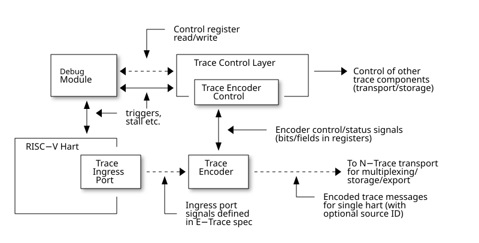

# 1.1. Introduction to N-Trace

## 1.1\. Introduction to N-Trace

This **RISC-V N-Trace (Nexus based trace) Specification** is based on the well-established **IEEE-5001 Nexus Standard** tailored to support the trace of RISC-V ISA cores, harts and SoC/MCU designs.

It serves multiple audiences:

* N-Trace encoder logic/IP developers.
* Validation teams testing of N-Trace implementation.
* Debug and trace tools developers.
* Software programmers utilizing the trace for debugging and performance tuning of RISC-V-based systems.

This specification, together with the **RISC-V Trace Control Interface Specification** and **RISC-V Trace Connectors Specification** provide a complete, end-to-end, trace system for RISC-V based SoC.

A trace ingress port, which serves as the connection between the RISC-V hart and the trace system, is defined in the ratified **Efficient Trace for RISC-V Specification**. This port enables the RISC-V hart to communicate execution information to the trace system. The N-Trace encoder is responsible for encoding an execution flow into a stream of trace messages. This document describes an appropriate selection of N-Trace messages compatible with the original IEEE-5001 Nexus Standard.

The primary objective was to define the program flow trace messages. Extensions have been introduced to enable better trace compression. Future versions may include IEEE-5001 Nexus-compatible data and bus trace.

The registers controlling the N-trace decoder are defined by the **RISC-V Trace Control Interface Specification**. This specification is shared with E-trace, so not all registers and register fields are supported by N-trace.

Trace connectors defined by IEEE-5001 Nexus Standard were debug oriented, so could not be directly applied. Instead, industry standard MIPI-compliant connectors are defined in **RISC-V Trace Connectors Specification**. These connectors are pure extensions of debug-only, MIPI-compliant connectors defined by ratified **RISC-V Debug Specification**.

### 1.1.1\. Related Specifications

This document provides reference to separated documents developed together with this **RISC-V N-Trace Specification**:

* **RISC-V Trace Control Interface Specification** \- Defines RISC-V trace control interface.  
   * This document is intended to be shared with ratified **Efficient Trace for RISC-V Specification**.
* **RISC-V Trace Connectors Specification** \- Defines RISC-V trace connectors (for external trace probes).

Ratified **Efficient Trace for RISC-V Specification** defines RISC-V Trace Ingress Port signals (chapter **4 Instruction Trace Interface**). At the moment of this writing this is version 2.0 (ratified May 5-th 2022).

| |  In the future trace ingress port may be defined in separated document - in such a a case reference to E-Trace specification will not be necessary. |
| ----------------------------------------------------------------------------------------------------------------------------------------------------- |

### 1.1.2\. Trace Encoder Interfaces

The diagram below shows one possible implementation with only a single RISC-V hart. In a system with multiple cores/harts the **Trace Ingress Port**, **Trace Encoder Control** and **Trace Encoder** blocks should be replicated for each hart. The main **Trace Control Layer** controlling other (shared) components in the trace system is not replicated.

 

Figure 1\. Trace Encoder Interfaces

| |  Placement of the Trace Encoder and Trace Control Layer are implementation dependent. |
| --------------------------------------------------------------------------------------- |

### 1.1.3\. Definitions and Terminology

__Table 1\. Terms Used In This Specification__
| Term                      | Definition                                                                                                                                                                                                                                                                                                                                                                                                                                                                                                                                                                                                                                                                         |
| ------------------------- | ---------------------------------------------------------------------------------------------------------------------------------------------------------------------------------------------------------------------------------------------------------------------------------------------------------------------------------------------------------------------------------------------------------------------------------------------------------------------------------------------------------------------------------------------------------------------------------------------------------------------------------------------------------------------------------- |
| Message                   | N-Trace messages are sequences of bytes. First byte of every message includes the TCODE field, which defines the type of information carried in the message and its format. When messages are transmitted or stored, a protocol, described in [N-Trace Transmission Protocol](#N-Trace Transmission Protocol) chapter, defines the start and the end of each message.                                                                                                                                                                                                                                                                                                              |
| Field                     | A field is a distinct piece of the information contained within a message, and messages may contain one or more fields (in addition to the first TCODE field). Fields can be either of fixed-length or variable-length. Several fields may be packed into single byte and single field may span multiple bytes. Definitions of all fields can be found in [Fields in Messages](#Fields in Messages) chapter.                                                                                                                                                                                                                                                                       |
| Variable-length Field     | Specifying that a field is variable-length (**Var** used as field size definition) means that the message must contain the field, but the field’s size may vary from a minimum of 1 bit. When messages are transmitted or stored, variable-length fields must end on a byte boundary. If necessary, they must zero-fill bit positions beyond the highest order bit of the variable-length data. Because variable-length fields may be of different lengths in messages of the same type, when messages are transmitted or stored, a protocol, described in [N-Trace Transmission Protocol](#N-Trace Transmission Protocol) chapter, defines the end of each variable-length field. |
| Configurable Field        | Configurable field (**Cfg** used as field size) means that existence and size of this field depends on some configuration setting. See [N-Trace Specific Trace Controls](#N-Trace Specific Trace Controls) chapter for details.                                                                                                                                                                                                                                                                                                                                                                                                                                                    |
| N-Trace                   | IEEE-5001 Nexus Standard Based Trace for RISC-V (as defined by this specification).                                                                                                                                                                                                                                                                                                                                                                                                                                                                                                                                                                                                |
| E-Trace                   | Efficient Trace for RISC-V (as defined by [E-Trace Specification](#E-Trace%5FSpecification)).                                                                                                                                                                                                                                                                                                                                                                                                                                                                                                                                                                                      |
| Unconditional Jump        | On RISC-V ISA all jump instructions are always unconditional, but these two words are always used together to avoid any confusions with the term 'branch' used by the IEEE-5001 Nexus Standard. The two main sub-categories of unconditional jumps that are relevant for tracing are: direct unconditional jump and indirect unconditional jump.                                                                                                                                                                                                                                                                                                                                   |
| Direct Conditional Branch | On RISC-V ISA all branch instructions are always direct and conditional (and also relative), but these three words are always used together to avoid confusion with the term 'branch' used by the IEEE-5001 Nexus Standard.                                                                                                                                                                                                                                                                                                                                                                                                                                                        |
