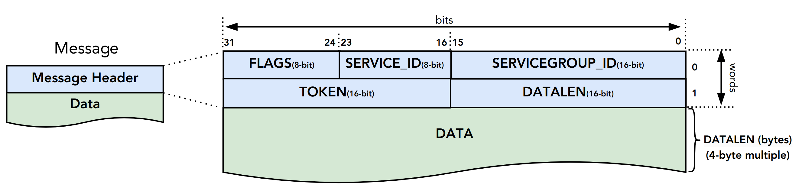
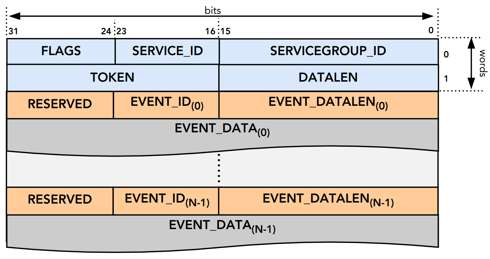
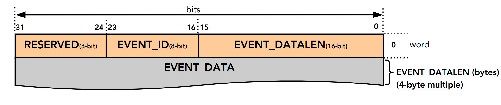

# 3.1. Messaging Protocol

## 3.1\. Messaging Protocol

The RPMI messaging protocol includes all the RPMI messages exchanged over a RPMI transport channel.

### 3.1.1\. Message Types

The RPMI messaging protocol defines three types of RPMI messages namely:**REQUEST**, **ACKNOWLEDGEMENT** and **NOTIFICATION**. The [Table 1](#messaging%5Fmessage%5Ftypes%5Ftable)below summarize all RPMI message types.

An **RPMI request message** represents a specific control and management task which needs to be performed and it is also referred to as an **RPMI service**. Multiple related RPMI services are grouped logically into an **RPMI service group** such as Clock, Voltage, Performance, etc. Depending on the RPMI service, a RPMI request message may carry data required to perform the control and management task. An RPMI request message may have an associated response which is sent back as an **RPMI acknowledgement message** on the same RPMI transport channel. The RPMI acknowledgement message carries the status and optional response data from an RPMI request after it has been processed.

An RPMI request message which has an associated RPMI acknowledgement message is referred to as a **NORMAL REQUEST** otherwise it is referred to as a **POSTED REQUEST**.

An **RPMI notification message** is an asynchronous message from the platform microcontroller to the application processors which is used to inform the later about certain events that have occurred in the system. There is no response required for an RPMI notification message from the application processors.

__Table 1\. RPMI Message Types__
| Message Type    | Message Subtypes                                                                              | Description                                                                         |
| --------------- | --------------------------------------------------------------------------------------------- | ----------------------------------------------------------------------------------- |
| REQUEST         | NORMAL REQUEST Request with Acknowledgement.  POSTED REQUEST Request without Acknowledgement. | Messages for requesting a service from the platform microcontroller.                |
| ACKNOWLEDGEMENT | _Not applicable_                                                                              | Response message corresponding to a NORMAL REQUEST message.                         |
| NOTIFICATION    | _Not applicable_                                                                              | Asynchronous messages from the platform microcontroller representing system events. |

### 3.1.2\. Message Format

An RPMI message consists of a fixed `8-byte` message header followed by a variable sized optional message data as show in the [Figure 1](#messaging%5Fformat)below. The byte ordering of an RPMI message is defined by the underlying RPMI transport.

 

Figure 1\. RPMI Message Format

#### 3.1.2.1\. Message Layout Tables

The RPMI message header and message data are split into multiple **words**, where each word is `4-byte` wide and indexed starting from `0`. The RPMI message layout is presented throughout the RPMI specification in the form of tables as shown in the [Table 2](#table%5Fmessage%5Flayout%5Ftable%5Fexample) below. Some of the columns listed below may be omitted in the layout tables if not required.

__Table 2\. Message Layout Table Example__
| Word                                                                                      | Name                                                    | Type                                     | Description                                  |
| ----------------------------------------------------------------------------------------- | ------------------------------------------------------- | ---------------------------------------- | -------------------------------------------- |
| Index of the 4-byte word at which the field starts in the message header or message data. | Name of the field. Name may be omitted if not required. | Type of field, eg: int32 or uint32, etc. | Description and interpretation of the field. |

#### 3.1.2.2\. Message Header

The layout of the `8-byte` wide RPMI message header is shown in the[Table 3](#table%5Fmessage%5Fheader) below. The RPMI message header provide a unique identity to the corresponding RPMI message withing an RPMI context.

__Table 3\. RPMI Message Header__
| Word | Description                                                                                                                                                                                                                                                                                                                                                                                                                                                                                                                                                                                                                        |
| ---- | ---------------------------------------------------------------------------------------------------------------------------------------------------------------------------------------------------------------------------------------------------------------------------------------------------------------------------------------------------------------------------------------------------------------------------------------------------------------------------------------------------------------------------------------------------------------------------------------------------------------------------------- |
| 0    | Bits Name Description \[31:24\] FLAGS Message flags. FLAGS\[7:4\]: Reserved and must be 0. FLAGS\[3\]: Reserved for RPMI transport. Refer the corresponding RPMI transport chapter for more details. FLAGS\[2:0\]: Message Type. 0b000: NORMAL\_REQUEST. 0b001: POSTED\_REQUEST. 0b010: ACKNOWLEDGEMENT. 0b011: NOTIFICATION. 0b100 - 0b111: Reserved for future use. \[23:16\] SERVICE\_ID Service ID.8-bit wide identifier representing a RPMI service. This identifier is unique within a given RPMI service group. \[15:0\] SERVICEGROUP\_ID Service group ID.16-bit wide unique identifier representing a RPMI service group. |
| 1    | Bits Name Description \[31:16\] TOKEN Message token.16-bit number for a RPMI message. \[15:0\] DATALEN Message data length.Stores the size of the message data in bytes. The value stored in this field must be a multiple of 4-byte or 0 if no message data is present.                                                                                                                                                                                                                                                                                                                                                           |

For an RPMI normal request message, the `TOKEN`, `SERVICEGROUP_ID`, and`SERVICE_ID` fields of the RPMI acknowledgement message must have the same values as corresponding fields in the RPMI request message. The `DATALEN`field of the RPMI acknowledgement message must be set according to the data carried by this acknowledgement.

| |  The message token will help the application processors to keep track of the origin of the request when it receives a response. This is useful when the multiple application processors are sharing the same queues. For example, two different application processors may send the same type of request message with the same SERVICEGROUP\_ID and SERVICE\_ID. When the response messages for both requests are received from the platform microcontroller, the token helps distinguish which response belongs to which request. For other message types such as RPMI posted request and RPMI notification messages, the implementations may use the token for debugging or logging purposes. |
| ------------------------------------------------------------------------------------------------------------------------------------------------------------------------------------------------------------------------------------------------------------------------------------------------------------------------------------------------------------------------------------------------------------------------------------------------------------------------------------------------------------------------------------------------------------------------------------------------------------------------------------------------------------------------------------------------- |

| |  The RPMI specification recommends monotonically increasing token numbers and the token number can be initialized from any value without any constraints. |
| ----------------------------------------------------------------------------------------------------------------------------------------------------------- |

For an RPMI notification message, the platform microcontroller will set appropriate values for the `TOKEN`, `SERVICEGROUP_ID`, and `DATALEN` fields whereas the `SERVICE_ID` field must be always set to `0x0`.

#### 3.1.2.3\. Message Data

The message data of an RPMI message is optional and variable sized. The maximum message data size of an RPMI message depends on the underlying RPMI transport implementation.

The message data carries different information based on the RPMI message type:

* An RPMI request message carries data required to perform the control and management task.
* An RPMI acknowledgement message carries the status and optional response data.
* An RPMI notification message carries an array of RPMI events.

The message data format for RPMI request message and RPMI acknowledgement message is defined separately for each RPMI service. The message data format for RPMI notification message is defined in the [\[Notifications\]](#Notifications).

An RPMI acknowledgement message must have a signed `STATUS` field as the first 4-byte word of the message data containing an error code defined in the [\[Possible Error Codes\]](#Possible Error Codes). An RPMI service where the response data exceeds the maximum message data size can use multipart RPMI acknowledgement messages.

If a physical address is passed in the message data of any message type, then it refers to the physical address space of the application processor.

### 3.1.3\. Notifications

The platform microcontroller can use RPMI notification message to notify application processors about system events which are also referred to as**RPMI events**. An RPMI notification message has no associated response or acknowledgement from application processors. Multiple RPMI events can be packed into a single RPMI notification message depending on the space available in the message data. Each RPMI event may have additional data associated with it based on the type of RPMI event. Any action required for handling an RPMI event depends on the application processors. The format of an RPMI notification message in shown in the [Figure 2](#messaging%5Fnotif%5Fformat)below.

The RPMI events are defined separately for each RPMI service group. An RPMI service group must have a `ENABLE_NOTIFICATION` service with a fixed`SERVICE_ID=0x01` which can be used by the application processors to enable or disable notification messages for a particular RPMI event defined by the RPMI service groups. By default, notifications are disabled for all RPMI events of an RPMI service group. The platform microcontroller only sends RPMI notification messages for RPMI events which are enabled by the application processors. If multiple RPMI events are supported by an RPMI service group then the application processors must enable to each RPMI event individually.

 

Figure 2\. RPMI Notification Message Format

#### 3.1.3.1\. Events

An RPMI event consists of a header containing two fields: `EVENT_ID (8-bit)`and `EVENT_DATALEN (16-bit)`. An RPMI event may have associated data whose size is specified in the `EVENT_DATALEN` field of the header and this data size must be a multiple of `4-byte`.

The number of RPMI events that can be stored in a single RPMI notification message depends on the maximum RPMI message data size. The `DATALEN` field in the RPMI message header represents the aggregate size of all RPMI events included in RPMI message data.

The [Table 4](#table%5Fnotification%5Fmessage%5Fformat) below defines the format of an RPMI event whereas the [Figure 3](#messaging%5Fevent%5Fformat) below shows a pictorial view of an RPMI event. The format of the event data for each RPMI event is defined separately by an RPMI service group. If multiple RPMI events are packed into a single RPMI notification message then the ordering of RPMI events within the RPMI notification message is implementation defined.

The platform microcontroller is not required to include every occurrence of an event of the same type in a notification message. Instead, the platform microcontroller must only include the most recently occurred event of the same type.

__Table 4\. Event Format__
| Word | Name        | Description                                                                                                                                                                                                                                                 |
| ---- | ----------- | ----------------------------------------------------------------------------------------------------------------------------------------------------------------------------------------------------------------------------------------------------------- |
| 0    | EVENT\_HDR  | 32-bit field represents a single event. Bits Name Description \[31:24\] _Reserved_ _Reserved_ and must be 0. \[23:16\] EVENT\_ID Unique identifier for an event in a service group. \[15:0\] EVENT\_DATALEN 16-bit field to store event data size in bytes. |
| 1    | EVENT\_DATA | Event data whose size is specified by EVENT\_DATALEN.                                                                                                                                                                                                       |

 

Figure 3\. Event Header

### 3.1.4\. Possible Error Codes

The [Table 5](#table%5Ferror%5Fcodes) below lists the error codes which can be returned by an RPMI service in the `STATUS` field of the RPMI acknowledgement message.

__Table 5\. RPMI Error Codes__
| Name                      | Error Code                           | Description                                                                                                    |
| ------------------------- | ------------------------------------ | -------------------------------------------------------------------------------------------------------------- |
| RPMI\_SUCCESS             | 0                                    | Service has been completed successfully.                                                                       |
| RPMI\_ERR\_FAILED         | \-1                                  | Failed due to general error.                                                                                   |
| RPMI\_ERR\_NOT\_SUPPORTED | \-2                                  | Service or feature is not supported.                                                                           |
| RPMI\_ERR\_INVALID\_PARAM | \-3                                  | One or more parameters passed are invalid.                                                                     |
| RPMI\_ERR\_DENIED         | \-4                                  | Requested operation denied due to insufficient permissions or failed dependency check.                         |
| RPMI\_ERR\_INVALID\_ADDR  | \-5                                  | One or more addresses are invalid.                                                                             |
| RPMI\_ERR\_ALREADY        | \-6                                  | Operation already in progress or state changed already for which the operation was performed.                  |
| RPMI\_ERR\_EXTENSION      | \-7                                  | Error in extension implementation that violates the extension specification or the extension version mismatch. |
| RPMI\_ERR\_HW\_FAULT      | \-8                                  | Failed due to hardware fault.                                                                                  |
| RPMI\_ERR\_BUSY           | \-9                                  | Service cannot be completed due to system or device is busy.                                                   |
| RPMI\_ERR\_INVALID\_STATE | \-10                                 | Invalid state.                                                                                                 |
| RPMI\_ERR\_BAD\_RANGE     | \-11                                 | Bad or invalid range.                                                                                          |
| RPMI\_ERR\_TIMEOUT        | \-12                                 | Failed due to timeout.                                                                                         |
| RPMI\_ERR\_IO             | \-13                                 | Input/Output error.                                                                                            |
| RPMI\_ERR\_NO\_DATA       | \-14                                 | Data not available.                                                                                            |
| \-15 to -127              | _Reserved_.                          |                                                                                                                |
| < -127                    | _Vendor or Implementation specific_. |                                                                                                                |
