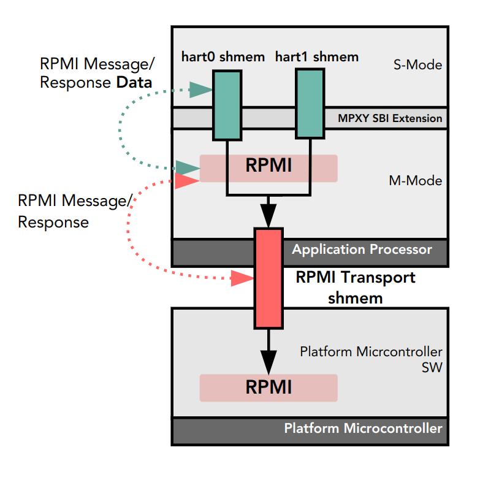

# 5.1. Integration with SBI MPXY Extension

## 5.1\. Integration with SBI MPXY Extension

A platform with a limited number of RPMI transport instances can share an M-mode RPMI transport instance with the supervisor software using the SBI MPXY extension \[[1](bibliography.html#bib-sbi)\]. An M-mode firmware or hypervisor can also virtualize RPMI message communication for the supervisor software using the SBI MPXY extension. As shown in the [Figure 1](#mpxy%5Frpmi%5Fintegration) below, the SBI implementation acts as a **RPMI proxy**for the supervisor software when sending RPMI messages through an SBI MPXY channel.

 

Figure 1\. RPMI and SBI MPXY Integration

The RPMI communication via the SBI MPXY extension must satisfy the following requirements:

1. The SBI MPXY channel must correspond to a single RPMI service group which is allowed in S-mode except BASE and CPPC service groups. The [\[table\_service\_groups\]](#table%5Fservice%5Fgroups)list the RPMI service groups allowed in S-mode.
2. The SBI MPXY channel corresponding to the RPMI SYSTEM\_MSI service group must not support the P2A doorbell system MSI.
3. The `message_id` parameter passed to the `sbi_mpxy_send_message_with_response()`and `sbi_mpxy_send_message_without_response()` must represent the `SERVICE_ID` of an RPMI service belonging to the RPMI service group bound to the SBI MPXY channel.
4. The format of the message data passed via the SBI MPXY shared memory to the`sbi_mpxy_send_message_with_response()` and `sbi_mpxy_send_message_without_response()`must match the request data format of the RPMI service represented by the`message_id` parameter.
5. The format of the response message data returned in the SBI MPXY shared memory by the `sbi_mpxy_send_message_with_response()` must match the response data format of the RPMI service represented by the `message_id` parameter.
6. The format of the protocol-specific data returned in the SBI MPXY shared memory by the `sbi_mpxy_get_notification_events()` must match the RPMI notifications message data format.
7. The SBI MPXY channel must support message protocol attributes listed in the[Table 1](#table%5Frpmi%5Fmpxy%5Fattributes) below.

__Table 1\. RPMI Message Protocol Attributes of an SBI MPXY Channel__
| Attribute Name          | Attribute ID | Access | Description                  |
| ----------------------- | ------------ | ------ | ---------------------------- |
| SERVICEGROUP\_ID        | 0x80000000   | RO     | RPMI service group ID.       |
| SERVICEGROUP\_VERSION   | 0x80000001   | RO     | RPMI service group version.  |
| IMPLEMENTATION\_ID      | 0x80000002   | RO     | RPMI implementation ID.      |
| IMPLEMENTATION\_VERSION | 0x80000003   | RO     | RPMI implementation version. |
