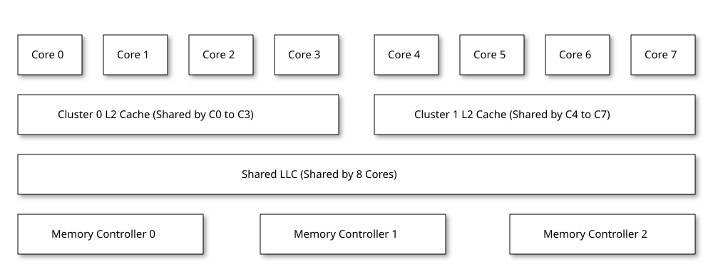
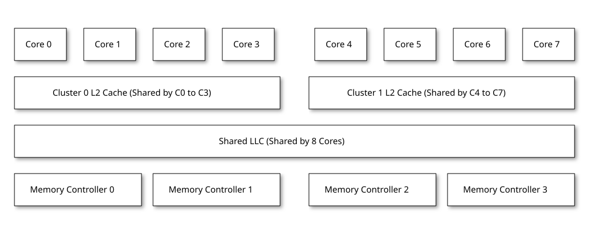

# 3.1. Example ACPI Table Implementation

## [](#chapter3)3.1\. Example ACPI Table Implementation

This chapter covers some system implementation examples.

### [](#example-1-single-socket-system-with-8-cores-and-3-memory-controllers)Example 1: Single Socket System with 8 cores and 3 memory controllers

The diagram below shows a model of the SoC described in this example.

 

Figure 1\. Single Socket System Example 1

In the example system above, Cluster 0 L2 cache is shared by 4 cores labeled Core 0 to 3\. Cluster 1 L2 cache is shared by 4 cores labeled Core 4 to 7\. Shared LLC (e.g. L3) is shared by all 8 cores. Shared LLC is connected to 3 memory controllers labeled 0 to 2\. Each Memory Controller has 1 DDR Channel. The DDR Memory is configured in UMA mode with the same proximity domain for all memory channels.

The system implements the following Capacity and Memory Bandwidth QoS controllers.

* 2 L2 Cache Capacity QoS Controllers (one per cluster)  
   * CBQRI located at `0x04821000` and `0x04822000`
* 1 LLC Cache Capacity QoS Controller  
   * CBQRI located at `0x04823000`
* 3 Memory Bandwidth QoS Controllers (one per memory controller)  
   * CBQRI located at `0x04828000`, `0x04829000` and `0x0482A000`

Globally all of the QoS Controllers implement 64 RCIDs and 256 MCIDs.

#### [](#rqsc-table)RQSC Table

```c
Name(\RQSC, Package()
{
    "RQSC",         // Signature
    0x00000148,     // Total Length of RQSC Table (328 bytes)
    0x01,           // Revision
    0xFF,           // Checksum (placeholder, to be fixed)
    "RIVOS ",       // OEMID
    "RVOS    ",     // OEM Table ID
    0x00000001,     // OEM Revision
    "RVOS",         // Creator ID
    0x00000001,     // Creator Revision
    0x00000006,     // Number of QoS Controllers
    Package()       // QoS Controller 1 - Cluster 0 L2 Cache Capacity QoS Controller
    {
        0x00,           // Controller Type - Capacity
        0x00,           // Reserved
        44,             // Length
        Package()       // Register Interface Address
        {
            0x00,                   // System Memory Space
            0x00,                   // Size of Register in bits (0)
            0x00,                   // Register Offset (0)
            0x04,                   // Access Size (DWORD)
            0x0000000004821000,     // Address
        },
        64,             // RCID Count
        256,            // MCID Count
        0x0000,         // Controller Flags
        0x0001,         // Number of Resources
        Package()       // Resource Structure - Cluster 0 L2 Cache
        {
            0x00,                   // Resource Type (Cache)
            0x00,                   // Reserved Byte
            20,                     // Length (20 bytes)
            0x0000,                 // Resource Flags
            0x00,                   // Reserved Byte
            0x00,                   // Resource ID Type (Processor Cache)
            0x0000000000000000,     // Resource ID 1 (Cache ID from PPTT)
            0x00000000,             // Resource ID 2 (0)
        },
    },
    Package()       // QoS Controller 2 - Cluster 1 L2 Cache Capacity QoS Controller
    {
        0x00,           // Controller Type - Capacity
        0x00,           // Reserved
        44,             // Length
        Package()       // Register Interface Address
        {
            0x00,                   // System Memory Space
            0x00,                   // Size of Register in bits (0)
            0x00,                   // Register Offset (0)
            0x04,                   // Access Size (DWORD)
            0x0000000004822000,     // Address
        },
        64,             // RCID Count
        256,            // MCID Count
        0x0000,         // Controller Flags
        0x0001,         // Number of Resources
        Package()       // Resource Structure - Cluster 1 L2 Cache
        {
            0x00,                   // Resource Type (Cache)
            0x00,                   // Reserved Byte
            20,                     // Length (20 bytes)
            0x0000,                 // Resource Flags
            0x00,                   // Reserved Byte
            0x00,                   // Resource ID Type (Processor Cache)
            0x0000000000000001,     // Resource ID 1 (Cache ID from PPTT)
            0x00000000,             // Resource ID 2 (0)
        },
    },
    Package()       // QoS Controller 3 - Shared LLC Cache Capacity QoS Controller
    {
        0x00,           // Controller Type - Capacity
        0x00,           // Reserved
        44,             // Length
        Package()       // Register Interface Address
        {
            0x00,                   // System Memory Space
            0x00,                   // Size of Register in bits (0)
            0x00,                   // Register Offset (0)
            0x04,                   // Access Size (DWORD)
            0x0000000004823000,     // Address
        },
        64,             // RCID Count
        256,            // MCID Count
        0x0000,         // Controller Flags
        0x0001,         // Number of Resources
        Package()       // Resource Structure - Shared LLC Cache
        {
            0x00,                   // Resource Type (Cache)
            0x00,                   // Reserved Byte
            20,                     // Length (20 bytes)
            0x0000,                 // Resource Flags
            0x00,                   // Reserved Byte
            0x00,                   // Resource ID Type (Processor Cache)
            0x0000000000000002,     // Resource ID 1 (Cache ID from PPTT)
            0x00000000,             // Resource ID 2 (0)
        },
    },
    Package()       // QoS Controller 4 - Memory Controller 0 Bandwidth QoS Controller
    {
        0x01,           // Controller Type - Bandwidth
        0x00,           // Reserved
        52,             // Length
        Package()       // Register Interface Address
        {
            0x00,                   // System Memory Space
            0x00,                   // Size of Register in bits (0)
            0x00,                   // Register Offset (0)
            0x04,                   // Access Size (DWORD)
            0x0000000004828000,     // Address
        },
        64,             // RCID Count
        256,            // MCID Count
        0x0000,         // Controller Flags
        0x0001,         // Number of Resources
        Package()       // Resource Structure - Proximity Domain
        {
            0x01,                   // Resource Type (Memory)
            0x00,                   // Reserved Byte
            28,                     // Length (28 bytes)
            0x0000,                 // Resource Flags
            0x00,                   // Reserved Byte
            0x01,                   // Resource ID Type (Memory Range)
            0x0000000000000000,     // Resource ID 1 (Proximity Domain from SRAT table for this memory)
            0x00000000,             // Resource ID 2 (0)
            0x0000000000000000,     // Resource Specific Data (No bandwidth per block data reported)
        },
    },
    Package()       // QoS Controller 5 - Memory Controller 1 Bandwidth QoS Controller
    {
        0x01,           // Controller Type - Bandwidth
        0x00,           // Reserved
        52,             // Length
        Package()       // Register Interface Address
        {
            0x00,                   // System Memory Space
            0x00,                   // Size of Register in bits (0)
            0x00,                   // Register Offset (0)
            0x04,                   // Access Size (DWORD)
            0x0000000004829000,     // Address
        },
        64,             // RCID Count
        256,            // MCID Count
        0x0000,         // Controller Flags
        0x0001,         // Number of Resources
        Package()       // Resource Structure - Proximity Domain
        {
            0x01,                   // Resource Type (Memory)
            0x00,                   // Reserved Byte
            28,                     // Length (28 bytes)
            0x0000,                 // Resource Flags
            0x00,                   // Reserved Byte
            0x01,                   // Resource ID Type (Memory Range)
            0x0000000000000000,     // Resource ID 1 (Proximity Domain from SRAT table for this memory)
            0x00000000,             // Resource ID 2 (0)
            0x0000000000000000,     // Resource Specific Data (No bandwidth per block data reported)
        },
    },
    Package()       // QoS Controller 6 - Memory Controller 2 Bandwidth QoS Controller
    {
        0x01,           // Controller Type - Bandwidth
        0x00,           // Reserved
        52,             // Length
        Package()       // Register Interface Address
        {
            0x00,                   // System Memory Space
            0x00,                   // Size of Register in bits (0)
            0x00,                   // Register Offset (0)
            0x04,                   // Access Size (DWORD)
            0x000000000482A000,     // Address
        },
        64,             // RCID Count
        256,            // MCID Count
        0x0000,         // Controller Flags
        0x0001,         // Number of Resources
        Package()       // Resource Structure - Proximity Domain
        {
            0x01,                   // Resource Type (Memory)
            0x00,                   // Reserved Byte
            28,                     // Length (28 bytes)
            0x0000,                 // Resource Flags
            0x00,                   // Reserved Byte
            0x01,                   // Resource ID Type (Memory Range)
            0x0000000000000000,     // Resource ID 1 (Proximity Domain from SRAT table for this memory)
            0x00000000,             // Resource ID 2 (0)
            0x0000000000000000,     // Resource Specific Data (No bandwidth per block data reported)
        },
    },
})
```

### [](#example-2-single-socket-system-with-8-cores-and-4-memory-controllers-with-numa-enabled)Example 2: Single Socket System with 8 cores and 4 memory controllers with NUMA enabled

The diagram below shows a model of the SoC described in this example.

 

Figure 2\. Single Socket System Example 2

In the example system above, Cluster 0 L2 cache is shared by 4 cores labeled Core 0 to 3\. Cluster 1 L2 cache is shared by 4 cores labeled Core 4 to 7\. Shared LLC (e.g. L3) is shared by all 8 cores. Shared LLC is connected to 4 memory controllers labeled 0 to 3\. Each Memory Controller has 1 DDR Channel. The DDR Memory is configured in NUMA mode with 2 proximity domains where memory controllers 0 and 1 serve cores 0 to 3 and memory controllers 2 and 3 serve cores 4 to 7.

When configuring the QoS parameters for the memory QoS controllers, QoS controllers of memory controllers 0 and 1 must be configured with the same parameters and QoS controllers of memory controllers 2 and 3 must be configured with the same parameters.

The system implements the following Capacity and Memory Bandwidth QoS controllers.

* 2 L2 Cache Capacity QoS Controllers (one per cluster)  
   * CBQRI located at `0x04821000` and `0x04822000`
* 1 LLC Cache Capacity QoS Controller  
   * CBQRI located at `0x04823000`
* 4 Memory Bandwidth QoS Controllers (one per memory controller)  
   * CBQRI located at `0x04828000`, `0x04829000`, `0x0482A000` and `0x0482B000`

Globally all of the QoS Controllers implement 64 RCIDs and 256 MCIDs.

#### [](#rqsc-table-2)RQSC Table

```c
Name(\RQSC, Package()
{
    "RQSC",         // Signature
    0x0000017C,     // Total Length of RQSC Table (380 bytes)
    0x01,           // Revision
    0xFF,           // Checksum (placeholder, to be fixed up by tool)
    "RIVOS ",       // OEMID
    "RVOS    ",     // OEM Table ID
    0x00000001,     // OEM Revision
    "RVOS",         // Creator ID
    0x00000001,     // Creator Revision
    0x00000007,     // Number of QoS Controllers
    Package()       // QoS Controller 1 - Cluster 0 L2 Cache Capacity QoS Controller
    {
        0x00,           // Controller Type - Capacity
        0x00,           // Reserved
        44,             // Length
        Package()       // Register Interface Address
        {
            0x00,                   // System Memory Space
            0x00,                   // Size of Register in bits (0)
            0x00,                   // Register Offset (0)
            0x04,                   // Access Size (DWORD)
            0x0000000004821000,     // Address
        },
        64,             // RCID Count
        256,            // MCID Count
        0x0000,         // Controller Flags
        0x0001,         // Number of Resources
        Package()       // Resource Structure - Cluster 0 L2 Cache
        {
            0x00,                   // Resource Type (Cache)
            0x00,                   // Reserved Byte
            20,                     // Length (20 bytes)
            0x0000,                 // Resource Flags
            0x00,                   // Reserved Byte
            0x00,                   // Resource ID Type (Processor Cache)
            0x0000000000000000,     // Resource ID 1 (Cache ID from PPTT)
            0x00000000,             // Resource ID 2 (0)
        },
    },
    Package()       // QoS Controller 2 - Cluster 1 L2 Cache Capacity QoS Controller
    {
        0x00,           // Controller Type - Capacity
        0x00,           // Reserved
        44,             // Length
        Package()       // Register Interface Address
        {
            0x00,                   // System Memory Space
            0x00,                   // Size of Register in bits (0)
            0x00,                   // Register Offset (0)
            0x04,                   // Access Size (DWORD)
            0x0000000004822000,     // Address
        },
        64,             // RCID Count
        256,            // MCID Count
        0x0000,         // Controller Flags
        0x0001,         // Number of Resources
        Package()       // Resource Structure - Cluster 1 L2 Cache
        {
            0x00,                   // Resource Type (Cache)
            0x00,                   // Reserved Byte
            20,                     // Length (20 bytes)
            0x0000,                 // Resource Flags
            0x00,                   // Reserved Byte
            0x00,                   // Resource ID Type (Processor Cache)
            0x0000000000000001,     // Resource ID 1 (Cache ID from PPTT)
            0x00000000,             // Resource ID 2 (0)
        },
    },
    Package()       // QoS Controller 3 - Shared LLC Cache Capacity QoS Controller
    {
        0x00,           // Controller Type - Capacity
        0x00,           // Reserved
        44,             // Length
        Package()       // Register Interface Address
        {
            0x00,                   // System Memory Space
            0x00,                   // Size of Register in bits (0)
            0x00,                   // Register Offset (0)
            0x04,                   // Access Size (DWORD)
            0x0000000004823000,     // Address
        },
        64,             // RCID Count
        256,            // MCID Count
        0x0000,         // Controller Flags
        0x0001,         // Number of Resources
        Package()       // Resource Structure - Shared LLC Cache
        {
            0x00,                   // Resource Type (Cache)
            0x00,                   // Reserved Byte
            20,                     // Length (20 bytes)
            0x0000,                 // Resource Flags
            0x00,                   // Reserved Byte
            0x00,                   // Resource ID Type (Processor Cache)
            0x0000000000000002,     // Resource ID 1 (Cache ID from PPTT)
            0x00000000,             // Resource ID 2 (0)
        },
    },
    Package()       // QoS Controller 4 - Memory Controller 0 Bandwidth QoS Controller
    {
        0x01,           // Controller Type - Bandwidth
        0x00,           // Reserved
        52,             // Length
        Package()       // Register Interface Address
        {
            0x00,                   // System Memory Space
            0x00,                   // Size of Register in bits (0)
            0x00,                   // Register Offset (0)
            0x04,                   // Access Size (DWORD)
            0x0000000004828000,     // Address
        },
        64,             // RCID Count
        256,            // MCID Count
        0x0000,         // Controller Flags
        0x0001,         // Number of Resources
        Package()       // Resource Structure - Proximity Domain
        {
            0x01,                   // Resource Type (Memory)
            0x00,                   // Reserved Byte
            28,                     // Length (28 bytes)
            0x0000,                 // Resource Flags
            0x00,                   // Reserved Byte
            0x01,                   // Resource ID Type (Memory Range)
            0x0000000000000000,     // Resource ID 1 (Proximity Domain from SRAT table for this memory)
            0x00000000,             // Resource ID 2 (0)
            0x0000000000000000,     // Resource Specific Data (No bandwidth per block data reported)
        },
    },
    Package()       // QoS Controller 5 - Memory Controller 1 Bandwidth QoS Controller
    {
        0x01,           // Controller Type - Bandwidth
        0x00,           // Reserved
        52,             // Length
        Package()       // Register Interface Address
        {
            0x00,                   // System Memory Space
            0x00,                   // Size of Register in bits (0)
            0x00,                   // Register Offset (0)
            0x04,                   // Access Size (DWORD)
            0x0000000004829000,     // Address
        },
        64,             // RCID Count
        256,            // MCID Count
        0x0000,         // Controller Flags
        0x0001,         // Number of Resources
        Package()       // Resource Structure - Proximity Domain
        {
            0x01,                   // Resource Type (Memory)
            0x00,                   // Reserved Byte
            28,                     // Length (28 bytes)
            0x0000,                 // Resource Flags
            0x00,                   // Reserved Byte
            0x01,                   // Resource ID Type (Memory Range)
            0x0000000000000000,     // Resource ID 1 (Proximity Domain from SRAT table for this memory)
            0x00000000,             // Resource ID 2 (0)
            0x0000000000000000,     // Resource Specific Data (No bandwidth per block data reported)
        },
    },
    Package()       // QoS Controller 6 - Memory Controller 2 Bandwidth QoS Controller
    {
        0x01,           // Controller Type - Bandwidth
        0x00,           // Reserved
        52,             // Length
        Package()       // Register Interface Address
        {
            0x00,                   // System Memory Space
            0x00,                   // Size of Register in bits (0)
            0x00,                   // Register Offset (0)
            0x04,                   // Access Size (DWORD)
            0x000000000482A000,     // Address
        },
        64,             // RCID Count
        256,            // MCID Count
        0x0000,         // Controller Flags
        0x0001,         // Number of Resources
        Package()       // Resource Structure - Proximity Domain
        {
            0x01,                   // Resource Type (Memory)
            0x00,                   // Reserved Byte
            28,                     // Length (28 bytes)
            0x0000,                 // Resource Flags
            0x00,                   // Reserved Byte
            0x01,                   // Resource ID Type (Memory Range)
            0x0000000000000001,     // Resource ID 1 (Proximity Domain from SRAT table for this memory)
            0x00000000,             // Resource ID 2 (0)
            0x0000000000000000,     // Resource Specific Data (No bandwidth per block data reported)
        },
    },
    Package()       // QoS Controller 7 - Memory Controller 3 Bandwidth QoS Controller
    {
        0x01,           // Controller Type - Bandwidth
        0x00,           // Reserved
        52,             // Length
        Package()       // Register Interface Address
        {
            0x00,                   // System Memory Space
            0x00,                   // Size of Register in bits (0)
            0x00,                   // Register Offset (0)
            0x04,                   // Access Size (DWORD)
            0x000000000482B000,     // Address
        },
        64,             // RCID Count
        256,            // MCID Count
        0x0000,         // Controller Flags
        0x0001,         // Number of Resources
        Package()       // Resource Structure - Proximity Domain
        {
            0x01,                   // Resource Type (Memory)
            0x00,                   // Reserved Byte
            28,                     // Length (28 bytes)
            0x0000,                 // Resource Flags
            0x00,                   // Reserved Byte
            0x01,                   // Resource ID Type (Memory Range)
            0x0000000000000001,     // Resource ID 1 (Proximity Domain from SRAT table for this memory)
            0x00000000,             // Resource ID 2 (0)
            0x0000000000000000,     // Resource Specific Data (No bandwidth per block data reported)
        },
    },

})
```
