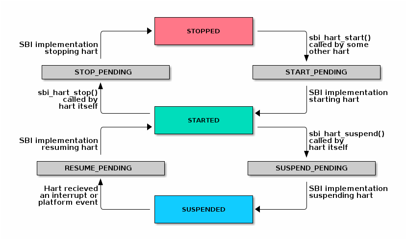

# 9.1. Hart State Management Extension (EID #0x48534D "HSM")

## [](#9-1-hart-state-management-extension-eid-0x48534d-hsm)9.1\. Hart State Management Extension (EID #0x48534D "HSM")

The Hart State Management (HSM) Extension introduces a set of hart states and a set of functions which allow the supervisor-mode software to request a hart state change.

The [Table 1](#table%5Fhsm%5Fstates) shown below describes all possible **HSM states**along with a unique **HSM state id** for each state:

__Table 1\. HSM Hart States__
| State ID | State Name       | Description                                                                                                                                                                                                        |
| -------- | ---------------- | ------------------------------------------------------------------------------------------------------------------------------------------------------------------------------------------------------------------ |
| 0        | STARTED          | The hart is physically powered-up and executing normally.                                                                                                                                                          |
| 1        | STOPPED          | The hart is not executing in supervisor-mode or any lower privilege mode. It is probably powered-down by the SBI implementation if the underlying platform has a mechanism to physically power-down harts.         |
| 2        | START\_PENDING   | Some other hart has requested to start (or power-up) the hart from the **STOPPED** state and the SBI implementation is still working to get the hart in the **STARTED** state.                                     |
| 3        | STOP\_PENDING    | The hart has requested to stop (or power-down) itself from the **STARTED** state and the SBI implementation is still working to get the hart in the **STOPPED** state.                                             |
| 4        | SUSPENDED        | This hart is in a platform specific suspend (or low power) state.                                                                                                                                                  |
| 5        | SUSPEND\_PENDING | The hart has requested to put itself in a platform specific low power state from the**STARTED** state and the SBI implementation is still working to get the hart in the platform specific **SUSPENDED** state.    |
| 6        | RESUME\_PENDING  | An interrupt or platform specific hardware event has caused the hart to resume normal execution from the **SUSPENDED** state and the SBI implementation is still working to get the hart in the **STARTED** state. |

At any point in time, a hart should be in one of the above mentioned hart states. The hart state transitions by the SBI implementation should follow the state machine shown below in the [Figure 1](#figure%5Fhsm).

 

Figure 1\. SBI HSM State Machine

A platform can have multiple harts grouped into hierarchical topology groups (namely cores, clusters, nodes, etc.) with separate platform specific low-power states for each hierarchical group. These platform specific low-power states of hierarchical topology groups can be represented as platform specific suspend states of a hart. An SBI implementation can utilize the suspend states of higher topology groups using one of the following approaches:

1. **Platform-coordinated:** In this approach, when a hart becomes idle the supervisor-mode power-managment software will request deepest suspend state for the hart and higher topology groups. An SBI implementation should choose a suspend state at higher topology group which is:  
   1. Not deeper than the specified suspend state  
   2. Wake-up latency is not higher than the wake-up latency of the specified suspend state
2. **OS-inititated:** In this approach, the supervisor-mode power-managment software will directly request a suspend state for higher topology group after the last hart in that group becomes idle. When a hart becomes idle, the supervisor-mode power-managment software will always select suspend state for the hart itself but it will select a suspend state for a higher topology group only if the hart is the last running hart in the group. An SBI implementation should:  
   1. Never choose a suspend state for higher topology group different from the specified suspend state  
   2. Always prefer most recent suspend state requested for higher topology group

### [](#9-1-1-function-hart-start-fid-0)9.1.1\. Function: Hart start (FID #0)

```C
struct sbiret sbi_hart_start(unsigned long hartid,
                             unsigned long start_addr,
                             unsigned long opaque)
```

Request the SBI implementation to start executing the target hart in supervisor-mode, at the address specified by `start_addr`, with the specific register values described in [Table 2](#table%5Fhsm%5Fhart%5Fstart%5Fregs).

__Table 2\. HSM Hart Start Register State__
| Register Name                                     | Register Value   |
| ------------------------------------------------- | ---------------- |
| satp                                              | 0                |
| sstatus.SIE                                       | 0                |
| a0                                                | hartid           |
| a1                                                | opaque parameter |
| All other registers remain in an undefined state. |                  |

| |  A single unsigned long parameter is sufficient as start\_addr, because the hart will start execution in supervisor-mode with the MMU off, hence start\_addr must be less than XLEN bits wide. |
| ------------------------------------------------------------------------------------------------------------------------------------------------------------------------------------------------ |

This call is asynchronous — more specifically, the `sbi_hart_start()` may return before the target hart starts executing as long as the SBI implementation is capable of ensuring the return code is accurate. If the SBI implementation is a platform runtime firmware executing in machine-mode (M-mode), then it MUST configure any physical memory protection it supports, such as that defined by PMP, and other M-mode state, before transferring control to supervisor-mode software.

The `hartid` parameter specifies the target hart which is to be started.

The `start_addr` parameter points to a runtime-specified physical address, where the hart can start executing in supervisor-mode.

The `opaque` parameter is an XLEN-bit value which will be set in the `a1`register when the hart starts executing at `start_addr`.

The possible error codes returned in `sbiret.error` are shown in the[Table 3](#table%5Fhsm%5Fhart%5Fstart%5Ferrors) below.

__Table 3\. HSM Hart Start Errors__
| Error code                   | Description                                                                                                                                                                                                                                     |
| ---------------------------- | ----------------------------------------------------------------------------------------------------------------------------------------------------------------------------------------------------------------------------------------------- |
| SBI\_SUCCESS                 | Hart was previously in stopped state. It will start executing from start\_addr.                                                                                                                                                                 |
| SBI\_ERR\_INVALID\_ADDRESS   | start\_addr is not valid, possibly due to the following reasons: \* It is not a valid physical address. \* Executable access to the address is prohibited by a physical memory protection mechanism or H-extension G-stage for supervisor-mode. |
| SBI\_ERR\_INVALID\_PARAM     | hartid is not a valid hartid as the corresponding hart cannot be started in supervisor mode.                                                                                                                                                    |
| SBI\_ERR\_ALREADY\_AVAILABLE | The given hartid is already started.                                                                                                                                                                                                            |
| SBI\_ERR\_FAILED             | The start request failed for unspecified or unknown other reasons.                                                                                                                                                                              |

### [](#9-1-2-function-hart-stop-fid-1)9.1.2\. Function: Hart stop (FID #1)

```C
struct sbiret sbi_hart_stop(void)
```

Request the SBI implementation to stop executing the calling hart in supervisor-mode and return its ownership to the SBI implementation. This call is not expected to return under normal conditions. The`sbi_hart_stop()` must be called with supervisor-mode interrupts disabled.

The possible error codes returned in `sbiret.error` are shown in the[Table 4](#table%5Fhsm%5Fhart%5Fstop%5Ferrors) below.

__Table 4\. HSM Hart Stop Errors__
| Error code       | Description                                  |
| ---------------- | -------------------------------------------- |
| SBI\_ERR\_FAILED | Failed to stop execution of the current hart |

### [](#9-1-3-function-hart-get-status-fid-2)9.1.3\. Function: Hart get status (FID #2)

```C
struct sbiret sbi_hart_get_status(unsigned long hartid)
```

Get the current status (or HSM state id) of the given hart in `sbiret.value`, or an error through `sbiret.error`.

The `hartid` parameter specifies the target hart for which status is required.

The possible status (or HSM state id) values returned in `sbiret.value`are described in [Table 1](#table%5Fhsm%5Fstates).

The possible error codes returned in `sbiret.error` are shown in the[Table 5](#table%5Fhsm%5Fhart%5Fget%5Fstatus%5Ferrors) below.

__Table 5\. HSM Hart Get Status Errors__
| Error code               | Description                    |
| ------------------------ | ------------------------------ |
| SBI\_ERR\_INVALID\_PARAM | The given hartid is not valid. |

The harts may transition HSM states at any time due to any concurrent`sbi_hart_start()` or `sbi_hart_stop()` or `sbi_hart_suspend()` calls, the return value from this function may not represent the actual state of the hart at the time of return value verification.

### [](#9-1-4-function-hart-suspend-fid-3)9.1.4\. Function: Hart suspend (FID #3)

```C
struct sbiret sbi_hart_suspend(uint32_t suspend_type,
                               unsigned long resume_addr,
                               unsigned long opaque)
```

Request the SBI implementation to put the calling hart in a platform specific suspend (or low power) state specified by the `suspend_type` parameter. The hart will automatically come out of suspended state and resume normal execution when it receives an interrupt or platform specific hardware event.

The platform specific suspend states for a hart can be either retentive or non-retentive in nature. A retentive suspend state will preserve hart register and CSR values for all privilege modes whereas a non-retentive suspend state will not preserve hart register and CSR values.

Resuming from a retentive suspend state is straight forward and the supervisor-mode software will see SBI suspend call return without any failures. The `resume_addr` parameter is unused during retentive suspend.

Resuming from a non-retentive suspend state is relatively more involved and requires software to restore various hart registers and CSRs for all privilege modes. Upon resuming from non-retentive suspend state, the hart will jump to supervisor-mode at address specified by `resume_addr` with specific registers values described in the [Table 6](#table%5Fhsm%5Fhart%5Fresume%5Fregs) below.

__Table 6\. HSM Hart Resume Register State__
| Register Name                                     | Register Value   |
| ------------------------------------------------- | ---------------- |
| satp                                              | 0                |
| sstatus.SIE                                       | 0                |
| a0                                                | hartid           |
| a1                                                | opaque parameter |
| All other registers remain in an undefined state. |                  |

| |  A single unsigned long parameter is sufficient for resume\_addr, because the hart will resume execution in supervisor-mode with the MMU off, hence resume\_addr must be less than XLEN bits wide. |
| ---------------------------------------------------------------------------------------------------------------------------------------------------------------------------------------------------- |

The `suspend_type` parameter is 32 bits wide and the possible values are shown in [Table 7](#table%5Fhsm%5Fhart%5Fsuspend%5Ftypes) below.

__Table 7\. HSM Hart Suspend Types__
| Value                   | Description                             |
| ----------------------- | --------------------------------------- |
| 0x00000000              | Default retentive suspend               |
| 0x00000001 - 0x0FFFFFFF | Reserved for future use                 |
| 0x10000000 - 0x7FFFFFFF | Platform specific retentive suspend     |
| 0x80000000              | Default non-retentive suspend           |
| 0x80000001 - 0x8FFFFFFF | Reserved for future use                 |
| 0x90000000 - 0xFFFFFFFF | Platform specific non-retentive suspend |

The `resume_addr` parameter points to a runtime-specified physical address, where the hart can resume execution in supervisor-mode after a non-retentive suspend.

The `opaque` parameter is an XLEN-bit value which will be set in the `a1`register when the hart resumes execution at `resume_addr` after a non-retentive suspend.

The possible error codes returned in `sbiret.error` are shown in the[Table 8](#table%5Fhsm%5Fhart%5Fsuspend%5Ferrors) below.

__Table 8\. HSM Hart Suspend Errors__
| Error code                 | Description                                                                                                                                                                                                                                      |
| -------------------------- | ------------------------------------------------------------------------------------------------------------------------------------------------------------------------------------------------------------------------------------------------ |
| SBI\_SUCCESS               | Hart has suspended and resumed successfully from a retentive suspend state.                                                                                                                                                                      |
| SBI\_ERR\_INVALID\_PARAM   | suspend\_type is reserved or is platform-specific and unimplemented.                                                                                                                                                                             |
| SBI\_ERR\_NOT\_SUPPORTED   | suspend\_type is not reserved and is implemented, but the platform does not support it due to one or more missing dependencies.                                                                                                                  |
| SBI\_ERR\_INVALID\_ADDRESS | resume\_addr is not valid, possibly due to the following reasons: \* It is not a valid physical address. \* Executable access to the address is prohibited by a physical memory protection mechanism or H-extension G-stage for supervisor-mode. |
| SBI\_ERR\_FAILED           | The suspend request failed for unspecified or unknown other reasons.                                                                                                                                                                             |

### [](#9-1-5-function-listing)9.1.5\. Function Listing

__Table 9\. HSM Function List__
| Function Name          | SBI Version | FID | EID      |
| ---------------------- | ----------- | --- | -------- |
| sbi\_hart\_start       | 0.2         | 0   | 0x48534D |
| sbi\_hart\_stop        | 0.2         | 1   | 0x48534D |
| sbi\_hart\_get\_status | 0.2         | 2   | 0x48534D |
| sbi\_hart\_suspend     | 0.3         | 3   | 0x48534D |
