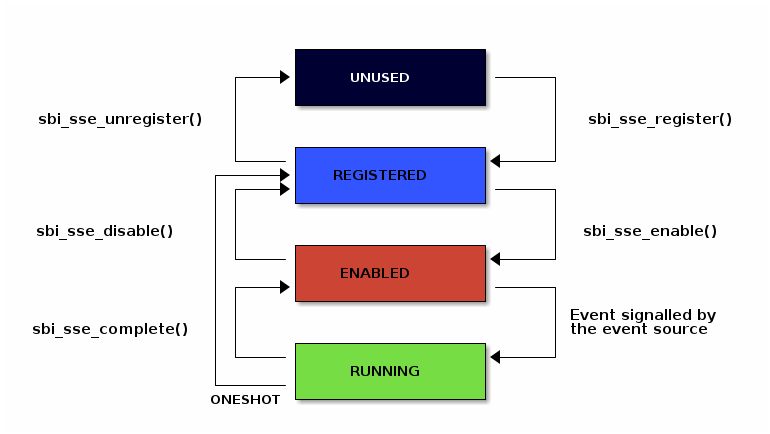

# 17.1. Supervisor Software Events Extension (EID #0x535345 "SSE")

## [](#17-1-supervisor-software-events-extension-eid-0x535345-sse)17.1\. Supervisor Software Events Extension (EID #0x535345 "SSE")

The SBI Supervisor Software Events (SSE) extension provides a mechanism to inject software events from an SBI implementation to supervisor software such that it preempts all other traps and interrupts. The supervisor software will receive software events only on harts which are ready to receive them. A software event is delivered only after supervisor software has registered an event handler and enabled the software event.

The software events are one of two types: local or global. A local software event is local to a hart and can be handled only on that hart whereas a global software event is a system event and can be handled by any participating hart.

### [](#17-1-1-software-event-identification)17.1.1\. Software Event Identification

Each software event is identified by a unique 32-bit unsigned integer called`event_id`. The `event_id` space is divided into multiple 16-bit ranges where each 16-bit range is encoded as follows:

```C
    event_id[14:14] = Platform (0: Standard event, 1: Platform specific event)
    event_id[15:15] = Global (0: Local event, 1: Global event)
```

The [Table 1](#table%5Fsse%5Fevent%5Fids) below show the complete `event_id` space along with standard events based on the above encoding.

__Table 1\. SSE Event ID Space__
| Software Event ID             | Description                                        |
| ----------------------------- | -------------------------------------------------- |
| Range 0x00000000 - 0x0000ffff |                                                    |
| 0x00000000                    | Local High Priority RAS event                      |
| 0x00000001                    | Local double trap event                            |
| 0x00000002 - 0x00003fff       | Local events reserved for future use               |
| 0x00004000 - 0x00007fff       | Platform specific local events                     |
| 0x00008000                    | Global High Priority RAS event                     |
| 0x00008001 - 0x0000bfff       | Global events reserved for future use              |
| 0x0000c000 - 0x0000ffff       | Platform specific global events                    |
| Range 0x00010000 - 0x0001ffff |                                                    |
| 0x00010000                    | Local PMU overflow event (depends on overflow IRQ) |
| 0x00010001 - 0x00013fff       | Local events reserved for future use               |
| 0x00014000 - 0x00017fff       | Platform specific local events                     |
| 0x00018000 - 0x0001bfff       | Global events reserved for future use              |
| 0x0001c000 - 0x0001ffff       | Platform specific global events                    |
| …​                            |                                                    |
| Range 0x00100000 - 0x0010ffff |                                                    |
| 0x00100000                    | Local Low Priority RAS event                       |
| 0x00100001 - 0x00103fff       | Local events reserved for future use               |
| 0x00104000 - 0x00107fff       | Platform specific local events                     |
| 0x00108000                    | Global Low Priority RAS event                      |
| 0x00108001 - 0x0010bfff       | Global events reserved for future use              |
| 0x0010c000 - 0x0010ffff       | Platform specific global events                    |
| …​                            |                                                    |
| Range 0xffff0000 - 0xffffffff |                                                    |
| 0xffff0000                    | Software injected local event                      |
| 0xffff0001 - 0xffff3fff       | Local events reserved for future use               |
| 0xffff4000 - 0xffff7fff       | Platform specific local events                     |
| 0xffff8000                    | Software injected global event                     |
| 0xffff8001 - 0xffffbfff       | Global events reserved for future use              |
| 0xffffc000 - 0xffffffff       | Platform specific global events                    |

| |  Local double trap event: For SSE double trap events to be generated, supervisor software **MUST** enable the double trap feature (DOUBLE\_TRAP) via the Firmware Feature extension ([\[sbi\_firmware\_features\_extension\]](#sbi%5Ffirmware%5Ffeatures%5Fextension)). |
| ------------------------------------------------------------------------------------------------------------------------------------------------------------------------------------------------------------------------------------------------------------------------- |

### [](#17-1-2-software-event-states)17.1.2\. Software Event States

At any point in time, a software event **MUST** be in one of the following states:

1. **UNUSED** \- Software event is not used by supervisor software
2. **REGISTERED** \- Supervisor software has provided an event handler for the software event
3. **ENABLED** \- Supervisor software is ready to handle the software event
4. **RUNNING** \- Supervisor software is handling the software event

A **global** software event **MUST** be registered and enabled only once by any hart. By default, a global software event will be routed to any hart which is ready to receive software events but supervisor software can provide a preferred hart to handle this software event. The state of a global software event **MUST** be common to all harts.

| |  The preferred hart assigned to a global software event by the supervisor software is only a hint about supervisor software’s preference. The SBI implementation may choose a different hart for handling the global software event to avoid an inter-processor interrupt. |
| ---------------------------------------------------------------------------------------------------------------------------------------------------------------------------------------------------------------------------------------------------------------------------- |

A **local** software event **MUST** be registered and enabled by all harts which want to handle this event. A local event is delivered to a hart only when the hart is ready to receive software events and the local event is registered and enabled on that hart. The state of a local software event**MUST** be tracked separately for each hart.

| |  If a software event in RUNNING state is signalled by the event source again, the software event will be taken only after the running event handler completes, provided that supervisor software doesn’t disable the software event upon completion. |
| ------------------------------------------------------------------------------------------------------------------------------------------------------------------------------------------------------------------------------------------------------ |

The [Figure 1](#figure%5Fsbi%5Fsse%5Fstate%5Fmachine) below shows the state transitions of a software event.

 

Figure 1\. SBI SSE State Machine

### [](#software%5Fevent%5Fpriority)17.1.3\. Software Event Priority

Each software event has an associated priority (referred as `event_priority`) which is used by an SBI implementation to select a software event for injection when multiple software events are pending on the same hart.

The priority of a software event is a 32-bit unsigned integer where lower value means higher priority. By default, all software events have event priority as zero.

If two or more software events have same priority on a given hart then the SBI implementation must use `event_id` for tie-breaking where lower `event_id`has higher priority.

A higher priority software event, unless disabled by supervisor software,**always** preempts a lower priority software event in `RUNNING` state on the same hart. Once a higher priority software event is completed, the previous lower priority software event will be resumed.

### [](#17-1-4-software-event-attributes)17.1.4\. Software Event Attributes

A software event can have various XLEN bits wide attributes associated to it where each event attribute is identified by a unique 32-bit unsigned integer called `attr_id`. A software event attribute has Read-Only or Read-Write access permissions. The [Table 2](#table%5Fsse%5Fevent%5Fattributes) below provides a list event attributes.

__Table 2\. SSE Event Attributes__
| Attribute Name     | Attribute ID (attr\_id) | Access (RO / RW)       | Description                                                                                                                                                                                                                                                                                                                                                                                                                                                                                                                                                                                                                                                                                                                                                                                              |
| ------------------ | ----------------------- | ---------------------- | -------------------------------------------------------------------------------------------------------------------------------------------------------------------------------------------------------------------------------------------------------------------------------------------------------------------------------------------------------------------------------------------------------------------------------------------------------------------------------------------------------------------------------------------------------------------------------------------------------------------------------------------------------------------------------------------------------------------------------------------------------------------------------------------------------- |
| STATUS             | 0x00000000              | RO                     | Status of the software event which is encoded as follows: bit\[1:0\]: Event state with following possible values: 0 = UNUSED, 1 = REGISTERED, 2 = ENABLED, and 3 = RUNNING bit\[2:2\]: Event pending status (1 = Pending and 0 = Not Pending). This flag is set by the event source and it is cleared when the software event is moved to RUNNING state. bit\[3:3\]: Event injection using the sbi\_sse\_inject call (1 = Allowed and 0 = Not allowed) bit\[XLEN-1:4\]: Reserved for future use and must be zero  The reset value of this attribute is zero.                                                                                                                                                                                                                                             |
| PRIORITY           | 0x00000001              | RW                     | Software event priority where only lower 32-bits of the value are used and other bits are always set to zero. This attribute can be updated only when the software event is in UNUSED or REGISTERED state.  The reset value of this attribute is zero.                                                                                                                                                                                                                                                                                                                                                                                                                                                                                                                                                   |
| CONFIG             | 0x00000002              | RW                     | Additional configuration of the software event. This attribute can be updated only when the software event is in UNUSED or REGISTERED state. The encoding of this event attribute is as follows: bit\[0:0\]: Disable software event upon sbi\_sse\_complete call (one-shot) bit\[XLEN-1:1\]: Reserved for future use and must be zero  The reset value of this attribute is zero.                                                                                                                                                                                                                                                                                                                                                                                                                        |
| PREFERRED\_HART    | 0x00000003              | RW (global) RO (local) | Hart ID of the preferred hart that should handle the global software event. The value of this attribute must always be valid hart ID for both local and global software events. This attribute is read-only for local software events and for global software events it can be updated only when the software event is in UNUSED or REGISTERED state.  The reset value of this attribute is SBI implementation specific.                                                                                                                                                                                                                                                                                                                                                                                 |
| ENTRY\_PC          | 0x00000004              | RO                     | Entry program counter value for handling the software event in supervisor software. The value of this event attribute MUST be 2-bytes aligned.  The reset value of this attribute is zero.                                                                                                                                                                                                                                                                                                                                                                                                                                                                                                                                                                                                               |
| ENTRY\_ARG         | 0x00000005              | RO                     | Entry argument (or parameter) value for handling the software event in supervisor software. This attribute value is passed to the supervisor software via A7 GPR.  The reset value of this attribute is zero.                                                                                                                                                                                                                                                                                                                                                                                                                                                                                                                                                                                            |
| INTERRUPTED\_SEPC  | 0x00000006              | RW                     | Interrupted sepc CSR value which is saved before handling the software event in supervisor software. This attribute can be updated only when the software event is in RUNNING state. For global events, only the hart executing the event handler can modify it.  The reset value of this attribute is zero.                                                                                                                                                                                                                                                                                                                                                                                                                                                                                             |
| INTERRUPTED\_FLAGS | 0x00000007              | RW                     | Interrupted flags which are saved before handling the software event in supervisor software. This attribute can be updated only when the software event is in RUNNING state. For global events, only the hart executing the event handler can modify it. The encoding of this event attribute is as follows: bit\[0:0\]: interrupted sstatus.SPP CSR bit value bit\[1:1\]: interrupted sstatus.SPIE CSR bit value bit\[2:2\]: interrupted hstatus.SPV CSR bit value bit\[3:3\]: interrupted hstatus.SPVP CSR bit value bit\[4:4\]: interrupted sstatus.SPELP CSR bit value if Zicfilp extension is available to supervisor mode bit\[5:5\]: interrupted sstatus.SDT CSR bit value if Ssdbltrp extension is available to supervisor mode bit\[XLEN-1:6\]: Reserved for future use and must be set to zero |
| INTERRUPTED\_A6    | 0x00000008              | RW                     | Interrupted A6 GPR value which is saved before handling the software event in supervisor software. This attribute can be updated only when the software event is in RUNNING state. For global events, only the hart executing the event handler can modify it.  The reset value of this attribute is zero.                                                                                                                                                                                                                                                                                                                                                                                                                                                                                               |
| INTERRUPTED\_A7    | 0x00000009              | RW                     | Interrupted A7 GPR value which is saved before handling the software event in supervisor software. This attribute can be updated only when the software event is in RUNNING state. For global events, only the hart executing the event handler can modify it.  The reset value of this attribute is zero.                                                                                                                                                                                                                                                                                                                                                                                                                                                                                               |
| RESERVED           | \> 0x00000009           | \---                   | Reserved for future use.                                                                                                                                                                                                                                                                                                                                                                                                                                                                                                                                                                                                                                                                                                                                                                                 |

### [](#17-1-5-software-event-injection)17.1.5\. Software Event Injection

To inject a software event on a hart, the SBI implementation must do the following:

1. Save interrupted state of supervisor mode  
   1. Set `INTERRUPTED_FLAGS` event attribute as follows:  
         1. `INTERRUPTED_FLAGS[0:0]` \= interrupted `sstatus.SPP` CSR bit value  
         2. `INTERRUPTED_FLAGS[1:1]` \= interrupted `sstatus.SPIE` CSR bit value  
         3. if H-extension is available to supervisor mode:  
                  1. Set `INTERRUPTED_FLAGS[2:2]` \= interrupted `hstatus.SPV` CSR bit value  
                  2. Set `INTERRUPTED_FLAGS[3:3]` \= interrupted `hstatus.SPVP` CSR bit value  
         4. else  
                  1. Set `INTERRUPTED_FLAGS[3:2]` \= zero  
         5. if `Zicfilp` extension is available to supervisor mode:  
                  1. `INTERRUPTED_FLAGS[4:4]` \= interrupted `sstatus.SPELP` CSR bit value  
         6. else  
                  1. `INTERRUPTED_FLAGS[4:4]` \= zero  
         7. if `Ssdbltrp` extension is available to supervisor mode:  
                  1. `INTERRUPTED_FLAGS[5:5]` \= interrupted `sstatus.SDT` CSR bit value  
         8. else  
                  1. `INTERRUPTED_FLAGS[5:5]` \= zero  
         9. Set `INTERRUPTED_FLAGS[XLEN-1:6]` \= zero  
   2. Set `INTERRUPTED_SEPC` event attribute = interrupted `sepc` CSR  
   3. Set `INTERRUPTED_A6` event attribute = interrupted `A6` GPR value  
   4. Set `INTERRUPTED_A7` event attribute = interrupted `A7` GPR value
2. Redirect execution to supervisor event handler  
   1. Set `A6` GPR = Current Hart ID  
   2. Set `A7` GPR = `ENTRY_ARG` event attribute value  
   3. Set `sepc` \= Interrupted program counter value  
   4. Set `sstatus.SPP` CSR bit = interrupted privilege mode  
   5. Set `sstatus.SPIE` CSR bit = `sstatus.SIE` CSR bit value  
   6. Set `sstatus.SIE` CSR bit = zero  
   7. if `Zicfilp` extension is available to supervisor mode:  
         1. Set `sstatus.SPELP` \= interrupted landing pad state  
         2. Set landing pad state = NO\_LP\_EXPECTED  
   8. if H-extension is available to supervisor mode:  
         1. Set `hstatus.SPV` CSR bit = interrupted virtualization state  
         2. if `hstatus.SPV` CSR bit == 1:  
                  1. Set `hstatus.SPVP` CSR bit = `sstatus.SPP` CSR bit value  
   9. if `Ssdbltrp` extension is available to supervisor mode:  
         1. Set S-mode-disable-trap = 1  
   10. Set virtualization state = OFF  
   11. Set privilege mode = S-mode  
   12. Set program counter = `ENTRY_PC` event attribute value

### [](#17-1-6-software-event-completion)17.1.6\. Software Event Completion

After handling the software event on a hart, the supervisor software must notify the SBI implementation about completion of event handling using`sbi_sse_complete` call. The SBI implementation must do the following to resume the interrupted state for a completed event:

1. Set program counter = `sepc` CSR value
2. Set privilege mode = `sstatus.SPP` CSR bit value
3. if `Ssdbltrp` extension is available to supervisor mode:  
   1. Set `sstatus.SDT` CSR bit = `INTERRUPTED_FLAGS[5:5]` event attribute value
4. if `Zicfilp` extension is available to supervisor mode:  
   1. Set `sstatus.SPELP` CSR bit = `INTERRUPTED_FLAGS[4:4]` event attribute value
5. if H-extension is available to supervisor mode:  
   1. Set virtualization state = `hstatus.SPV` CSR bit value  
   2. Set `hstatus.SPV` CSR bit = `INTERRUPTED_FLAGS[2:2]` event attribute value  
   3. Set `hstatus.SPVP` CSR bit = `INTERRUPTED_FLAGS[3:3]` event attribute value
6. Set `sstatus.SIE` CSR bit = `sstatus.SPIE` CSR bit
7. Set `sstatus.SPIE` CSR bit = `INTERRUPTED_FLAGS[1:1]` event attribute value
8. Set `sstatus.SPP` CSR bit = `INTERRUPTED_FLAGS[0:0]` event attribute value
9. Set `A7` GPR = `INTERRUPTED_A7` event attribute value
10. Set `A6` GPR = `INTERRUPTED_A6` event attribute value
11. Set `sepc` \= `INTERRUPTED_SEPC` event attribute value

If the supervisor software wishes to resume from a different location, it can update the event attributes of the software event before calling`sbi_sse_complete`.

### [](#17-1-7-function-read-software-event-attributes-fid-0)17.1.7\. Function: Read software event attributes (FID #0)

```C
struct sbiret sbi_sse_read_attrs(uint32_t event_id,
                                 uint32_t base_attr_id, uint32_t attr_count,
                                 unsigned long output_phys_lo,
                                 unsigned long output_phys_hi)
```

Read a range of event attribute values from a software event.

The `event_id` parameter specifies the software event ID whereas `base_attr_id`and `attr_count` parameters specifies the range of event attribute IDs.

The event attribute values are written to a output shared memory which is specified by the `output_phys_lo` and `output_phys_hi` parameters where:

* The `output_phys_lo` parameter MUST be `XLEN / 8` bytes aligned
* The size of output shared memory is assumed to be `(XLEN / 8) * attr_count`
* The value of event attribute with ID `base_attr_id + i` should be written at offset `(XLEN / 8) * (base_attr_id + i)`

In case of an error, the possible error codes are shown in the[Table 3](#table%5Fsse%5Fread%5Fattrs%5Ferrors) below:

__Table 3\. SSE Event Attributes Read Errors__
| Error code                 | Description                                                                                                                                                                                                                                                  |
| -------------------------- | ------------------------------------------------------------------------------------------------------------------------------------------------------------------------------------------------------------------------------------------------------------ |
| SBI\_SUCCESS               | Event attribute values read successfully.                                                                                                                                                                                                                    |
| SBI\_ERR\_NOT\_SUPPORTED   | event\_id is not reserved and valid, but the platform does not support it due to one or more missing dependencies (Hardware or SBI implementation).                                                                                                          |
| SBI\_ERR\_INVALID\_PARAM   | event\_id is invalid or attr\_count is zero.                                                                                                                                                                                                                 |
| SBI\_ERR\_BAD\_RANGE       | One of the event attribute IDs in the range specified by base\_attr\_id and attr\_count is reserved.                                                                                                                                                         |
| SBI\_ERR\_INVALID\_ADDRESS | The shared memory pointed to by theoutput\_phys\_lo and output\_phys\_hi parameters does not satisfy the requirements described in[\[\_shared\_memory\_physical\_address\_range\_parameter\]](#%5Fshared%5Fmemory%5Fphysical%5Faddress%5Frange%5Fparameter). |
| SBI\_ERR\_FAILED           | The read failed for unspecified or unknown other reasons.                                                                                                                                                                                                    |

### [](#17-1-8-function-write-software-event-attributes-fid-1)17.1.8\. Function: Write software event attributes (FID #1)

```C
struct sbiret sbi_sse_write_attrs(uint32_t event_id,
                                 uint32_t base_attr_id, uint32_t attr_count,
                                 unsigned long input_phys_lo,
                                 unsigned long input_phys_hi)
```

Write a range of event attribute values to a software event.

The `event_id` parameter specifies the software event ID whereas `base_attr_id`and `attr_count` parameters specifies the range of event attribute IDs.

The event attribute values are read from a input shared memory which is specified by the `input_phys_lo` and `input_phys_hi` parameters where:

* The `input_phys_lo` parameter MUST be `XLEN / 8` bytes aligned
* The size of input shared memory is assumed to be `(XLEN / 8) * attr_count`
* The value of event attribute with ID `base_attr_id + i` should be read from offset `(XLEN / 8) * (base_attr_id + i)`

For local events, the event attributes are updated only for the calling hart. For global events, the event attributes are updated for all the harts.

The possible error codes returned in `sbiret.error` are shown in[Table 4](#table%5Fsse%5Fwrite%5Fattrs%5Ferrors) below. In case of errors with attribute values, the first error encountered (based on attributes ID order) is returned.

__Table 4\. SSE Event Attributes Write Errors__
| Error code                 | Description                                                                                                                                                                                                                                                |
| -------------------------- | ---------------------------------------------------------------------------------------------------------------------------------------------------------------------------------------------------------------------------------------------------------- |
| SBI\_SUCCESS               | Event attribute values written successfully.                                                                                                                                                                                                               |
| SBI\_ERR\_NOT\_SUPPORTED   | event\_id is not reserved and valid, but the platform does not support it due to one or more missing dependencies (Hardware or SBI implementation).                                                                                                        |
| SBI\_ERR\_INVALID\_PARAM   | Attribute write operation failed because either: \- event\_id is invalid \- attr\_count is zero \- event\_id is valid but one of the attribute values violates the legal values described in[Table 2](#table%5Fsse%5Fevent%5Fattributes).                  |
| SBI\_ERR\_DENIED           | event\_id is valid but one of the attributes is read-only.                                                                                                                                                                                                 |
| SBI\_ERR\_INVALID\_STATE   | event\_id is valid but one of the attribute values violates the state rules described in[Table 2](#table%5Fsse%5Fevent%5Fattributes).                                                                                                                      |
| SBI\_ERR\_BAD\_RANGE       | One of the event attribute IDs in the range specified by base\_attr\_id and attr\_count is reserved.                                                                                                                                                       |
| SBI\_ERR\_INVALID\_ADDRESS | The shared memory pointed to by theinput\_phys\_lo and input\_phys\_hi parameters does not satisfy the requirements described in[\[\_shared\_memory\_physical\_address\_range\_parameter\]](#%5Fshared%5Fmemory%5Fphysical%5Faddress%5Frange%5Fparameter). |
| SBI\_ERR\_FAILED           | The write failed for unspecified or unknown other reasons.                                                                                                                                                                                                 |

### [](#17-1-9-function-register-a-software-event-fid-2)17.1.9\. Function: Register a software event (FID #2)

```C
struct sbiret sbi_sse_register(uint32_t event_id,
                               unsigned long handler_entry_pc,
                               unsigned long handler_entry_arg)
```

Register an event handler for the software event.

The `event_id` parameter specifies the event ID for which an event handler is being registered. The `handler_entry_pc` parameter MUST be 2-bytes aligned and specifies the `ENTRY_PC` event attribute of the software event whereas the `handler_entry_arg` parameter specifies the `ENTRY_ARG` event attribute of the software event.

For local events, the event is registered only for the calling hart. For global events, the event is registered for all the harts.

The event MUST be in `UNUSED` state otherwise this function will fail.

| |  It is advisable to use different values for handler\_entry\_arg for different events because higher priority events preempt lower priority events. |
| ----------------------------------------------------------------------------------------------------------------------------------------------------- |

Upon success, the event state moves from `UNUSED` to `REGISTERED`. In case of an error, possible error codes are listed in [Table 5](#table%5Fsse%5Fregister%5Ferrors)below.

__Table 5\. SSE Event Register Errors__
| Error code               | Description                                                                                                                                         |
| ------------------------ | --------------------------------------------------------------------------------------------------------------------------------------------------- |
| SBI\_SUCCESS             | Event handler is registered successfully.                                                                                                           |
| SBI\_ERR\_NOT\_SUPPORTED | event\_id is not reserved and valid, but the platform does not support it due to one or more missing dependencies (Hardware or SBI implementation). |
| SBI\_ERR\_INVALID\_STATE | event\_id is valid but the event is not inUNUSED state.                                                                                             |
| SBI\_ERR\_INVALID\_PARAM | event\_id is invalid or handler\_entry\_pc is not 2-bytes aligned.                                                                                  |

### [](#17-1-10-function-unregister-a-software-event-fid-3)17.1.10\. Function: Unregister a software event (FID #3)

```C
struct sbiret sbi_sse_unregister(uint32_t event_id)
```

Unregister the event handler for given `event_id`.

For local events, the event is unregistered only for the calling hart. For global events, the event is unregistered for all the harts.

The event MUST be in `REGISTERED` state otherwise this function will fail.

Upon success, the event state moves from `REGISTERED` to `UNUSED`. In case of an error, possible error codes are listed in [Table 6](#table%5Fsse%5Funregister%5Ferrors)below.

__Table 6\. SSE Event Unregister Errors__
| Error code               | Description                                                                                                                                         |
| ------------------------ | --------------------------------------------------------------------------------------------------------------------------------------------------- |
| SBI\_SUCCESS             | Event handler is unregistered successfully.                                                                                                         |
| SBI\_ERR\_NOT\_SUPPORTED | event\_id is not reserved and valid, but the platform does not support it due to one or more missing dependencies (Hardware or SBI implementation). |
| SBI\_ERR\_INVALID\_STATE | event\_id is valid but the event is not inREGISTERED state.                                                                                         |
| SBI\_ERR\_INVALID\_PARAM | event\_id is invalid.                                                                                                                               |

### [](#17-1-11-function-enable-a-software-event-fid-4)17.1.11\. Function: Enable a software event (FID #4)

```C
struct sbiret sbi_sse_enable(uint32_t event_id)
```

Enable the software event specified by the `event_id` parameter.

For local events, the event is enabled only for the calling hart. For global events, the event is enabled for all the harts.

The event MUST be in `REGISTERED` state otherwise this function will fail.

Upon success, the event state moves from `REGISTERED` to `ENABLED`. In case of an error, possible error codes are listed in [Table 7](#table%5Fsse%5Fenable%5Ferrors)below.

__Table 7\. SSE Event Enable Errors__
| Error code               | Description                                                                                                                                         |
| ------------------------ | --------------------------------------------------------------------------------------------------------------------------------------------------- |
| SBI\_SUCCESS             | Event is successfully enabled.                                                                                                                      |
| SBI\_ERR\_NOT\_SUPPORTED | event\_id is not reserved and valid, but the platform does not support it due to one or more missing dependencies (Hardware or SBI implementation). |
| SBI\_ERR\_INVALID\_PARAM | event\_id is not valid.                                                                                                                             |
| SBI\_ERR\_INVALID\_STATE | event\_id is valid but the event is not inREGISTERED state.                                                                                         |

### [](#17-1-12-function-disable-a-software-event-fid-5)17.1.12\. Function: Disable a software event (FID #5)

```C
struct sbiret sbi_sse_disable(uint32_t event_id)
```

Disable the software event specified by the `event_id` parameter.

For local events, the event is disabled only for the calling hart. For global events, the event is disabled for all the harts.

The event MUST be in `ENABLED` state otherwise this function will fail.

Upon success, the event state moves from `ENABLED` to `REGISTERED`. In case of an error, possible error codes are listed in [Table 8](#table%5Fsse%5Fdisable%5Ferrors)below.

__Table 8\. SSE Event Disable Errors__
| Error code               | Description                                                                                                                                         |
| ------------------------ | --------------------------------------------------------------------------------------------------------------------------------------------------- |
| SBI\_SUCCESS             | Event is successfully disabled.                                                                                                                     |
| SBI\_ERR\_NOT\_SUPPORTED | event\_id is not reserved and valid, but the platform does not support it due to one or more missing dependencies (Hardware or SBI implementation). |
| SBI\_ERR\_INVALID\_PARAM | event\_id is not valid.                                                                                                                             |
| SBI\_ERR\_INVALID\_STATE | event\_id is valid but the event is not inENABLED state.                                                                                            |

### [](#17-1-13-function-complete-software-event-handling-fid-6)17.1.13\. Function: Complete software event handling (FID #6)

```C
struct sbiret sbi_sse_complete(void)
```

Complete the supervisor event handling for the highest priority event in`RUNNING` state on the calling hart.

If there were no events in `RUNNING` state on the calling hart then this function does nothing and returns `SBI_SUCCESS` otherwise it moves the highest priority event in `RUNNING` state to:

* `REGISTERED` if the event is configured as one-shot (see the `CONFIG`attribute in [Table 2](#table%5Fsse%5Fevent%5Fattributes).)
* `ENABLED` state otherwise

It then resumes the interrupted supervisor state as described in[\[\_software\_event\_completion\]](#%5Fsoftware%5Fevent%5Fcompletion).

### [](#17-1-14-function-inject-a-software-event-fid-7)17.1.14\. Function: Inject a software event (FID #7)

```C
struct sbiret sbi_sse_inject(uint32_t event_id, unsigned long hart_id)
```

The supervisor software can inject a software event with this function. The `event_id` paramater refers to the ID of the event to be injected.

For local events, the `hart_id` parameter refers to the hart on which the event is to be injected. For global events, the `hart_id` parameter is ignored.

An event can only be injected if it is allowed by the event attribute as described in [Table 2](#table%5Fsse%5Fevent%5Fattributes).

If an event is injected from within an SSE event handler, if it is ready to be run, it will be handled according to the priority rules described in[17.1.3\. Software Event Priority](#software%5Fevent%5Fpriority):

* If it has a higher priority than the one currently running, then it will be handled immediately, effectively preempting the currently running one.
* If it has a lower priority, it will be run after the one that is currently running completes.

In case of an error, possible error codes are listed in[Table 9](#table%5Fsse%5Finject%5Ferrors) below.

__Table 9\. SSE Event Inject Errors__
| Error code               | Description                                                                                                                                         |
| ------------------------ | --------------------------------------------------------------------------------------------------------------------------------------------------- |
| SBI\_SUCCESS             | Event is successfully injected.                                                                                                                     |
| SBI\_ERR\_NOT\_SUPPORTED | event\_id is not reserved and valid, but the platform does not support it due to one or more missing dependencies (Hardware or SBI implementation). |
| SBI\_ERR\_INVALID\_PARAM | event\_id or hart\_id is invalid.                                                                                                                   |
| SBI\_ERR\_FAILED         | The injection failed for unspecified or unknown other reasons.                                                                                      |

### [](#17-1-15-function-unmask-software-events-on-a-hart-fid-8)17.1.15\. Function: Unmask software events on a hart (FID #8)

```C
struct sbiret sbi_sse_hart_unmask(void)
```

Start receiving (or unmask) software events on the calling hart. In other words, the calling hart is ready to receive software events from the SBI implementation.

The software events are masked initially on all harts so the supervisor software must explicitly unmask software events on relevant harts at boot-time.

In case of an error, possible error codes are listed in[Table 10](#table%5Fsse%5Fhard%5Funmask%5Ferrors) below.

__Table 10\. SSE Hart Unmask Errors__
| Error code                 | Description                                                  |
| -------------------------- | ------------------------------------------------------------ |
| SBI\_SUCCESS               | Software events unmasked successfully on the calling hart.   |
| SBI\_ERR\_ALREADY\_STARTED | Software events were already unmasked on the calling hart.   |
| SBI\_ERR\_FAILED           | The request failed for unspecified or unknown other reasons. |

### [](#17-1-16-function-mask-software-events-on-a-hart-fid-9)17.1.16\. Function: Mask software events on a hart (FID #9)

```C
struct sbiret sbi_sse_hart_mask(void)
```

Stop receiving (or mask) software events on the calling hart. In other words, the calling hart will no longer be ready to receive software events from the SBI implementation.

In case of an error, possible error codes are listed in[Table 11](#table%5Fsse%5Fhard%5Fmask%5Ferrors) below.

__Table 11\. SSE Hart Mask Errors__
| Error code                 | Description                                                  |
| -------------------------- | ------------------------------------------------------------ |
| SBI\_SUCCESS               | Software events masked successfully on the calling hart.     |
| SBI\_ERR\_ALREADY\_STOPPED | Software events were already masked on the calling hart.     |
| SBI\_ERR\_FAILED           | The request failed for unspecified or unknown other reasons. |

### [](#17-1-17-function-listing)17.1.17\. Function Listing

__Table 12\. SSE Function List__
| Function Name          | SBI Version | FID | EID      |
| ---------------------- | ----------- | --- | -------- |
| sbi\_sse\_read\_attrs  | 3.0         | 0   | 0x535345 |
| sbi\_sse\_write\_attrs | 3.0         | 1   | 0x535345 |
| sbi\_sse\_register     | 3.0         | 2   | 0x535345 |
| sbi\_sse\_unregister   | 3.0         | 3   | 0x535345 |
| sbi\_sse\_enable       | 3.0         | 4   | 0x535345 |
| sbi\_sse\_disable      | 3.0         | 5   | 0x535345 |
| sbi\_sse\_complete     | 3.0         | 6   | 0x535345 |
| sbi\_sse\_inject       | 3.0         | 7   | 0x535345 |
| sbi\_sse\_hart\_unmask | 3.0         | 8   | 0x535345 |
| sbi\_sse\_hart\_mask   | 3.0         | 9   | 0x535345 |
