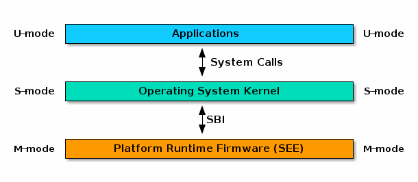
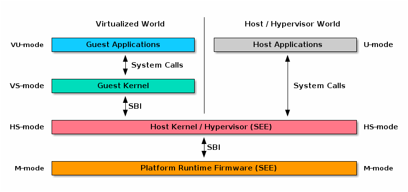

# 1.1. Introduction

## 1.1\. Introduction

This specification describes the RISC-V Supervisor Binary Interface, known from here on as SBI. The SBI allows supervisor-mode (S-mode or VS-mode) software to be portable across all RISC-V implementations by defining an abstraction for platform (or hypervisor) specific functionality. The design of the SBI follows the general RISC-V philosophy of having a small core along with a set of optional modular extensions.

An SBI extension defines a set of SBI functions which provides a particular functionality to supervisor-mode software. SBI extensions as a whole are optional and cannot be partially implemented unless an SBI extension defines a mechanism to discover implemented SBI functions. If sbi\_probe\_extension() signals that an extension is available, all functions present in the SBI version reported by sbi\_get\_spec\_version() must conform to that version of the SBI specification.

The higher privilege software providing SBI interface to the supervisor-mode software is referred as an SBI implementation or Supervisor Execution Environment (SEE). An SBI implementation (or SEE) can be platform runtime firmware executing in machine-mode (M-mode) (see below [Figure 1](#fig%5Fintro1)) or it can be some hypervisor executing in hypervisor-mode (HS-mode) (see below[Figure 2](#fig%5Fintro2)).

 

Figure 1\. RISC-V System without H-extension

 

Figure 2\. RISC-V System with H-extension

Harts are provisioned by the SBI implementation for supervisor-mode software. Hence, from the perspective of the SBI implementation, the S-mode hart contexts are referred to as virtual harts. In the case that the implementation is a hypervisor, virtual harts represent the VS-mode guest contexts.

The SBI specification doesn’t specify any method for hardware discovery. The supervisor software must rely on the other industry standard hardware discovery methods (i.e. Device Tree or ACPI) for that.
