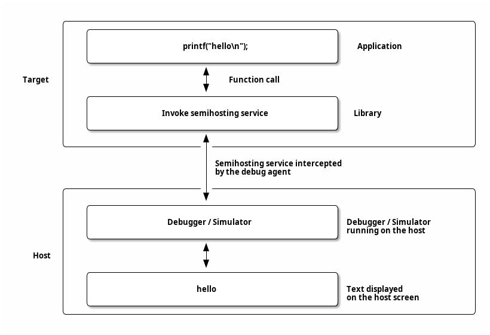

# 1.1. Introduction

## 1.1\. Introduction

Semihosting is a technique where an application running in a debug or simulation environment can access elements of the system hosting the debugger or simulator including console, file system, time and other functions. This allows for diagnostics, interaction and measurement of a target system without requiring significant infrastructure to exist in that target environment.

The RISC-V semihosting specification adopts the design of the ARM semihosting specification \[[1](bibliography.html#bib-armsemihostingref)\] to minimize the development effort. The services defined by the ARM semihosting specification \[[1](bibliography.html#bib-armsemihostingref)\] are portable across different architectures, and only the mechanism of invoking a semihosting service (aka semihosting binary interface) is archicture specific. The [Figure 1](#fig%5Fintro1) below shows an architecture independent high-level view of semihosting usage.

The RISC-V semihosting specification only defines the semihosting binary interface for RISC-V platforms and all other aspects of semihosting are defined by the ARM semihosting specification \[[1](bibliography.html#bib-armsemihostingref)\].

 

Figure 1\. Generic Semihosting Usage Flow
