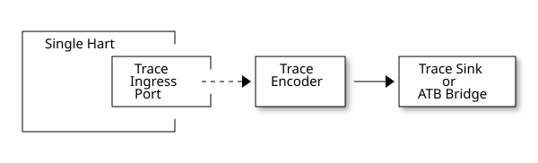
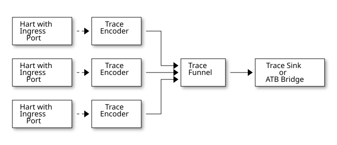
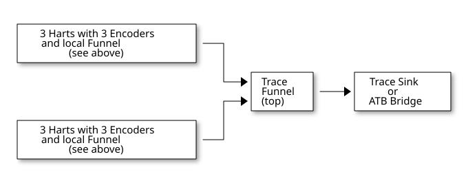
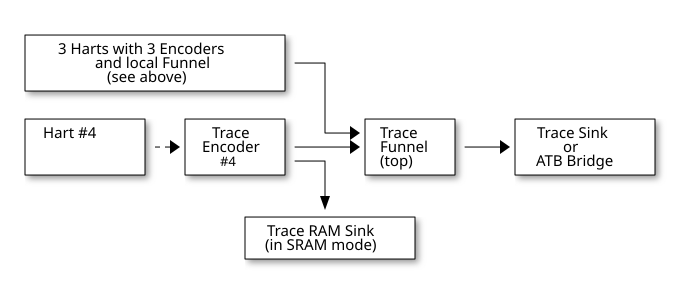

# Trace Control Interface Overview

## Trace Control Interface Overview

The Trace Control interface consists of a set of 32-bit registers. The control interface can be used to set up and control a trace session, retrieve collected trace, and control any trace system components.

### Trace Components

Each Trace Component is controlled by a set of 32-bit registers occupying up to 4KB of an address space. Base address of each trace component must be aligned on the 4KB boundary.

Each hart being traced must have its own separate Trace Encoder control component. A system with multiple harts must allow generating messages with a field indicating which hart is responsible for that message.

This specification defines the following trace components (**_N_** in at the end of symbol name denotes 0-based index of the component)

__Table 1\. **Trace Components**__
| **Component Name** | **Component Type** (value=symbol) | **Base Address** (symbol #**_N_**) |
| ------------------ | --------------------------------- | ---------------------------------- |
| Trace Encoder      | 0x1=TRCOMP\_ENCODER               | trBaseEncoder**_N_**               |
| Trace Funnel       | 0x8=TRCOMP\_FUNNEL                | trBaseFunnel**_N_**                |
| Trace RAM Sink     | 0x9=TRCOMP\_RAMSINK               | trBaseRamSink**_N_**               |
| Trace PIB Sink     | 0xA=TRCOMP\_PIBSINK               | trBasePibSink**_N_**               |
| Trace ATB Bridge   | 0xE=TRCOMP\_ATBBRIDGE             | trBaseAtbBridge**_N_**             |

| |  This specification does NOT address the discovery of base addresses of trace components. These base addresses (symbols in above table) must be specified as part of trace tool configuration. Connections between different trace components must be also defined. Future versions of this specification may allow a single base address to be sufficient to access and discover all trace components in the system. |
| ----------------------------------------------------------------------------------------------------------------------------------------------------------------------------------------------------------------------------------------------------------------------------------------------------------------------------------------------------------------------------------------------------------------------- |

#### Connections Between Components

Different components must be connected via internal busses and/or FIFO buffers. This specification does not define this interconnect logic, but the following rules must be followed:

* Each component sending a trace message/packet must assure the entire packet can be accepted by the destination component (or pushed into the FIFO buffer).  
   * Sending a partial packet is NEVER allowed as it will not be possible to process and decode such a trace.
* If a component cannot send an entire message/packet it must wait until it is possible to do so.
* Tracing is typically required to be non-intrusive, and if the Trace Encoder cannot keep up with the hart it should drop the packet and wait for the receiver to be ready.  
   * Once trace is allowed to resume it must issue an instruction trace synchronization message/packet so the decoder will be aware that some (unknown) amount of trace has been lost.  
   * It is advisable to drain the trace pipeline to some hysteresis level before resuming - otherwise a lot of short chunks of trace may be produced.
* Optionally the Trace Encoder may be configured to stall the hart to avoid trace data loss.
* To prevent trace overflows the following techniques can be used:  
   * Add a FIFO capable of holding several trace messages/packets to mitigate bursts of trace data.  
   * Use wider internal busses to provide more bandwidth.  
   * Make sure funnels and sinks provide the same or more bandwidth than encoders.  
   * Use triggers to create trace windows/ranges to limit amount of trace data - especially in multi-core configurations.

__Table 2\. **Allowed Connections Between Components**__
| **Input**        | **Output**       | **Description**                                                                                                  |
| ---------------- | ---------------- | ---------------------------------------------------------------------------------------------------------------- |
| Ingress Port     | Trace Encoder    | Ingress Port (from hart) providing raw trace to be encoded                                                       |
| Trace Encoder    | Trace RAM Sink   | Single hart tracing to RAM buffer                                                                                |
| Trace Encoder    | Trace PIB Sink   | Single hart tracing via pins                                                                                     |
| Trace Encoder    | Trace ATB Bridge | Single hart tracing to Arm ATB infrastructure                                                                    |
| Trace Encoder    | Trace Funnel     | Sending trace from single hart to Trace Funnel (to be combined from other RISC-V trace)                          |
| Trace Funnel     | Trace Funnel     | Sending combined trace from multiple harts to higher level Trace Funnel (to be combined from other RISC-V trace) |
| Trace Funnel     | Trace RAM Sink   | Sending combined trace from multiple harts to RAM buffer                                                         |
| Trace Funnel     | Trace PIB Sink   | Sending combined trace from multiple harts via pins                                                              |
| Trace Funnel     | Trace ATB Bridge | Sending combined trace from multiple harts to Arm ATB infrastructure                                             |
| Trace ATB Bridge | Arm ATB bus      | Sending trace to ATB (to combine RISC-V trace with other Arm components on the system)                           |

| |  Sending RISC-V trace to Arm CoreSight infrastructure is allowed (via ATB Bridge), but this specification does not specify how to transport trace data from other Arm CoreSight components in the system using RISC-V Trace sub-system. One of possible ways of doing so would be to create a custom trace component, configure it to encapsulate it as custom N-Trace trace messages and connect it as input to one of trace funnels. |
| ---------------------------------------------------------------------------------------------------------------------------------------------------------------------------------------------------------------------------------------------------------------------------------------------------------------------------------------------------------------------------------------------------------------------------------------- |

#### Example Component Connection Diagrams

 

Figure 1\. Simplest trace: Single Hart, Trace Encoder and Trace Sink/Bridge

 

Figure 2\. Multi-hart trace: Three harts, three Encoders, single Funnel and single Sink/Bridge

 

Figure 3\. Multi-cluster trace: two three-hart clusters with top-level Funnel and Sink/Bridge

 

Figure 4\. Local RAM Sink: Three-hart cluster plus extra hart with own RAM Sink (in SRAM mode)

| |  Trace data from **Trace Encoder #4** may be combined with trace from other 3 Trace Encoders. But it may be also sent to dedicated **Trace RAM Sink** \- in such a case corresponding input to **Trace Funnel (top)** should be disabled. |
| ------------------------------------------------------------------------------------------------------------------------------------------------------------------------------------------------------------------------------------------- |

### Accessing Trace Control Registers

For the access method to the trace control registers, it makes a difference whether these registers shall be accessed by an external debug/trace tool, or by an internal debugger running on the chip.

Trace control register access by an external debugger (this is the most common use case):

* External debuggers must be able to access all trace control registers independent of whether the traced harts are running or halted. That is why for external debuggers, the recommended access method for memory-mapped control registers is memory accesses through the RISC-V debug module using SBA (System Bus Access) as defined in the RISC-V Debug Specification.

Trace control register access by an internal debugger:

* Through loads and stores performed by one or more harts in the system. Mapping the control interface into physical memory accessible from a hart allows that hart to manage a trace session independently from an external debugger. A hart may act as an internal debugger or may act in cooperation with an external debugger. Two possible use models are collecting crash information in the field and modifying trace collection parameters during execution. If a system has physical memory protection (PMP), a range can be configured to restrict access to the trace system from hart(s).

| |  Additional control path(s) may also be implemented, such as extra JTAG registers or devices, a dedicated DMI debug bus or message-passing network. Such an access (which is NOT based on System Bus) may require custom implementation by trace probe vendors as this specification only mandates probe vendors to provide access via SBA commands. |
| ------------------------------------------------------------------------------------------------------------------------------------------------------------------------------------------------------------------------------------------------------------------------------------------------------------------------------------------------------ |

### Trace Component Register Map

Each block of 32-bit registers (for each component) has the following layout:

__Table 3\. **Register Layout for Component**__
| **Address Offset** | **Register Name** | **Compliance** | **Description**                                                                                                                          |
| ------------------ | ----------------- | -------------- | ---------------------------------------------------------------------------------------------------------------------------------------- |
| 0x000              | tr??Control       | Required       | Main control register for this trace component                                                                                           |
| 0x004              | tr??Impl          | Required       | Trace Implementation information for this trace component                                                                                |
| 0x008 - 0x00F      | extra controls    | Optional       | Extra controls for this trace component (named differently)                                                                              |
| 0x010 - 0xDFF      | —                 | Optional       | Additional registers (specific for the type of a component). All not used registers are reserved and should read as 0 and ignore writes. |
| 0xE00 - 0xFFF      | —                 | Optional       | Registers reserved for implementation/vendor specific details. May allow identification of components on a system bus.                   |

| |  Each component has a tr??Active bit in the tr??Control register. Accesses to other registers are unspecified when the tr??Active bit is 0. |
| --------------------------------------------------------------------------------------------------------------------------------------------- |

Each trace component has a `tr??Impl` register (at address offset 0x4) allowing trace component version and trace component type to be identified. This register allows debug tools to confirm the component type and potentially adjust tool behavior by looking at component versions.

| |  Each component may have a different version. Initial version of this specification defines all components to specify component version as 1.0 (major=1, minor=0). |
| -------------------------------------------------------------------------------------------------------------------------------------------------------------------- |

Registers in the 4KB range that are not implemented are reserved and read as 0 and ignore writes.

Most trace control registers are optional. Some WARL fields may be hard coded to any value (including 0). It allows different implementations to provide different functionality.

Both N-Trace and E-Trace encoders are controlled by the same set of bits/fields in the same `trTe???` registers - as almost every register, field, bit is optional this provides good flexibility in implementation.

All other trace components are shared between different trace encoders (N-Trace and E-Trace).

#### Summary of Trace Encoder Registers

__Table 4\. **Trace Encoder Registers (trTe??, trTs??)**__
| **Address Offset**                                     | **Register Name**     | **Compliance** | **Description**                                               |
| ------------------------------------------------------ | --------------------- | -------------- | ------------------------------------------------------------- |
| 0x000                                                  | trTeControl           | Required       | Trace Encoder control register                                |
| 0x004                                                  | trTeImpl              | Required       | Trace Encoder implementation information                      |
| 0x008                                                  | trTeInstFeatures      | Optional       | Extra instruction trace encoder features and trace source IDs |
| 0x00C                                                  | trTeInstFilters       | Optional       | Mask of filters to qualify an instruction trace               |
| **_Data trace control (trTeData??)_**                  |                       |                |                                                               |
| 0x010                                                  | trTeDataControl       | Optional       | Data trace control and features                               |
| 0x014 - 0x018                                          | —                     | Reserved       | Reserved for data trace related future standard extension     |
| 0x01C                                                  | trTeDataFilters       | Optional       | Mask of filters to qualify data trace                         |
| **_Reserved_**                                         |                       |                |                                                               |
| 0x020 - 0x03F                                          | —                     | Reserved       | Reserved for future standard extension                        |
| **_Timestamp control (trTs??)_**                       |                       |                |                                                               |
| 0x040                                                  | trTsControl           | Optional       | Timestamp control register                                    |
| 0x044                                                  | —                     | Reserved       | Reserved for future timestamp related standard extension      |
| 0x048                                                  | trTsCounterLow        | Optional       | Lower 32 bits of timestamp counter                            |
| 0x04C                                                  | trTsCounterHigh       | Optional       | Upper bits of timestamp counter                               |
| **_Trigger control (trTeTrig??)_**                     |                       |                |                                                               |
| 0x050                                                  | trTeTrigDbgControl    | Optional       | Debug Triggers control register                               |
| 0x054                                                  | trTeTrigExtInControl  | Optional       | External Triggers Input control register                      |
| 0x058                                                  | trTeTrigExtOutControl | Optional       | External Triggers Output control register                     |
| **_Reserved_**                                         |                       |                |                                                               |
| 0x060 - 0x3FF                                          | —                     | Reserved       | Reserved for future standard extension                        |
| **_Filters & comparators (trTeFilter??, trTeComp??)_** |                       |                |                                                               |
| 0x400 - 0x5FF                                          | trTeFilter??          | Optional       | Trace Encoder Filter Registers                                |
| 0x600 - 0x7FF                                          | trTeComp??            | Optional       | Trace Encoder Comparator Registers                            |

#### Summary of Trace RAM Sink Registers

__Table 5\. **Trace RAM Sink Registers (trRam??)**__
| **Address Offset** | **Register Name** | **Compliance** | **Description**                                                           |
| ------------------ | ----------------- | -------------- | ------------------------------------------------------------------------- |
| 0x000              | trRamControl      | Required       | RAM Sink control register                                                 |
| 0x004              | trRamImpl         | Required       | RAM Sink Implementation information                                       |
| 0x008 - 0x00F      | —                 | Reserved       | Reserved for more control registers                                       |
| 0x010              | trRamStartLow     | Required       | Lower 32 bits of start address of circular trace buffer                   |
| 0x014              | trRamStartHigh    | Optional       | Upper bits of start address of circular trace buffer                      |
| 0x018              | trRamLimitLow     | Required       | Lower 32 bits of end address of circular trace buffer                     |
| 0x01C              | trRamLimitHigh    | Optional       | Upper bits of end address of circular trace buffer                        |
| 0x020              | trRamWPLow        | Required       | Lower 32 bits of current write location for trace data in circular buffer |
| 0x024              | trRamWPHigh       | Optional       | Upper bits of current write location for trace data in circular buffer    |
| 0x028              | trRamRPLow        | Optional       | Lower 32 bits of access pointer for trace readback                        |
| 0x02C              | trRamRPHigh       | Optional       | Upper bits of access pointer for trace readback                           |
| 0x030 - 0x03F      | —                 | Reserved       | Reserved for more control registers                                       |
| 0x040              | trRamData         | Optional       | Read/write access to SRAM trace memory (32-bit data)                      |

#### Summary of Trace PIB Sink Registers

__Table 6\. **Trace PIB Sink Registers (trPib??)**__
| **Address Offset** | **Register Name** | **Compliance** | **Description**                           |
| ------------------ | ----------------- | -------------- | ----------------------------------------- |
| 0x000              | trPibControl      | Required       | Trace PIB Sink control register           |
| 0x004              | trPibImpl         | Required       | Trace PIB Sink Implementation information |

#### Summary of Trace Funnel Registers

__Table 7\. **Trace Funnel Registers (trFunnel??, trTs??)**__
| **Address Offset**               | **Register Name** | **Compliance** | **Description**                         |
| -------------------------------- | ----------------- | -------------- | --------------------------------------- |
| 0x000                            | trFunnelControl   | Required       | Trace Funnel control register           |
| 0x004                            | trFunnelImpl      | Required       | Trace Funnel Implementation information |
| 0x008                            | trFunnelDisInput  | Optional       | Disable individual funnel inputs        |
| 0x00C - 0x03F                    | —                 | Reserved       | Reserved for more control registers     |
| **_Timestamp control (trTs??)_** |                   |                |                                         |
| 0x040                            | trTsControl       | Optional       | Timestamp control register              |
| 0x044                            | —                 | Reserved       | Reserved for extra timestamp control    |
| 0x048                            | trTsCounterLow    | Optional       | Lower 32 bits of timestamp counter      |
| 0x04C                            | trTsCounterHigh   | Optional       | Upper bits of timestamp counter         |

| |  Funnels may optionally be a source of timestamp and/or forward timestamp to Trace Encoders in the system. This way several Trace Encoders may share timestamp and trace from several harts may be time-correlated. |
| --------------------------------------------------------------------------------------------------------------------------------------------------------------------------------------------------------------------- |

#### Summary of Trace ATB Bridge Registers

__Table 8\. **Trace ATB Bridge Registers (trAtbBridge??)**__
| **Address Offset** | **Register Name**  | **Compliance** | **Description**                             |
| ------------------ | ------------------ | -------------- | ------------------------------------------- |
| 0x000              | trAtbBridgeControl | Required       | Trace ATB Bridge control register           |
| 0x004              | trAtbBridgeImpl    | Required       | Trace ATB Bridge Implementation information |
